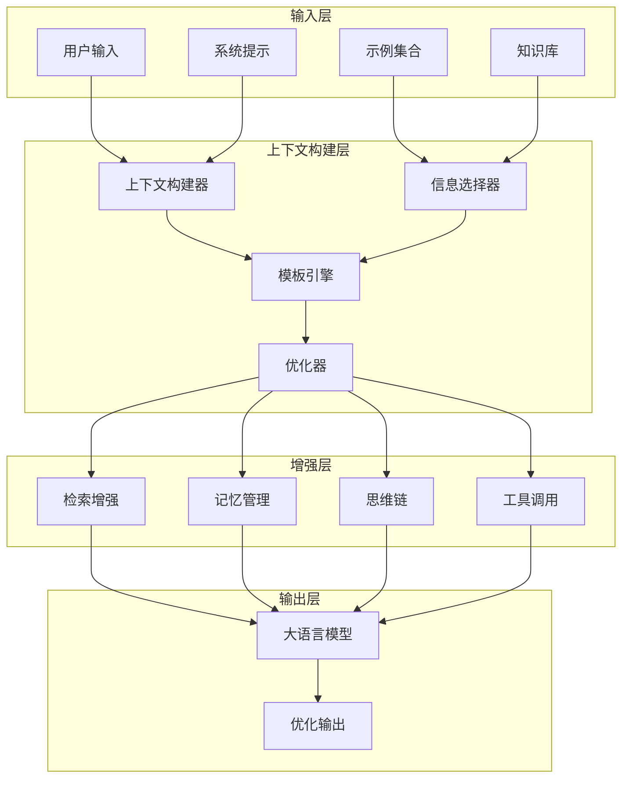
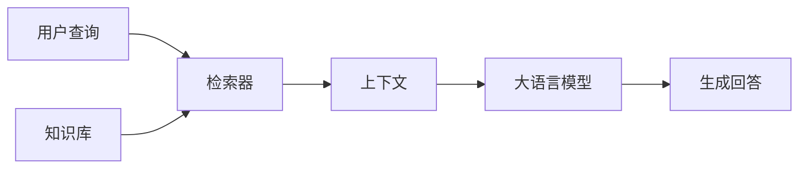

# Context Engineering上下文工程：打造高效的AI对话

上下文工程是设计和管理与大语言模型交互的艺术和科学，通过精心构造输入上下文来引导模型产生更准确、更相关的输出。本文将深入探讨上下文工程的核心概念、最新技术和最佳实践。

## 什么是上下文工程？

### 基本概念

上下文工程是指通过设计、优化和管理提供给大语言模型的上下文信息，以最大化模型性能和输出质量的技术体系。它不仅仅是简单的提示词编写，而是一个系统性的工程学科。

### 核心要素

**上下文构建**：
- 系统提示词（System Prompt）
- 用户指令（User Instruction）
- 示例演示（Examples/Demonstrations）
- 背景知识（Background Knowledge）
- 约束条件（Constraints）

**优化目标**：
- 提高回答准确性和相关性
- 减少模型幻觉和错误
- 控制输出格式和风格
- 提升推理能力和逻辑性
- 优化计算成本和响应时间

## 上下文工程架构

### 整体框架

### 核心组件

#### 1. 上下文构建器

负责将各种信息源整合成统一的上下文表示：

**功能特点**：
- 多模态信息融合
- 动态上下文组装
- 优先级管理
- 长度控制

**构建策略**：
- 基于任务类型的模板选择
- 根据复杂度调整信息密度
- 考虑模型上下文窗口限制
- 平衡信息的完整性和简洁性

#### 2. 模板引擎

提供灵活的上下文模板管理：

**模板类型**：
- 固定模板：适用于标准化任务
- 参数化模板：支持动态内容插入
- 条件模板：根据情况选择不同内容
- 组合模板：多个子模板的灵活组合

**设计原则**：
- 模块化和可重用性
- 易于维护和更新
- 支持多语言和本地化
- 版本控制和回滚机制

#### 3. 信息选择器

智能选择最相关的上下文信息：

**选择算法**：
- 语义相似度匹配
- 关键词相关性评分
- 图谱关系分析
- 用户偏好学习

**优化策略**：
- 多样性保证避免信息冗余
- 时效性考虑优先最新信息
- 权威性评估选择可靠来源
- 个性化定制适应特定用户

## 基础提示技术

### 系统提示设计

系统提示是上下文工程的基础，定义了模型的行为模式和响应风格：

**核心要素**：
- 角色定义：明确模型扮演的角色
- 任务描述：清晰说明要完成的目标
- 输出规范：指定格式、长度、风格要求
- 约束条件：设定限制和边界

**设计原则**：
- 简洁明了，避免歧义
- 具体可操作，不过于抽象
- 考虑模型能力和局限
- 预见可能的误解和滥用

### 指令优化技术

通过精确的指令设计提升模型理解：

**指令类型**：
- 直接指令：明确的命令和要求
- 间接指令：通过暗示和引导
- 条件指令：基于条件的分支逻辑
- 迭代指令：多步骤的逐步指导

**优化方法**：
- 使用明确的关键词和术语
- 提供具体的操作步骤
- 设定清晰的评估标准
- 预设常见问题的处理方式

### 示例驱动学习

通过精心设计的示例引导模型行为：

**示例选择**：
- 代表性：覆盖典型场景
- 多样性：涵盖不同情况
- 难度梯度：从简单到复杂
- 质量保证：确保示例正确性

**展示方式**：
- 少样本学习：2-5个精选示例
- 思维链示例：展示推理过程
- 错误案例：说明不正确的做法
- 边界情况：处理特殊情况

## 高级上下文技术

### 检索增强生成（RAG）

RAG是2025年上下文工程的核心技术，将外部知识检索与生成结合：

**架构设计**：

**技术优势**：
- 减少模型幻觉，提供事实依据
- 支持实时知识更新
- 可解释性和可追溯性
- 降低训练成本和复杂度

**2025年发展趋势**：
- 混合检索：结合稠密和稀疏检索
- 多模态检索：支持图像、音频等
- 实时更新：动态知识库同步
- 个性化检索：基于用户偏好优化

### 思维链技术

引导模型展示推理过程，提升复杂任务的解决能力：

**核心方法**：
- 逐步分解：将复杂问题拆解
- 中间步骤：展示推理中间结果
- 自我验证：检查答案的合理性
- 错误修正：识别和纠正错误

**应用场景**：
- 数学问题求解
- 逻辑推理任务
- 复杂决策分析
- 创意思维过程

**2025年创新**：
- 自动思维链生成
- 分层思维链组织
- 多路径并行推理
- 动态思维链调整

### 记忆管理系统

为模型提供持久化的记忆能力：

**记忆类型**：
- 短期记忆：当前对话上下文
- 长期记忆：历史交互信息
- 语义记忆：通用知识和概念
- 情景记忆：特定事件和经验

**管理策略**：
- 记忆压缩：保留关键信息
- 重要性评分：动态优先级排序
- 遗忘机制：避免信息过载
- 关联建立：构建知识网络

### 工具调用集成

将外部工具和能力集成到上下文中：

**工具类型**：
- 计算工具：数学计算和数据分析
- 搜索工具：实时信息检索
- API接口：外部服务调用
- 创作工具：图像生成、代码编辑

**集成方式**：
- 函数调用：标准的API调用格式
- 插件系统：可扩展的工具架构
- 工作流编排：多工具协同执行
- 错误处理：异常情况的恢复

## 上下文优化策略

### 长上下文管理

随着模型上下文窗口的扩大，高效管理长上下文变得重要：

**挑战**：
- 信息密度不均匀
- 注意力分散问题
- 计算成本增加
- 相关性判断困难

**解决方案**：
- 信息分层：重要信息优先放置
- 摘要压缩：保留核心内容
- 分块处理：逻辑分组管理
- 动态筛选：实时相关性评估

### 上下文压缩技术

在有限空间内最大化信息价值：

**压缩方法**：
- 关键词提取：保留核心术语
- 句子压缩：简化表达方式
- 语义抽象：高层次的概括
- 结构化表示：表格和列表形式

**质量保证**：
- 信息完整性检查
- 语义一致性验证
- 可读性评估
- 效果测试反馈

### 个性化上下文

根据用户特征定制上下文内容：

**个性化维度**：
- 知识背景：教育水平、专业领域
- 语言风格：正式程度、表达习惯
- 兴趣偏好：话题关注、内容类型
- 交互历史：过往反馈和行为模式

**实现方式**：
- 用户画像构建
- 偏好学习算法
- 动态调整机制
- 隐私保护措施

## 2025年技术趋势

### 自适应上下文

上下文系统能够根据情况自动调整：

**智能特性**：
- 实时性能监控
- 动态策略调整
- 自我优化学习
- 异常自动恢复

**应用价值**：
- 减少人工配置
- 提升系统稳定性
- 适应环境变化
- 持续性能改进

### 多模态上下文

整合文本、图像、音频等多种模态：

**技术融合**：
- 跨模态对齐
- 统一表示学习
- 模态间互补
- 联合推理机制

**应用场景**：
- 视觉问答系统
- 多媒体内容分析
- 沉浸式交互体验
- 创意内容生成

### 协作上下文工程

多人协作的上下文管理系统：

**协作特性**：
- 版本控制
- 权限管理
- 变更追踪
- 团队共享

**工具支持**：
- 可视化编辑器
- 模板库管理
- 效果分析工具
- 自动化测试框架

### 上下文安全与伦理

确保上下文工程的安全性和合规性：

**安全考虑**：
- 敏感信息过滤
- 恶意输入检测
- 输出内容审核
- 隐私保护机制

**伦理准则**：
- 公平性和包容性
- 透明度和可解释性
- 用户自主控制
- 社会责任考虑

## 实战应用指南

### 上下文工程流程

**第一步：需求分析**
- 明确任务目标和要求
- 分析用户特征和场景
- 识别关键成功因素
- 评估资源约束条件

**第二步：原型设计**
- 选择基础模板和框架
- 设计核心提示结构
- 准备示例和测试用例
- 建立评估指标体系

**第三步：迭代优化**
- 小规模测试验证
- 收集反馈和性能数据
- 分析问题和改进方向
- 持续优化和调整

**第四步：部署监控**
- 生产环境部署
- 实时性能监控
- 用户反馈收集
- 持续改进循环

### 常见应用场景

#### 客户服务机器人

**上下文设计要点**：
- 明确服务范围和边界
- 设计友好的对话风格
- 准备常见问题解答库
- 建立人工转接机制

**优化策略**：
- 个性化服务体验
- 情感识别和响应
- 多语言支持
- 实时知识更新

#### 内容创作助手

**上下文设计要点**：
- 定义创作目标和风格
- 提供结构化创作框架
- 包含质量标准指导
- 设置创意边界和约束

**优化策略**：
- 领域专业知识集成
- 创意灵感激发
- 多版本比较选择
- 实时反馈调整

#### 教育辅导系统

**上下文设计要点**：
- 适配学习水平和进度
- 提供循序渐进的指导
- 包含丰富的教学资源
- 设计互动和练习环节

**优化策略**：
- 个性化学习路径
- 错误模式识别
- 学习效果评估
- 家长教师协作

### 性能评估方法

#### 量化评估指标

**质量指标**：
- 准确性：回答正确率
- 相关性：与查询的匹配度
- 完整性：信息覆盖程度
- 一致性：逻辑连贯性

**效率指标**：
- 响应时间：生成速度
- 资源消耗：计算成本
- 吞吐量：并发处理能力
- 稳定性：系统可靠性

#### 质性评估方法

**用户评估**：
- 满意度调查
- 专家评审
- A/B测试对比
- 实际使用反馈

**案例分析**：
- 典型场景测试
- 边界情况验证
- 长期效果追踪
- 竞品对比分析

## 工具和平台

### 开发工具

**提示词编辑器**：
- 可视化界面设计
- 语法高亮和检查
- 版本管理功能
- 协作编辑支持

**测试平台**：
- 批量测试执行
- 性能基准测试
- 结果对比分析
- 自动化报告生成

**监控工具**：
- 实时性能监控
- 异常检测告警
- 使用统计分析
- 成本跟踪管理

### 部署平台

**云服务平台**：
- 弹性伸缩能力
- 全球部署网络
- 安全防护机制
- 运维管理工具

**本地部署**：
- 私有云解决方案
- 边缘计算支持
- 离线运行能力
- 数据安全保障

**混合部署**：
- 云边协同架构
- 动态负载均衡
- 灾备恢复机制
- 统一管理界面

## 最佳实践建议

### 设计原则

**用户中心**：
- 深入理解用户需求
- 关注用户体验
- 持续收集反馈
- 快速迭代改进

**简洁有效**：
- 避免过度复杂化
- 专注核心功能
- 保持清晰结构
- 便于维护扩展

**可扩展性**：
- 模块化设计
- 标准化接口
- 灵活配置机制
- 插件式架构

**安全可靠**：
- 输入验证和过滤
- 输出内容审核
- 异常处理机制
- 隐私保护措施

### 常见陷阱避免

**过度设计**：
- 避免不必要的复杂性
- 专注实际需求
- 保持简单有效
- 逐步迭代完善

**忽略测试**：
- 建立完善测试体系
- 覆盖各种场景
- 持续验证效果
- 及时发现问题

**静态思维**：
- 保持灵活性和适应性
- 关注技术发展趋势
- 准备应对变化
- 建立学习机制

**孤立开发**：
- 加强团队协作
- 分享经验和知识
- 参与社区交流
- 借鉴最佳实践

## 未来展望

### 技术发展方向

**智能化程度提升**：
- 自主学习和优化
- 预测性上下文构建
- 主动建议和推荐
- 智能异常处理

**多模态深度融合**：
- 统一的多模态表示
- 跨模态推理能力
- 沉浸式交互体验
- 创意内容生成

**个性化和适应性**：
- 深度用户理解
- 动态策略调整
- 情境感知能力
- 预期行为预测

### 应用前景

**企业智能化转型**：
- 业务流程自动化
- 决策支持系统
- 知识管理和共享
- 创新能力提升

**教育个性化发展**：
- 自适应学习系统
- 智能辅导助手
- 学习效果优化
- 教育资源均衡

**医疗健康服务**：
- 诊断辅助系统
- 个性化治疗方案
- 健康管理平台
- 医学教育培训

## 本章小结

上下文工程是连接大语言模型能力与实际应用需求的关键桥梁：

- **核心价值**：通过精心设计上下文最大化模型性能
- **技术体系**：从基础提示到高级增强技术的完整框架
- **实践指导**：系统化的设计、开发、优化流程
- **未来趋势**：智能化、多模态、个性化发展方向
- **应用前景**：广泛的行业应用和社会价值

对于 LLM 初学者来说，掌握上下文工程的基本原理和核心技术，将帮助你在实际项目中充分发挥大语言模型的潜力，构建真正有价值的 AI 应用。

## 延伸阅读

- Prompt Engineering Guide
- Retrieval-Augmented Generation: Survey and Frontiers
- Chain-of-Thought Prompting Elicits Reasoning
- Constitutional AI: Harmlessness from AI Feedback
- The Rise and Potential of Large Language Models

---

*下一篇：[大模型评测 Evaluation](./26-evaluation.md)*
