# Context Engineering：上下文工程

随着大语言模型应用从简单的问答场景发展到复杂的 Agent 系统，仅仅优化 Prompt 已经无法满足需求。Context Engineering（上下文工程）应运而生，它代表了从"精准指令设计"到"系统级信息管理"的范式升级。

## 1. 什么是上下文工程

### 1.1 定义

**Context Engineering** 是一套为大模型构建"信息支援系统"的技术体系。其核心是构建一个动态运转的系统，能够精准判断任务需求，然后把**正确的信息**（如历史对话、外部数据）和**适用的工具**（如检索插件、计算功能），按模型能理解的格式递过去。

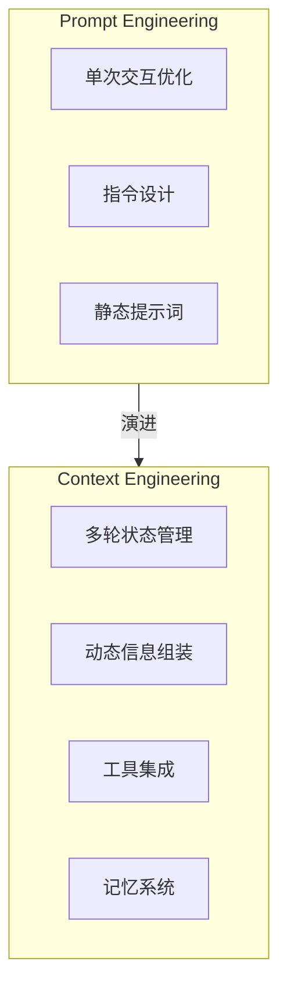

### 1.2 与 Prompt Engineering 的区别

| 维度 | Prompt Engineering | Context Engineering |
|------|-------------------|---------------------|
| **关注点** | 单次交互的指令设计 | 整个任务生命周期的信息管理 |
| **状态管理** | 无状态，需附加全部历史 | 有状态，专门服务管理记忆 |
| **扩展性** | 难以应对复杂用例 | 通过模块化设计灵活扩展 |
| **维护性** | 提示词冗长复杂 | 组件解耦，易于维护 |
| **外部集成** | 只能在提示中描述操作 | 通过标准化接口调用工具 |
| **适用场景** | 简单问答、单轮任务 | Agent、复杂工作流 |

### 1.3 为什么需要上下文工程

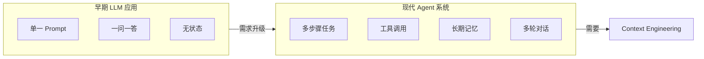

当应用场景变得复杂时，简单的 Prompt Engineering 面临以下挑战：

1. **上下文窗口限制**：无法将所有信息塞入有限的 token 窗口
2. **状态管理困难**：多轮对话需要维护会话状态
3. **动态信息需求**：不同任务需要不同的背景知识
4. **工具协调复杂**：需要动态选择和调用外部工具

## 2. 上下文工程的核心组件

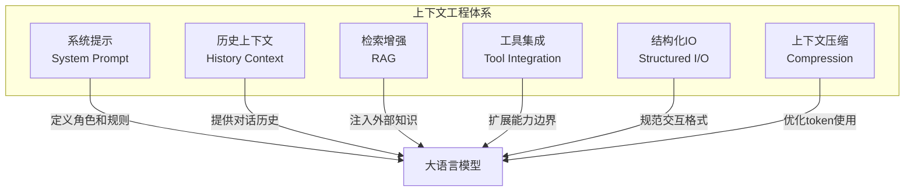

### 2.1 系统提示设计（System Prompt）

系统提示定义了模型的角色、行为规范和输出格式。

```python
system_prompt = """
你是一个专业的代码助手，遵循以下规则：

## 角色定义
- 精通 Python、JavaScript、Go 等主流编程语言
- 擅长代码审查、重构和性能优化

## 行为规范
1. 先理解用户需求，再给出方案
2. 代码要有清晰的注释
3. 指出潜在的安全风险

## 输出格式
- 代码块使用 markdown 格式
- 复杂逻辑要分步骤解释
"""
```

**设计原则**：

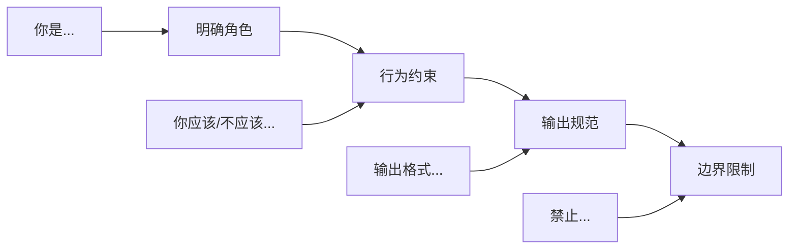

### 2.2 历史上下文管理

管理对话历史和任务状态，实现多轮交互的连贯性。

```python
class ConversationManager:
    def __init__(self, max_turns: int = 10):
        self.max_turns = max_turns
        self.short_term_memory = []  # 近期对话
        self.long_term_memory = {}   # 重要信息摘要
        
    def add_turn(self, role: str, content: str):
        """添加一轮对话"""
        self.short_term_memory.append({
            "role": role,
            "content": content,
            "timestamp": time.time()
        })
        
        # 超出限制时压缩旧对话
        if len(self.short_term_memory) > self.max_turns:
            self._compress_old_turns()
    
    def _compress_old_turns(self):
        """压缩旧对话为摘要"""
        old_turns = self.short_term_memory[:5]
        summary = self._summarize(old_turns)
        
        self.long_term_memory["summary"] = summary
        self.short_term_memory = self.short_term_memory[5:]
    
    def get_context(self) -> list:
        """获取当前上下文"""
        context = []
        
        # 添加长期记忆摘要
        if self.long_term_memory.get("summary"):
            context.append({
                "role": "system",
                "content": f"之前的对话摘要：{self.long_term_memory['summary']}"
            })
        
        # 添加近期对话
        context.extend(self.short_term_memory)
        
        return context
```

**记忆管理策略**：

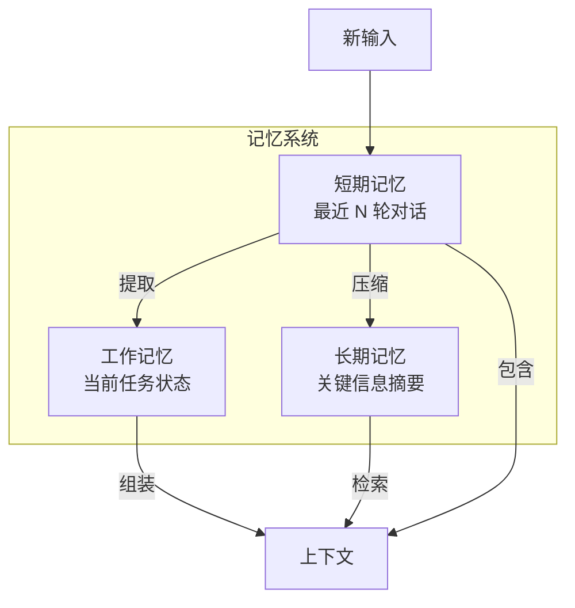

### 2.3 检索增强生成（RAG）

将外部知识动态注入上下文，扩展模型的知识边界。

```python
class RAGContextBuilder:
    def __init__(self, vector_store, top_k: int = 5):
        self.vector_store = vector_store
        self.top_k = top_k
        
    def build_context(self, query: str) -> str:
        """构建 RAG 上下文"""
        # 1. 检索相关文档
        docs = self.vector_store.similarity_search(query, k=self.top_k)
        
        # 2. 重排序（可选）
        docs = self._rerank(query, docs)
        
        # 3. 格式化上下文
        context = self._format_context(docs)
        
        return context
    
    def _format_context(self, docs: list) -> str:
        """格式化检索结果"""
        context_parts = []
        for i, doc in enumerate(docs, 1):
            context_parts.append(f"""
[文档 {i}]
来源：{doc.metadata.get('source', '未知')}
内容：{doc.page_content}
""")
        return "\n".join(context_parts)
```

**RAG 流程**：

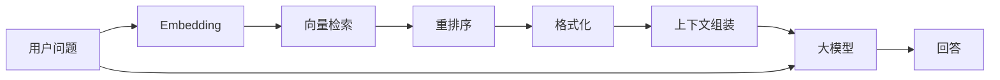

### 2.4 工具集成

通过标准化接口扩展模型的能力边界。

```python
class ToolRegistry:
    def __init__(self):
        self.tools = {}
        
    def register(self, name: str, description: str, parameters: dict):
        """注册工具"""
        def decorator(func):
            self.tools[name] = {
                "function": func,
                "description": description,
                "parameters": parameters
            }
            return func
        return decorator
    
    def get_tools_context(self) -> str:
        """生成工具描述上下文"""
        tools_desc = []
        for name, tool in self.tools.items():
            tools_desc.append(f"""
工具名称：{name}
描述：{tool['description']}
参数：{json.dumps(tool['parameters'], ensure_ascii=False)}
""")
        return "\n".join(tools_desc)

# 使用示例
registry = ToolRegistry()

@registry.register(
    name="search_web",
    description="搜索互联网获取最新信息",
    parameters={"query": {"type": "string", "description": "搜索关键词"}}
)
def search_web(query: str) -> str:
    # 实现搜索逻辑
    pass

@registry.register(
    name="execute_code",
    description="执行 Python 代码",
    parameters={"code": {"type": "string", "description": "Python 代码"}}
)
def execute_code(code: str) -> str:
    # 实现代码执行逻辑
    pass
```

### 2.5 结构化输入输出

定义清晰的数据格式，提高系统可靠性。

```python
from pydantic import BaseModel
from typing import List, Optional

class TaskInput(BaseModel):
    """任务输入格式"""
    task_type: str
    description: str
    constraints: Optional[List[str]] = None
    
class TaskOutput(BaseModel):
    """任务输出格式"""
    status: str  # success, failed, pending
    result: str
    steps: List[str]
    tools_used: List[str]

def build_structured_prompt(task: TaskInput) -> str:
    """构建结构化提示"""
    return f"""
## 任务类型
{task.task_type}

## 任务描述
{task.description}

## 约束条件
{chr(10).join(f'- {c}' for c in (task.constraints or []))}

## 输出要求
请按以下 JSON 格式输出：
{{
    "status": "success/failed/pending",
    "result": "执行结果",
    "steps": ["步骤1", "步骤2", ...],
    "tools_used": ["工具1", "工具2", ...]
}}
"""
```

### 2.6 上下文压缩

在保持关键信息的同时减少 token 使用。

```python
class ContextCompressor:
    def __init__(self, llm, max_tokens: int = 2000):
        self.llm = llm
        self.max_tokens = max_tokens
        
    def compress(self, context: str) -> str:
        """压缩上下文"""
        current_tokens = self._count_tokens(context)
        
        if current_tokens <= self.max_tokens:
            return context
            
        # 策略1：摘要压缩
        summary = self._summarize(context)
        
        # 策略2：关键信息提取
        key_info = self._extract_key_info(context)
        
        # 组合压缩结果
        compressed = f"""
[上下文摘要]
{summary}

[关键信息]
{key_info}
"""
        return compressed
    
    def _summarize(self, text: str) -> str:
        """生成摘要"""
        prompt = f"请将以下内容压缩为简洁摘要，保留关键信息：\n{text}"
        return self.llm.generate(prompt)
    
    def _extract_key_info(self, text: str) -> str:
        """提取关键信息"""
        prompt = f"请提取以下内容中的关键实体、数字和结论：\n{text}"
        return self.llm.generate(prompt)
```

**压缩策略对比**：

| 策略 | 适用场景 | 信息损失 | 计算成本 |
|------|----------|----------|----------|
| 截断 | 近期对话更重要 | 高 | 低 |
| 摘要 | 需要整体理解 | 中 | 中 |
| 选择性保留 | 任务相关性明确 | 低 | 中 |
| 向量检索 | 知识库场景 | 低 | 高 |

## 3. 上下文工程实践模式

### 3.1 静态与动态上下文分离

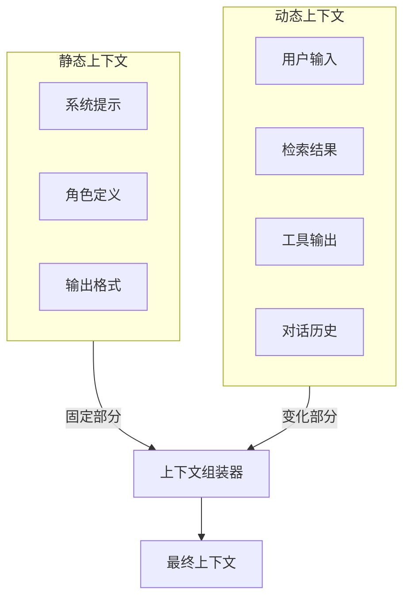

```python
class ContextAssembler:
    def __init__(self, system_prompt: str):
        self.system_prompt = system_prompt
        
    def assemble(
        self,
        user_input: str,
        history: list = None,
        rag_context: str = None,
        tool_outputs: list = None
    ) -> list:
        """组装最终上下文"""
        messages = []
        
        # 1. 系统提示（静态）
        system_content = self.system_prompt
        
        # 2. 添加 RAG 上下文（动态）
        if rag_context:
            system_content += f"\n\n## 参考资料\n{rag_context}"
            
        messages.append({"role": "system", "content": system_content})
        
        # 3. 添加历史对话（动态）
        if history:
            messages.extend(history)
            
        # 4. 添加工具输出（动态）
        if tool_outputs:
            for output in tool_outputs:
                messages.append({
                    "role": "assistant",
                    "content": f"工具调用结果：{output}"
                })
        
        # 5. 当前用户输入
        messages.append({"role": "user", "content": user_input})
        
        return messages
```

### 3.2 上下文窗口管理

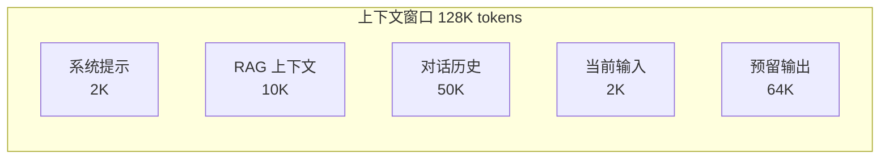

```python
class WindowManager:
    def __init__(self, max_tokens: int = 128000):
        self.max_tokens = max_tokens
        self.reserved_output = 64000  # 预留输出空间
        self.available = max_tokens - self.reserved_output
        
    def allocate(
        self,
        system_tokens: int,
        rag_tokens: int,
        history_tokens: int,
        input_tokens: int
    ) -> dict:
        """分配 token 预算"""
        total_needed = system_tokens + rag_tokens + history_tokens + input_tokens
        
        if total_needed <= self.available:
            return {
                "system": system_tokens,
                "rag": rag_tokens,
                "history": history_tokens,
                "input": input_tokens
            }
        
        # 需要压缩，优先保证系统提示和当前输入
        fixed = system_tokens + input_tokens
        flexible = self.available - fixed
        
        # 按比例分配剩余空间
        rag_ratio = 0.3
        history_ratio = 0.7
        
        return {
            "system": system_tokens,
            "rag": int(flexible * rag_ratio),
            "history": int(flexible * history_ratio),
            "input": input_tokens
        }
```

### 3.3 多轮任务的上下文演进

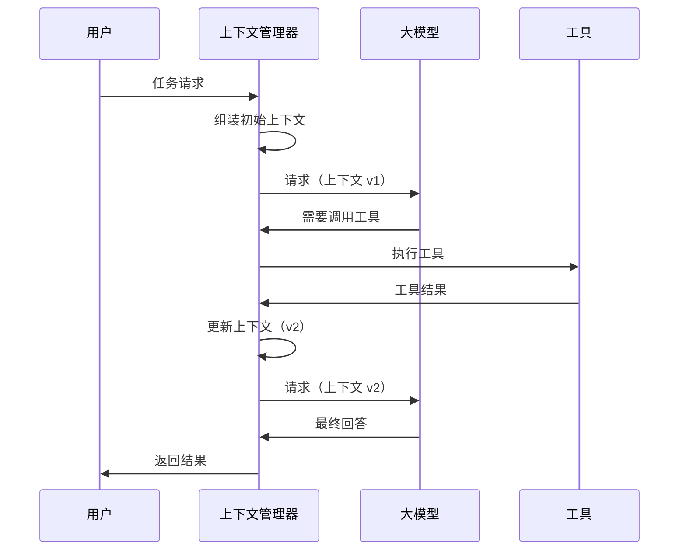

## 4. 高级上下文技术

### 4.1 上下文缓存

对于重复或相似的上下文，使用缓存减少计算开销。

```python
import hashlib
from functools import lru_cache

class ContextCache:
    def __init__(self, max_size: int = 1000):
        self.cache = {}
        self.max_size = max_size
        
    def _hash_context(self, context: list) -> str:
        """生成上下文哈希"""
        content = json.dumps(context, sort_keys=True)
        return hashlib.md5(content.encode()).hexdigest()
    
    def get(self, context: list) -> str:
        """获取缓存的响应"""
        key = self._hash_context(context)
        return self.cache.get(key)
    
    def set(self, context: list, response: str):
        """缓存响应"""
        if len(self.cache) >= self.max_size:
            # 简单的 FIFO 淘汰
            oldest_key = next(iter(self.cache))
            del self.cache[oldest_key]
            
        key = self._hash_context(context)
        self.cache[key] = response
```

### 4.2 上下文路由

根据任务类型选择不同的上下文模板。

```python
class ContextRouter:
    def __init__(self):
        self.routes = {}
        
    def register_route(self, task_type: str, context_builder):
        """注册上下文路由"""
        self.routes[task_type] = context_builder
        
    def route(self, task_type: str, **kwargs) -> list:
        """路由到对应的上下文构建器"""
        builder = self.routes.get(task_type)
        if not builder:
            raise ValueError(f"未知任务类型: {task_type}")
        return builder(**kwargs)

# 使用示例
router = ContextRouter()

router.register_route("code_review", lambda **kw: [
    {"role": "system", "content": "你是代码审查专家..."},
    {"role": "user", "content": kw.get("code")}
])

router.register_route("translation", lambda **kw: [
    {"role": "system", "content": "你是专业翻译..."},
    {"role": "user", "content": f"翻译: {kw.get('text')}"}
])
```

### 4.3 上下文安全

防止提示注入和敏感信息泄露。

```python
class ContextSanitizer:
    def __init__(self):
        self.injection_patterns = [
            r"忽略之前的指令",
            r"ignore previous instructions",
            r"你现在是",
            r"system:",
        ]
        self.sensitive_patterns = [
            r"\b\d{11}\b",           # 手机号
            r"\b\d{18}\b",           # 身份证
            r"[a-zA-Z0-9._%+-]+@[a-zA-Z0-9.-]+\.[a-zA-Z]{2,}",  # 邮箱
        ]
        
    def sanitize_input(self, text: str) -> str:
        """清理用户输入"""
        # 检测注入攻击
        for pattern in self.injection_patterns:
            if re.search(pattern, text, re.IGNORECASE):
                raise SecurityError("检测到潜在的提示注入攻击")
        
        return text
    
    def mask_sensitive(self, text: str) -> str:
        """遮盖敏感信息"""
        for pattern in self.sensitive_patterns:
            text = re.sub(pattern, "[已脱敏]", text)
        return text
```

## 5. 上下文工程最佳实践

### 5.1 设计原则

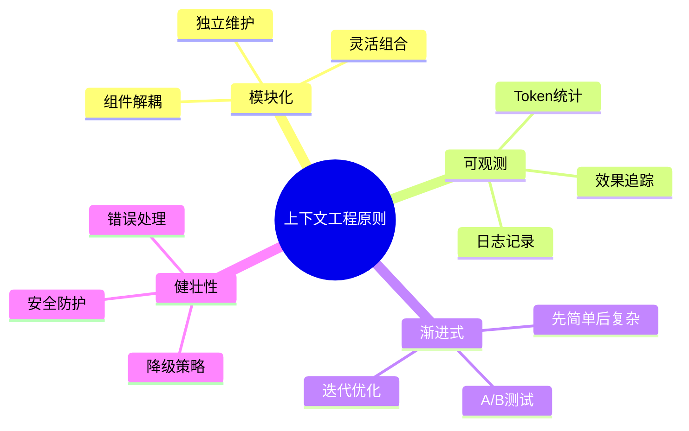

### 5.2 常见陷阱

| 陷阱 | 问题描述 | 解决方案 |
|------|----------|----------|
| 上下文膨胀 | 上下文无限增长导致超出限制 | 设置上限，定期压缩 |
| 信息冗余 | 重复信息占用 token | 去重和摘要 |
| 顺序敏感 | 信息顺序影响模型理解 | 固定模板，关键信息靠前 |
| 格式混乱 | 不同来源格式不一致 | 统一格式化处理 |
| 安全漏洞 | 提示注入攻击 | 输入清理和验证 |

### 5.3 调试与优化

```python
class ContextDebugger:
    def __init__(self):
        self.logs = []
        
    def log_context(self, stage: str, context: list):
        """记录上下文状态"""
        self.logs.append({
            "stage": stage,
            "timestamp": time.time(),
            "token_count": self._count_tokens(context),
            "context_snapshot": context[:2]  # 只保存部分
        })
    
    def analyze(self) -> dict:
        """分析上下文演进"""
        return {
            "total_stages": len(self.logs),
            "token_growth": [log["token_count"] for log in self.logs],
            "bottlenecks": self._find_bottlenecks()
        }
    
    def _find_bottlenecks(self) -> list:
        """找出 token 增长瓶颈"""
        bottlenecks = []
        for i in range(1, len(self.logs)):
            growth = self.logs[i]["token_count"] - self.logs[i-1]["token_count"]
            if growth > 1000:  # 阈值
                bottlenecks.append({
                    "stage": self.logs[i]["stage"],
                    "growth": growth
                })
        return bottlenecks
```

## 6. 本章小结

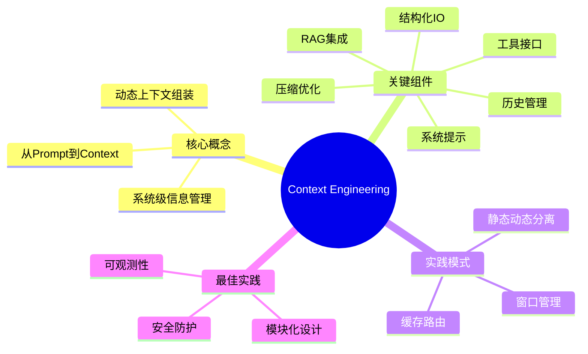

**核心要点**：
- Context Engineering 是 Prompt Engineering 的自然演进，关注系统级的信息管理
- 核心组件包括系统提示、历史管理、RAG、工具集成、结构化 IO 和上下文压缩
- 静态与动态上下文分离是关键设计模式
- 上下文窗口管理需要合理分配 token 预算
- 安全防护和可观测性是生产环境的必备能力

## 思考题

1. 在一个客服 Agent 中，如何设计上下文管理策略来处理用户的多轮复杂问题？
2. 当 RAG 检索到的内容与用户问题关联度不高时，如何优化上下文质量？
3. 如何在保证上下文完整性的同时，最大化减少 token 消耗？

## 延伸阅读

- [LangChain: Building Context-Aware Applications](https://python.langchain.com/)
- [Prompt Engineering Guide](https://www.promptingguide.ai/)
- [Building LLM Applications: From Prompts to Context](https://lilianweng.github.io/posts/2023-06-23-agent/)

---

*下一篇：[常见模型评测的维度、方法和系统](./26-model-evaluation.md) - 了解如何科学评估大模型能力*
