# 大模型评测

大语言模型的能力评估是一个复杂的系统工程。如何科学、全面地评测一个 LLM 的能力？本文将介绍主流的评测维度、基准测试和评测系统。

## 1. 为什么需要模型评测

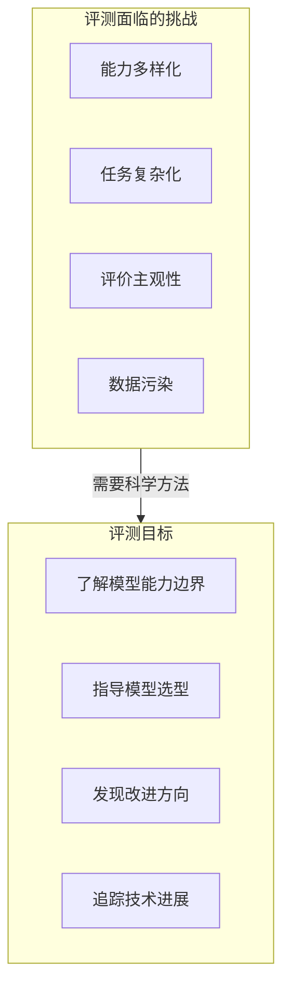

**评测的核心价值**：

1. **能力画像**：全面了解模型在不同任务上的表现
2. **横向对比**：在统一标准下比较不同模型
3. **迭代优化**：为模型训练提供反馈信号
4. **安全审计**：发现潜在的偏见和风险

## 2. 评测维度

### 2.1 评测维度全景

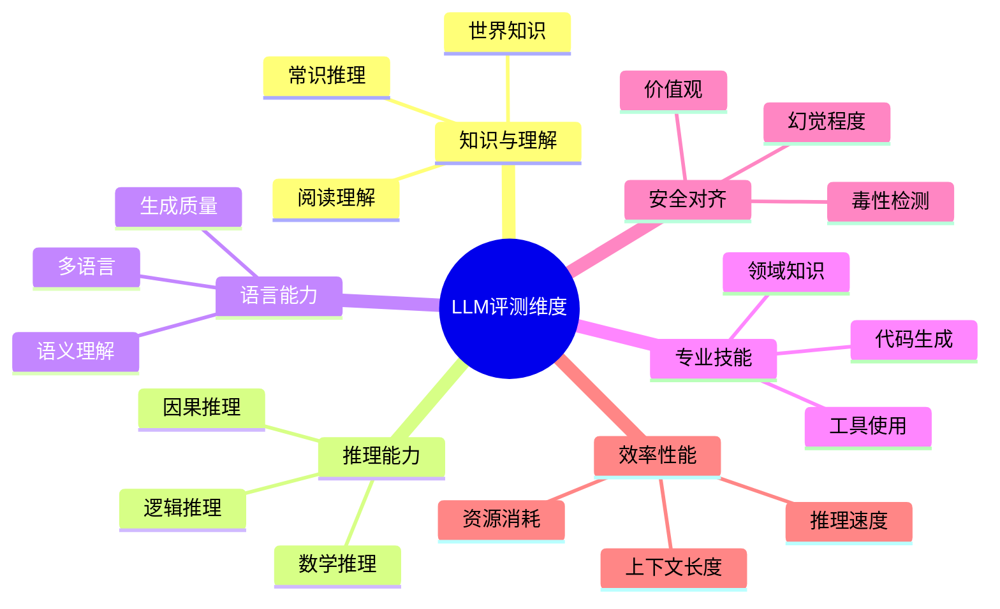

### 2.2 各维度详解

**知识与理解**

| 子维度 | 说明 | 典型测试 |
|--------|------|----------|
| 世界知识 | 事实性知识覆盖 | MMLU, TriviaQA |
| 阅读理解 | 文本理解和信息提取 | SQuAD, RACE |
| 常识推理 | 日常场景的推理判断 | HellaSwag, PIQA |

**推理能力**

| 子维度 | 说明 | 典型测试 |
|--------|------|----------|
| 数学推理 | 数学问题求解 | GSM8K, MATH |
| 逻辑推理 | 逻辑关系判断 | LogiQA, ReClor |
| 因果推理 | 因果关系识别 | COPA, e-CARE |

**专业技能**

| 子维度 | 说明 | 典型测试 |
|--------|------|----------|
| 代码生成 | 编程能力 | HumanEval, MBPP |
| 工具使用 | API/工具调用 | ToolBench, APIBench |
| 领域知识 | 专业领域能力 | MedQA, LegalBench |

## 3. 主流基准测试详解

### 3.1 MMLU (Massive Multitask Language Understanding)

**概述**：多任务语言理解基准，覆盖 57 个学科，被誉为"LLM 的高考"。

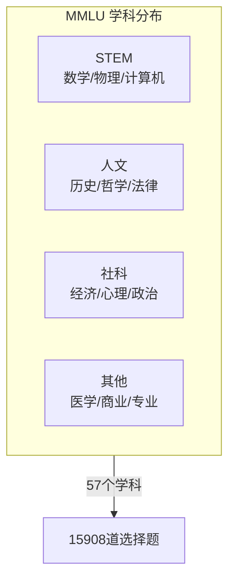

**评测方法**：
- **题型**：四选一选择题
- **测试方式**：Zero-shot 或 Few-shot (5-shot)
- **评分标准**：准确率（Accuracy）
- **基线**：随机猜测 25%，人类专家约 89.8%

**示例题目**：

```
学科：天文学
问题：以下哪个行星的自转方向与其他行星相反？
A. 火星
B. 金星
C. 木星
D. 土星
答案：B
```

**主流模型表现（2025年初）**：

| 模型 | MMLU 分数 |
|------|-----------|
| GPT-4o | 88.7% |
| Claude 3.5 Sonnet | 88.3% |
| Gemini 1.5 Pro | 85.9% |
| LLaMA-3.1-405B | 88.6% |
| Qwen2-72B | 84.2% |

**局限性**：
- 约 6.5% 题目存在错误（多答案、表述模糊）
- 以英文为主，文化多样性不足
- 存在数据污染风险

### 3.2 HellaSwag

**概述**：常识推理基准，测试模型预测日常场景后续发展的能力。

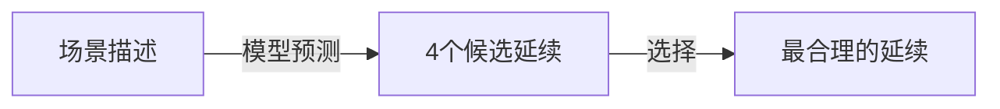

**评测方法**：
- **题型**：给定场景，选择最合理的后续
- **设计特点**：干扰项由模型生成后人工筛选，增加难度
- **评分标准**：准确率

**示例题目**：

```
场景：一个人站在厨房里，手里拿着一把刀和一根胡萝卜。

A. 他开始后空翻
B. 他把刀放进洗碗机
C. 他开始切胡萝卜
D. 他把胡萝卜扔向窗户

答案：C
```

**主流模型表现**：

| 模型 | HellaSwag 分数 |
|------|----------------|
| GPT-4 Turbo | 96.0% |
| Claude 3 Opus | 95.4% |
| LLaMA-3-70B | 88.0% |

**争议与改进**：
- 研究发现约 40% 题目存在语法或逻辑问题
- 21.1% 题目有多个合理答案
- GoldenSwag 作为修正版子集被提出

### 3.3 HumanEval

**概述**：代码生成基准，测试模型编写功能正确代码的能力。

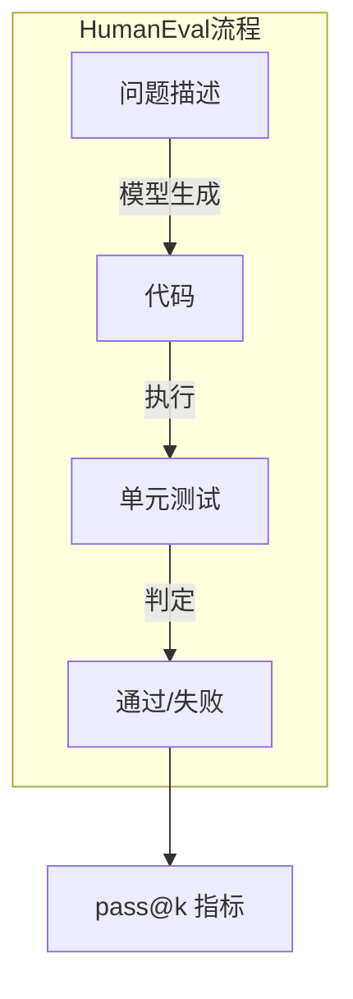

**评测方法**：
- **任务**：164 个手工编写的 Python 编程题
- **评估指标**：pass@k（k 次尝试中至少一次通过测试）
- **安全措施**：沙箱隔离、资源限制

**示例题目**：

```python
def has_close_elements(numbers: List[float], threshold: float) -> bool:
    """
    检查列表中是否存在两个数字距离小于给定阈值。
    
    >>> has_close_elements([1.0, 2.0, 3.0], 0.5)
    False
    >>> has_close_elements([1.0, 2.8, 3.0, 4.0], 0.3)
    True
    """
    # 模型需要生成实现代码
```

**主流模型表现**：

| 模型 | pass@1 |
|------|--------|
| GPT-4o | 90.2% |
| Claude 3.5 Sonnet | 92.0% |
| DeepSeek-Coder-V2 | 90.2% |
| Qwen2-72B-Instruct | 86.0% |

**扩展测试集**：
- **HumanEval+**：增强测试用例覆盖
- **MBPP**：更基础的 Python 题目（974 道）
- **MultiPL-E**：多语言代码生成

### 3.4 GSM8K

**概述**：小学数学应用题，测试多步骤数学推理能力。

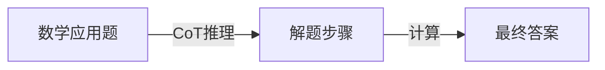

**评测方法**：
- **题目**：8500 道小学数学应用题
- **特点**：需要 2-8 步推理
- **评估**：最终答案准确率

**示例题目**：

```
问题：小明有 5 个苹果，小红给了他 3 个，他又吃掉了 2 个。
请问小明现在有几个苹果？

推理过程：
1. 小明开始有 5 个苹果
2. 小红给了他 3 个：5 + 3 = 8 个
3. 他吃掉了 2 个：8 - 2 = 6 个

答案：6
```

**主流模型表现**：

| 模型 | GSM8K 分数 |
|------|------------|
| GPT-4o | 95.8% |
| Claude 3.5 Sonnet | 96.4% |
| LLaMA-3.1-405B | 96.8% |

## 4. 2025年评测基准新发展

### 4.1 新兴高难度基准

随着模型能力的快速提升，传统基准逐渐饱和，2025年出现了更具挑战性的评测基准：

**GPQA (Graduate-Level Google-Proof Q&A)**
- 专门面向研究生水平的科学问题
- 涵盖物理、生物、化学、数学等领域
- 问题设计确保无法通过搜索直接找到答案
- 专门测试模型的深度推理和知识整合能力

**MMLU-Pro (MMLU增强版)**
- 在原 MMLU 基础上增加题目难度
- 包含更多需要多步推理的问题
- 引入动态对抗性评估机制
- 更好地区分顶尖模型的能力差异

**Big-Bench Hard (BBH) 的扩展**
- 从原始 Big-Bench 中筛选最具挑战性的23个任务
- 专注于测试模型的复杂推理能力
- 2025年新增了更多任务类型，如数学证明、程序推理

### 4.2 多模态评测基准

**MMMU (Multimodal Massive Multitask Understanding)**
- 跨学科的图文理解评测基准
- 涵盖理工科、人文学科等30个学科
- 需要模型同时理解图像和文本信息
- 测试真实的跨模态推理能力

**MathVista**
- 数学视觉推理基准
- 包含几何图形、图表分析等视觉数学问题
- 测试模型的视觉理解和数学推理结合能力

### 4.3 安全与对齐评测

**TruthfulQA 的增强版本**
- 更加注重模型的诚实性和准确性
- 新增了更多常见误解和虚假信息场景
- 测试模型避免生成虚假信息的能力

**AI Safety Benchmark**
- 专门测试模型的潜在风险
- 包括偏见检测、毒性内容生成、隐私泄露等
- Anthropic 和 OpenAI 联合推动的标准化评测

## 5. 更多基准测试

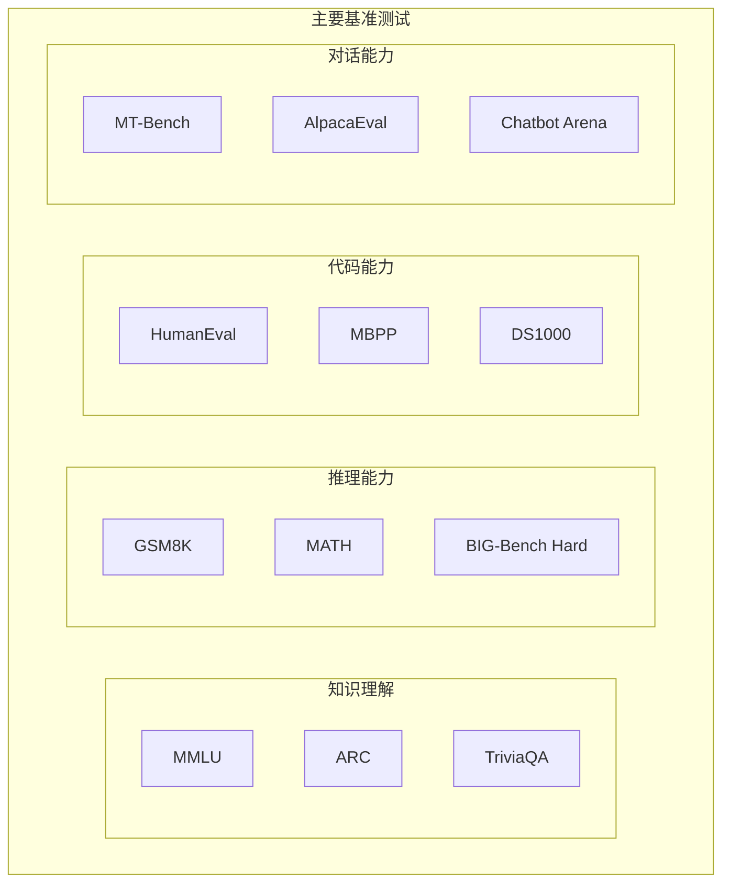

| 基准 | 评测维度 | 题目数量 | 评估方式 |
|------|----------|----------|----------|
| ARC | 科学推理 | 7787 | 选择题准确率 |
| MATH | 高等数学 | 12500 | 答案准确率 |
| WinoGrande | 常识推理 | 44000 | 二选一准确率 |
| MT-Bench | 多轮对话 | 80 | GPT-4 评分 |
| AlpacaEval | 指令遵循 | 805 | Win Rate |
| TruthfulQA | 真实性 | 817 | 真实/有信息 |

## 6. 评测方法论

### 6.1 评测范式

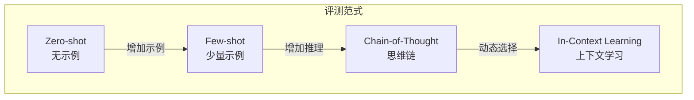

**Zero-shot vs Few-shot**

Zero-shot 直接提问模型，不提供示例：
- 优点：测试模型的真实能力，不依赖示例质量
- 缺点：可能无法完全理解任务要求

Few-shot 提供少量示例引导模型：
- 优点：帮助模型理解任务格式和要求
- 缺点：示例选择会影响结果，可能引入偏差

### 6.2 评估指标

**客观指标**

| 指标 | 计算方法 | 适用场景 |
|------|----------|----------|
| Accuracy | 正确数/总数 | 分类、选择题 |
| F1 Score | 精确率和召回率调和平均 | 序列标注 |
| BLEU | n-gram 重合度 | 翻译、生成 |
| ROUGE | 召回导向的重合度 | 摘要 |
| pass@k | k 次尝试通过率 | 代码生成 |
| Perplexity | 困惑度 | 语言建模 |

**主观指标**

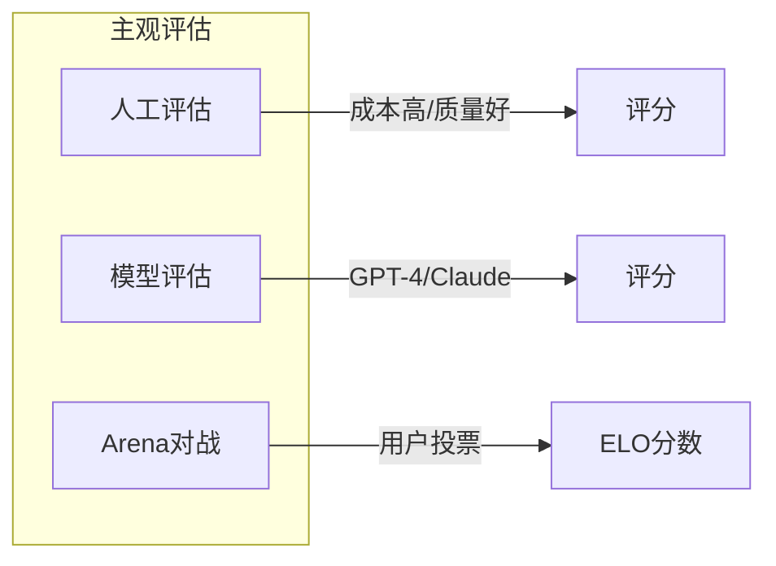

### 6.3 模型作为评委 (LLM-as-Judge)

使用强大的 LLM 评估其他模型的输出质量。这种方法的提示设计通常包括：

```
请评估以下两个回答的质量，从 1-10 打分。

用户问题：{question}

回答 A：{answer_a}

回答 B：{answer_b}

评估维度：
1. 准确性：信息是否正确
2. 相关性：是否切题
3. 完整性：是否全面
4. 清晰度：表达是否清楚

请给出评分和理由：
```

**优缺点**：

| 优点 | 缺点 |
|------|------|
| 成本低、速度快 | 存在偏见（偏好自己风格） |
| 可大规模使用 | 对细微差异不敏感 |
| 相对一致 | 位置偏见（倾向第一个） |

## 7. 主流评测系统

### 7.1 OpenCompass（司南）

**概述**：上海人工智能实验室开发的开源评测平台。

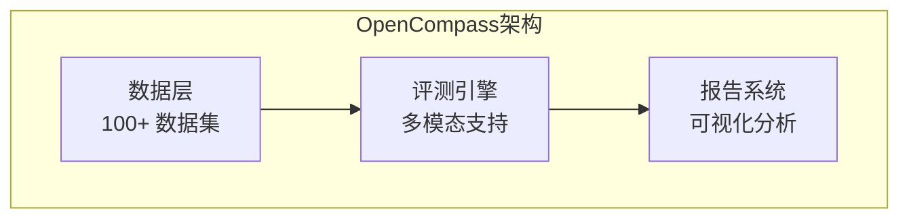

**特点**：
- 支持 100+ 评测数据集
- 支持语言模型和多模态模型
- 提供标准化评测流程
- 开源可复现

**2025年新特性**：
- 新增对 MMLU-Pro、GPQA 的支持
- 增强的多模态评测能力
- 更好的可视化分析工具
- 支持分布式评测

### 7.2 lm-evaluation-harness

**概述**：EleutherAI 开发的评测框架，被广泛使用。

**运行评测的基本流程**：
1. 指定模型和数据集
2. 配置评测参数（few-shot 数量、batch size等）
3. 执行评测并收集结果
4. 生成详细的评测报告

**特点**：
- 200+ 评测任务
- 支持多种模型接口（HuggingFace、OpenAI API 等）
- 社区活跃，持续更新
- 良好的扩展性

### 7.3 Chatbot Arena

**概述**：基于人类偏好的大规模众包评测平台。

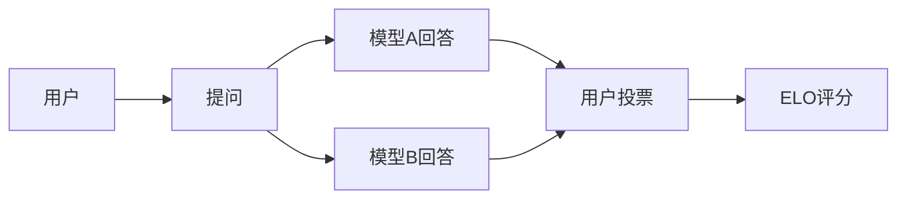

**特点**：
- 双盲对战，避免品牌偏见
- 真实用户偏好
- ELO 评分系统
- 覆盖 100+ 模型

**当前排行榜（2025年初）**：

| 排名 | 模型 | ELO 分数 |
|------|------|----------|
| 1 | GPT-4o | 1287 |
| 2 | Claude 3.5 Sonnet | 1271 |
| 3 | Gemini 1.5 Pro | 1260 |
| 4 | GPT-4 Turbo | 1256 |
| 5 | LLaMA-3.1-405B | 1247 |

### 7.4 HELM (Holistic Evaluation of Language Models)

**概述**：斯坦福大学开发的全面评测框架。

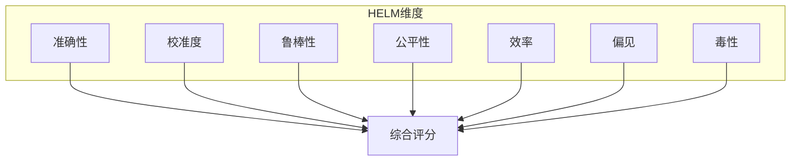

**特点**：
- 7 个核心评测维度
- 42 个场景
- 强调全面性和透明度

**2025年更新**：
- 新增多模态评测模块
- 增强的公平性评估
- 更详细的效率指标
- 支持 Agent 评测

### 7.5 OpenAI Evals

**概述**：OpenAI 开源的自定义评测框架。

**核心功能**：
- 支持自定义评测数据集
- 灵活的评估指标定义
- 与 OpenAI 模型 API 深度集成
- 社区贡献的评测库

**2025年发展**：
- 更好的多模态支持
- 增强的安全性评测
- 改进的批量评测能力

## 8. 评测挑战与趋势

### 8.1 数据污染问题

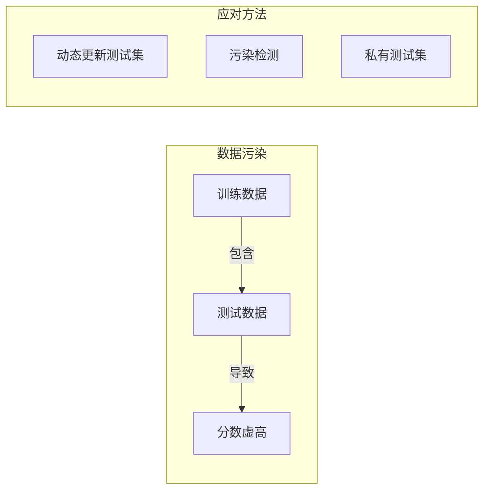

**检测方法**：
- 分析训练数据与测试数据的重叠
- 对比不同版本模型在同一测试集上的表现跳跃
- 使用 canary 字符串检测

**2025年新进展**：
- 自动化污染检测工具
- 动态生成测试题目
- 联邦评测机制

### 8.2 评测饱和

随着模型能力提升，许多基准测试已接近饱和。

| 基准 | 2022 SOTA | 2025 SOTA | 差距 |
|------|-----------|-----------|------|
| MMLU | 70.7% | 88.7% | +18% |
| HellaSwag | 89.2% | 96.0% | +6.8% |
| HumanEval | 67.0% | 92.0% | +25% |

**应对方向**：
- 开发更难的基准（MMLU-Pro、GPQA）
- 评测更复杂的能力（Agent、长上下文）
- 关注安全和对齐评测
- 引入动态评测机制

### 8.3 2025年趋势

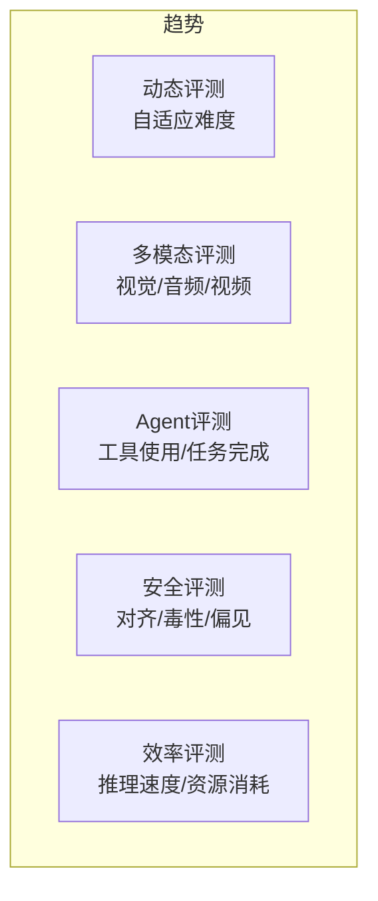

**动态评测**：
- 根据模型能力自动调整题目难度
- 实时生成新的测试题目
- 避免模型过拟合固定测试集

**Agent 评测**：
- 评测模型的工具使用能力
- 多步骤任务完成度评估
- 实际环境下的表现测试

**效率评测**：
- 推理速度和延迟测量
- 资源消耗分析
- 成本效益评估

## 9. 评测实践指南

### 9.1 选择合适的基准

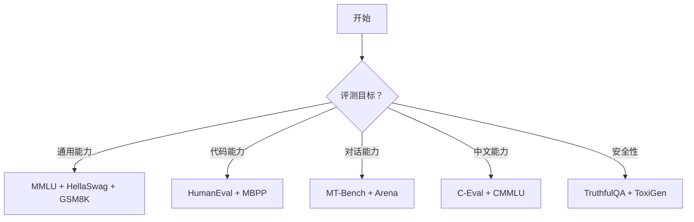

### 9.2 评测配置建议

**通用能力评测配置**：
- 数据集：MMLU、HellaSwag、ARC Challenge
- Few-shot 数量：5
- 评估指标：准确率

**推理能力评测配置**：
- 数据集：GSM8K、MATH、BBH
- Few-shot 数量：8
- 评估指标：准确率
- 使用思维链提示

**代码能力评测配置**：
- 数据集：HumanEval、MBPP
- Few-shot 数量：0（通常 zero-shot）
- 评估指标：pass@1、pass@10
- 温度设置：0.8（采样多个结果）

**安全性评测配置**：
- 数据集：TruthfulQA、ToxiGen
- Few-shot 数量：0
- 评估指标：真实性分数、毒性分数

### 9.3 结果分析

**性能画像分析**：
- 识别模型的优势领域
- 发现明显的性能短板
- 对比同类模型的表现
- 分析不同评测条件下的稳定性

**改进建议生成**：
- 基于评测结果制定改进策略
- 针对弱项调整训练数据
- 优化模型架构和训练方法
- 设计针对性的微调任务

## 10. 评测的可重复性与透明度

### 10.1 可重复性挑战

- **模型版本**：不同版本的模型可能有显著差异
- **随机种子**：采样模型的随机性影响结果
- **环境差异**：硬件和软件环境的变化
- **提示设计**：细微的提示改动可能影响结果

### 10.2 提升透明度

**标准化报告**：
- 详细的实验配置说明
- 完整的统计信息
- 错误分析和案例研究
- 与基线方法的对比

**开放数据集**：
- 提供测试数据集的访问
- 公布评分标准和方法
- 分享评测代码和工具
- 建立社区验证机制

## 11. 本章小结

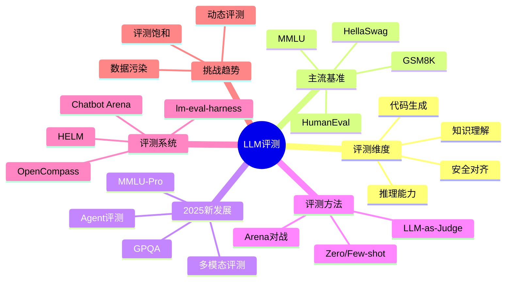

**核心要点**：
- LLM 评测需要覆盖知识、推理、代码、安全等多个维度
- 2025年出现了 GPQA、MMLU-Pro 等更具挑战性的基准
- 传统基准如 MMLU、HellaSwag 逐渐饱和，需要更难的测试
- 评测方法包括自动评测和人工/模型评估
- 数据污染和评测饱和是当前面临的主要挑战
- 评测系统正在向动态化、多模态、Agent 方向发展
- 可重复性和透明度对评测的科学性至关重要

## 思考题

1. 为什么 Chatbot Arena 的 ELO 评分被认为是最能反映真实用户偏好的指标？
2. 如何设计一个评测基准来测试模型的"常识推理"能力，同时避免 HellaSwag 的问题？
3. 对于一个即将上线的对话 AI 产品，你会如何设计评测方案？

## 延伸阅读

- [OpenCompass 官网](https://opencompass.org.cn/)
- [Chatbot Arena Leaderboard](https://chat.lmsys.org/)
- [HELM: Holistic Evaluation of Language Models](https://crfm.stanford.edu/helm/)
- [lm-evaluation-harness](https://github.com/EleutherAI/lm-evaluation-harness)
- [GPQA: Graduate-Level Google-Proof Q&A Benchmark](https://arxiv.org/abs/2311.12022)

---

*下一篇：[构建 Agent](./27-building-agents.md) - 学习如何构建具有推理和行动能力的智能代理*
