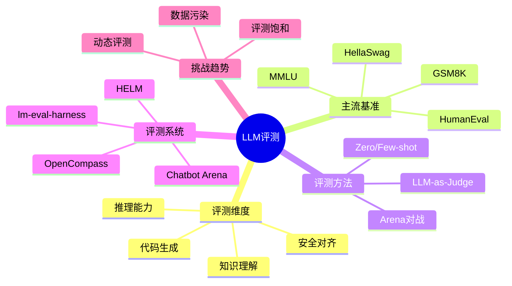

# 大模型评测

大语言模型的能力评估是一个复杂的系统工程。如何科学、全面地评测一个 LLM 的能力？本文将介绍主流的评测维度、基准测试和评测系统。

## 1. 为什么需要模型评测


**评测的核心价值**：

1. **能力画像**：全面了解模型在不同任务上的表现
2. **横向对比**：在统一标准下比较不同模型
3. **迭代优化**：为模型训练提供反馈信号
4. **安全审计**：发现潜在的偏见和风险

## 2. 评测维度

### 2.1 评测维度全景


### 2.2 各维度详解

**知识与理解**

| 子维度 | 说明 | 典型测试 |
|--------|------|----------|
| 世界知识 | 事实性知识覆盖 | MMLU, TriviaQA |
| 阅读理解 | 文本理解和信息提取 | SQuAD, RACE |
| 常识推理 | 日常场景的推理判断 | HellaSwag, PIQA |

**推理能力**

| 子维度 | 说明 | 典型测试 |
|--------|------|----------|
| 数学推理 | 数学问题求解 | GSM8K, MATH |
| 逻辑推理 | 逻辑关系判断 | LogiQA, ReClor |
| 因果推理 | 因果关系识别 | COPA, e-CARE |

**专业技能**

| 子维度 | 说明 | 典型测试 |
|--------|------|----------|
| 代码生成 | 编程能力 | HumanEval, MBPP |
| 工具使用 | API/工具调用 | ToolBench, APIBench |
| 领域知识 | 专业领域能力 | MedQA, LegalBench |

## 3. 主流基准测试详解

### 3.1 MMLU (Massive Multitask Language Understanding)

**概述**：多任务语言理解基准，覆盖 57 个学科，被誉为"LLM 的高考"。


**评测方法**：
- **题型**：四选一选择题
- **测试方式**：Zero-shot 或 Few-shot (5-shot)
- **评分标准**：准确率（Accuracy）
- **基线**：随机猜测 25%，人类专家约 89.8%

**示例题目**：

```
学科：天文学
问题：以下哪个行星的自转方向与其他行星相反？
A. 火星
B. 金星
C. 木星
D. 土星
答案：B
```

**主流模型表现（2024）**：

| 模型 | MMLU 分数 |
|------|-----------|
| GPT-4o | 88.7% |
| Claude 3.5 Sonnet | 88.3% |
| Gemini 1.5 Pro | 85.9% |
| LLaMA-3.1-405B | 88.6% |
| Qwen2-72B | 84.2% |

**局限性**：
- 约 6.5% 题目存在错误（多答案、表述模糊）
- 以英文为主，文化多样性不足
- 存在数据污染风险

### 3.2 HellaSwag

**概述**：常识推理基准，测试模型预测日常场景后续发展的能力。


**评测方法**：
- **题型**：给定场景，选择最合理的后续
- **设计特点**：干扰项由模型生成后人工筛选，增加难度
- **评分标准**：准确率

**示例题目**：

```
场景：一个人站在厨房里，手里拿着一把刀和一根胡萝卜。

A. 他开始后空翻
B. 他把刀放进洗碗机
C. 他开始切胡萝卜
D. 他把胡萝卜扔向窗户

答案：C
```

**主流模型表现**：

| 模型 | HellaSwag 分数 |
|------|----------------|
| GPT-4 Turbo | 96.0% |
| Claude 3 Opus | 95.4% |
| LLaMA-3-70B | 88.0% |

**争议与改进**：
- 研究发现约 40% 题目存在语法或逻辑问题
- 21.1% 题目有多个合理答案
- GoldenSwag 作为修正版子集被提出

### 3.3 HumanEval

**概述**：代码生成基准，测试模型编写功能正确代码的能力。


**评测方法**：
- **任务**：164 个手工编写的 Python 编程题
- **评估指标**：pass@k（k 次尝试中至少一次通过测试）
- **安全措施**：沙箱隔离、资源限制

**示例题目**：

```python
def has_close_elements(numbers: List[float], threshold: float) -> bool:
    """
    检查列表中是否存在两个数字距离小于给定阈值。
    
    >>> has_close_elements([1.0, 2.0, 3.0], 0.5)
    False
    >>> has_close_elements([1.0, 2.8, 3.0, 4.0], 0.3)
    True
    """
    # 模型需要生成实现代码
```

**主流模型表现**：

| 模型 | pass@1 |
|------|--------|
| GPT-4o | 90.2% |
| Claude 3.5 Sonnet | 92.0% |
| DeepSeek-Coder-V2 | 90.2% |
| Qwen2-72B-Instruct | 86.0% |

**扩展测试集**：
- **HumanEval+**：增强测试用例覆盖
- **MBPP**：更基础的 Python 题目（974 道）
- **MultiPL-E**：多语言代码生成

### 3.4 GSM8K

**概述**：小学数学应用题，测试多步骤数学推理能力。


**评测方法**：
- **题目**：8500 道小学数学应用题
- **特点**：需要 2-8 步推理
- **评估**：最终答案准确率

**示例题目**：

```
问题：小明有 5 个苹果，小红给了他 3 个，他又吃掉了 2 个。
请问小明现在有几个苹果？

推理过程：
1. 小明开始有 5 个苹果
2. 小红给了他 3 个：5 + 3 = 8 个
3. 他吃掉了 2 个：8 - 2 = 6 个

答案：6
```

**主流模型表现**：

| 模型 | GSM8K 分数 |
|------|------------|
| GPT-4o | 95.8% |
| Claude 3.5 Sonnet | 96.4% |
| LLaMA-3.1-405B | 96.8% |

### 3.5 更多基准测试


| 基准 | 评测维度 | 题目数量 | 评估方式 |
|------|----------|----------|----------|
| ARC | 科学推理 | 7787 | 选择题准确率 |
| MATH | 高等数学 | 12500 | 答案准确率 |
| WinoGrande | 常识推理 | 44000 | 二选一准确率 |
| MT-Bench | 多轮对话 | 80 | GPT-4 评分 |
| AlpacaEval | 指令遵循 | 805 | Win Rate |
| TruthfulQA | 真实性 | 817 | 真实/有信息 |

## 4. 评测方法论

### 4.1 评测范式


**Zero-shot vs Few-shot**

```python
# Zero-shot 示例
prompt_zero = """
问题：法国的首都是什么？
答案：
"""

# Few-shot (3-shot) 示例
prompt_few = """
问题：日本的首都是什么？
答案：东京

问题：英国的首都是什么？
答案：伦敦

问题：德国的首都是什么？
答案：柏林

问题：法国的首都是什么？
答案：
"""
```

### 4.2 评估指标

**客观指标**

| 指标 | 计算方法 | 适用场景 |
|------|----------|----------|
| Accuracy | 正确数/总数 | 分类、选择题 |
| F1 Score | 精确率和召回率调和平均 | 序列标注 |
| BLEU | n-gram 重合度 | 翻译、生成 |
| ROUGE | 召回导向的重合度 | 摘要 |
| pass@k | k 次尝试通过率 | 代码生成 |
| Perplexity | 困惑度 | 语言建模 |

**主观指标**


### 4.3 模型作为评委 (LLM-as-Judge)

使用强大的 LLM 评估其他模型的输出质量。

```python
judge_prompt = """
请评估以下两个回答的质量，从 1-10 打分。

用户问题：{question}

回答 A：{answer_a}

回答 B：{answer_b}

评估维度：
1. 准确性：信息是否正确
2. 相关性：是否切题
3. 完整性：是否全面
4. 清晰度：表达是否清楚

请给出评分和理由：
"""
```

**优缺点**：

| 优点 | 缺点 |
|------|------|
| 成本低、速度快 | 存在偏见（偏好自己风格） |
| 可大规模使用 | 对细微差异不敏感 |
| 相对一致 | 位置偏见（倾向第一个） |

## 5. 主流评测系统

### 5.1 OpenCompass（司南）

**概述**：上海人工智能实验室开发的开源评测平台。


**特点**：
- 支持 100+ 评测数据集
- 支持语言模型和多模态模型
- 提供标准化评测流程
- 开源可复现

**评测命令示例**：

```bash
# 评测 LLaMA 在 MMLU 上的表现
python run.py \
    --models llama-7b \
    --datasets mmlu \
    --partition llmeval
```

### 5.2 lm-evaluation-harness

**概述**：EleutherAI 开发的评测框架，被广泛使用。

```python
from lm_eval import evaluator, tasks

# 运行评测
results = evaluator.simple_evaluate(
    model="hf",
    model_args="pretrained=meta-llama/Llama-2-7b",
    tasks=["hellaswag", "mmlu", "arc_easy"],
    num_fewshot=5,
    batch_size=16
)

print(results["results"])
```

**特点**：
- 200+ 评测任务
- 支持多种模型接口（HuggingFace、OpenAI API 等）
- 社区活跃，持续更新

### 5.3 Chatbot Arena

**概述**：基于人类偏好的大规模众包评测平台。


**特点**：
- 双盲对战，避免品牌偏见
- 真实用户偏好
- ELO 评分系统
- 覆盖 100+ 模型

**当前排行榜（2024.12 部分数据）**：

| 排名 | 模型 | ELO 分数 |
|------|------|----------|
| 1 | GPT-4o | 1287 |
| 2 | Claude 3.5 Sonnet | 1271 |
| 3 | Gemini 1.5 Pro | 1260 |
| 4 | GPT-4 Turbo | 1256 |
| 5 | LLaMA-3.1-405B | 1247 |

### 5.4 HELM (Holistic Evaluation of Language Models)

**概述**：斯坦福大学开发的全面评测框架。


**特点**：
- 7 个核心评测维度
- 42 个场景
- 强调全面性和透明度

## 6. 评测挑战与趋势

### 6.1 数据污染问题


**检测方法**：
- 分析训练数据与测试数据的重叠
- 对比不同版本模型在同一测试集上的表现跳跃
- 使用 canary 字符串检测

### 6.2 评测饱和

随着模型能力提升，许多基准测试已接近饱和。

| 基准 | 2022 SOTA | 2024 SOTA | 差距 |
|------|-----------|-----------|------|
| MMLU | 70.7% | 88.7% | +18% |
| HellaSwag | 89.2% | 96.0% | +6.8% |
| HumanEval | 67.0% | 92.0% | +25% |

**应对方向**：
- 开发更难的基准（MMLU-Pro、GPQA）
- 评测更复杂的能力（Agent、长上下文）
- 关注安全和对齐评测

### 6.3 未来趋势


## 7. 评测实践指南

### 7.1 选择合适的基准


### 7.2 评测配置建议

```python
evaluation_config = {
    # 通用能力评测
    "general": {
        "datasets": ["mmlu", "hellaswag", "arc_challenge"],
        "few_shot": 5,
        "metrics": ["accuracy"]
    },
    
    # 推理能力评测
    "reasoning": {
        "datasets": ["gsm8k", "math", "bbh"],
        "few_shot": 8,
        "metrics": ["accuracy"],
        "use_cot": True  # 使用思维链
    },
    
    # 代码能力评测
    "coding": {
        "datasets": ["humaneval", "mbpp"],
        "few_shot": 0,  # 通常 zero-shot
        "metrics": ["pass@1", "pass@10"],
        "temperature": 0.8  # 采样多个结果
    },
    
    # 安全性评测
    "safety": {
        "datasets": ["truthfulqa", "toxigen"],
        "few_shot": 0,
        "metrics": ["mc1", "mc2", "toxicity_score"]
    }
}
```

### 7.3 结果分析

```python
def analyze_results(results: dict) -> dict:
    """分析评测结果"""
    analysis = {
        "strengths": [],
        "weaknesses": [],
        "recommendations": []
    }
    
    # 识别优势领域
    for task, score in results.items():
        if score > 0.85:
            analysis["strengths"].append(f"{task}: {score:.1%}")
        elif score < 0.60:
            analysis["weaknesses"].append(f"{task}: {score:.1%}")
    
    # 生成建议
    if "math" in [w.split(":")[0] for w in analysis["weaknesses"]]:
        analysis["recommendations"].append("考虑增加数学推理训练数据")
    
    return analysis
```

## 8. 本章小结



**核心要点**：
- LLM 评测需要覆盖知识、推理、代码、安全等多个维度
- MMLU、HellaSwag、HumanEval、GSM8K 是最常用的基准测试
- 评测方法包括自动评测和人工/模型评估
- 数据污染和评测饱和是当前面临的主要挑战
- 评测系统正在向动态化、多模态、Agent 方向发展

## 思考题

1. 为什么 Chatbot Arena 的 ELO 评分被认为是最能反映真实用户偏好的指标？
2. 如何设计一个评测基准来测试模型的"常识推理"能力，同时避免 HellaSwag 的问题？
3. 对于一个即将上线的对话 AI 产品，你会如何设计评测方案？

## 延伸阅读

- [OpenCompass 官网](https://opencompass.org.cn/)
- [Chatbot Arena Leaderboard](https://chat.lmsys.org/)
- [HELM: Holistic Evaluation of Language Models](https://crfm.stanford.edu/helm/)
- [lm-evaluation-harness](https://github.com/EleutherAI/lm-evaluation-harness)

---

*下一篇：[构建 Agent](./27-building-agents.md) - 学习如何构建具有推理和行动能力的智能代理*
