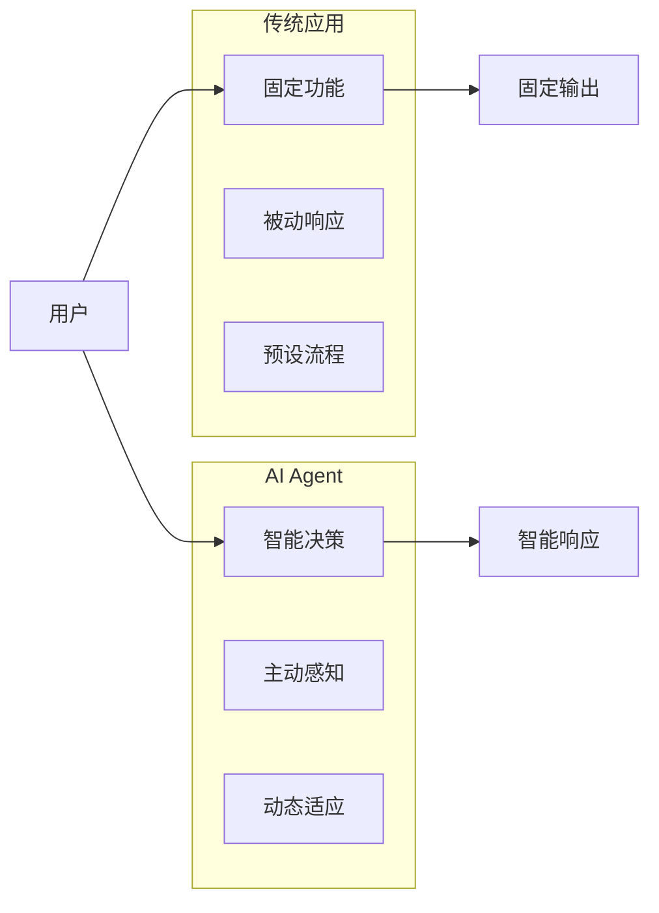
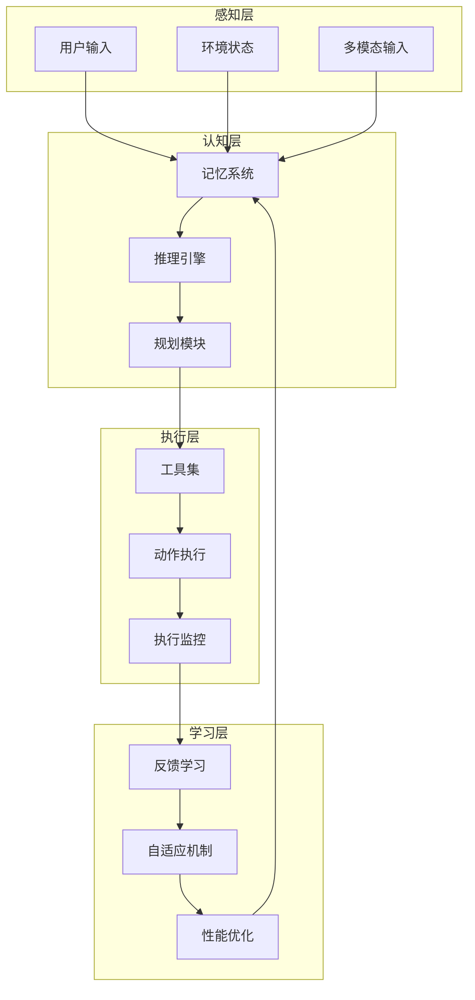
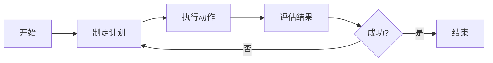
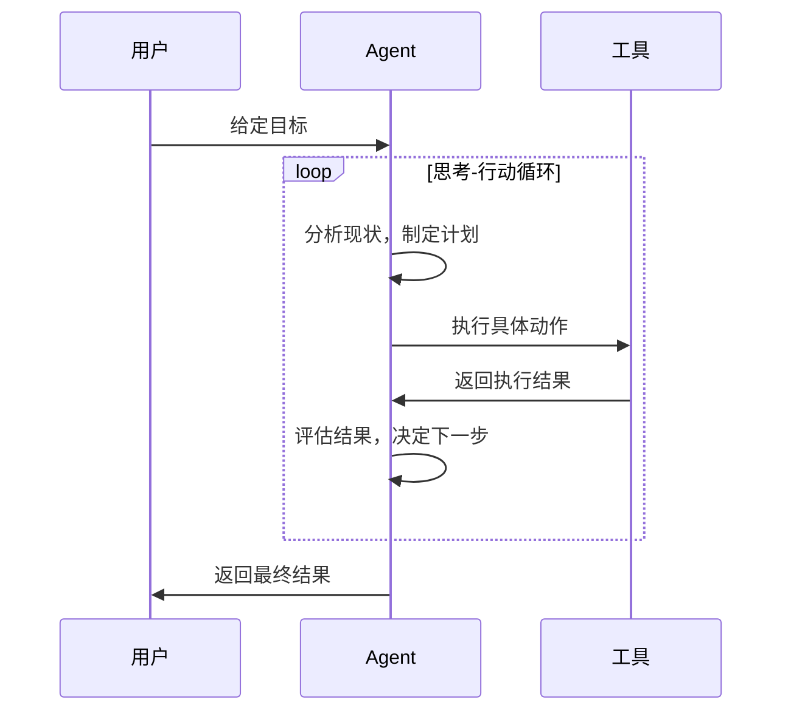

# 构建 Agent：打造自主智能体

AI Agent（智能体）是能够自主感知环境、理解任务、制定计划并执行动作的智能系统。2025年被誉为AI Agent商用元年，多智能体系统正在重塑企业运营和服务模式。本文将深入探讨Agent的核心架构、主流框架和实践方法。

## 什么是AI Agent？

### 基本定义

AI Agent是基于大语言模型构建的自主智能系统，具备以下核心特征：

**自主性（Autonomy）**：
- 能够独立制定决策和行动计划
- 不需要人工持续干预即可完成任务
- 具备自我学习和适应能力

**感知能力（Perception）**：
- 理解自然语言指令和目标
- 感知环境状态和变化
- 多模态信息处理能力

**推理规划（Reasoning & Planning）**：
- 将复杂任务分解为子任务
- 制定执行策略和步骤
- 动态调整计划应对变化

**工具使用（Tool Using）**：
- 调用外部API和服务
- 操作软件和系统
- 与数字世界交互

### Agent vs 传统应用

**关键区别**：
- 从功能驱动到目标驱动
- 从被动执行到主动规划
- 从固定流程到动态适应

## Agent核心架构

### 基础架构组件

#### 1. 感知层（Perception Layer）

**多模态输入处理**：
- 文本理解：自然语言指令解析
- 语音识别：口语指令转换
- 图像理解：视觉信息分析
- 环境感知：状态变化监测

**上下文理解**：
- 对话历史管理
- 任务背景分析
- 用户偏好识别
- 隐含意图推理

#### 2. 认知层（Cognitive Layer）

**记忆系统**：
- 短期记忆：当前对话和任务状态
- 长期记忆：历史经验和知识积累
- 工作记忆：任务执行过程中的临时信息
- 语义记忆：概念和关系网络

**推理引擎**：
- 逻辑推理：因果关系分析
- 归纳推理：从特殊到一般
- 演绎推理：从一般到特殊
- 类比推理：相似性判断

**规划模块**：
- 任务分解：复杂任务拆分
- 策略制定：行动计划设计
- 资源分配：时间和计算资源优化
- 风险评估：潜在问题识别

#### 3. 执行层（Execution Layer）

**工具生态系统**：
- API调用：外部服务集成
- 软件操作：应用界面自动化
- 数据处理：分析和计算工具
- 通信工具：消息和邮件服务

**执行监控**：
- 进度跟踪：任务执行状态
- 异常检测：错误和失败识别
- 结果验证：输出质量检查
- 回滚机制：错误恢复能力

#### 4. 学习层（Learning Layer）

**反馈学习**：
- 用户反馈收集和分析
- 成功失败模式识别
- 策略效果评估
- 知识库更新维护

**自适应机制**：
- 行为模式调整
- 偏好学习更新
- 环境变化适应
- 性能持续优化

## 主流Agent框架

### LangChain + LangGraph生态

#### LangChain基础框架

**核心组件**：
- Models：大语言模型集成接口
- Prompts：提示词管理和模板
- Chains：工作流链式组合
- Memory：记忆管理模块
- Agents：智能体框架
- Tools：工具集成系统

**LCEL（LangChain Expression Language）**：
- 声明式工作流定义
- 类型安全和异步支持
- 流式处理能力
- 组合和复用机制

#### LangGraph：状态ful工作流

**架构特点**：
- 有向图状态机设计
- 循环和条件分支支持
- 持久化状态管理
- 调试和检查点功能

**ReAct模式实现**：
- Reasoning（思考）阶段
- Acting（行动）阶段
- Observation（观察）阶段
- 循环迭代直到目标完成

### AutoGPT框架

#### 核心架构

**自主决策引擎**：
- 目标理解和分解
- 策略优化算法
- 实时风险评估
- 多Agent协作机制

**关键特性**：
- 完全自主的任务执行
- 自学习和改进能力
- Docker容器化部署
- 企业级安全控制

#### 2025年新特性

**多Agent协作**：
- 任务自动分配
- 冲突解决机制
- 知识共享协议
- 性能监控体系

**企业级功能**：
- 权限管理系统
- 审计日志记录
- 合规性检查
- SLA保证机制

### CrewAI框架

#### 设计理念

**团队协作模式**：
- 基于角色的Agent定义
- 组织结构模拟
- 任务分工协作
- 团队工作流编排

**双核心设计**：
- Crews：高层协调管理
- Flows：事件驱动执行

#### 角色化Agent

**常见角色类型**：
- Researcher：信息收集和研究
- Analyst：数据分析和洞察
- Writer：内容创作和编辑
- Reviewer：质量审核和验证

**工具集成能力**：
- SQL数据库操作
- REST API调用
- 自定义函数集成
- 文件系统访问

### AutoGen框架

#### 多智能体对话

**对话模式**：
- 群聊式协作
- 结构化消息传递
- 上下文共享机制
- 协议驱动的交互

**应用场景**：
- 软件开发自动化
- 代码生成和调试
- 复杂问题求解
- 创意内容协作

## Agent设计模式

### ReAct模式

Reasoning + Acting的经典模式：

**实施要点**：
- 明确的思考步骤记录
- 工具选择的理性依据
- 结果评估的客观标准
- 循环终止的明确条件

### 计划执行模式

**分层规划**：
- 战略层：总体目标和约束
- 战术层：具体策略和方法
- 执行层：具体动作和操作

**动态调整**：
- 执行效果实时监控
- 计划灵活调整机制
- 异常情况的应对策略
- 资源重新分配能力

### 协作模式

**主从协作**：
- 主Agent负责总体协调
- 从Agent专注具体任务
- 层次化的管理结构
- 清晰的汇报关系

**平等协作**：
- 多个Agent平等参与
- 基于能力的任务分配
- 民主决策机制
- 共识达成过程

## 2025年技术趋势

### 商用化元年

**企业级应用爆发**：
- 15%的企业决策将由Agentic AI处理
- 金融、制造、医疗等行业深度应用
- ROI显著提升，投资回报周期缩短
- 标准化和规模化部署加速

**行业解决方案**：
- 制造业：生产线优化和质量控制
- 金融业：风险评估和客户服务
- 零售业：个性化推荐和库存管理
- 医疗业：诊断辅助和患者管理

### 多模态Agent

**统一多模态理解**：
- 文本、图像、音频、视频统一处理
- 跨模态推理和知识迁移
- 沉浸式交互体验
- 创意内容生成能力

**应用场景扩展**：
- 视觉导航Agent
- 语音交互Agent
- 视频分析Agent
- 多媒体创作Agent

### 群体智能

**大规模Agent协作**：
- 数百个Agent协同工作
- 复杂任务的分布式处理
- 智能负载均衡
- 故障自愈能力

**涌现行为**：
- 简单规则产生复杂行为
- 群体智慧超越个体
- 自组织协作模式
- 适应性群体决策

### 安全与可控

**安全保障机制**：
- 沙箱执行环境
- 权限细粒度控制
- 行为审计追踪
- 安全边界设置

**可控性增强**：
- 人类监督机制
- 紧急停止功能
- 行为预测和干预
- 价值对齐保证

## 实践开发指南

### Agent开发流程

#### 1. 需求分析和设计

**目标明确化**：
- 定义Agent的具体任务
- 确定成功标准和评估指标
- 分析目标用户和使用场景
- 识别技术约束和限制

**架构设计**：
- 选择合适的框架和工具
- 设计Agent的内部结构
- 定义角色和职责分工
- 规划数据流和控制流

#### 2. 核心功能开发

**感知模块开发**：
- 实现多模态输入处理
- 建立上下文理解机制
- 设计用户接口和交互方式
- 确保输入的安全性和可靠性

**推理和规划**：
- 实现任务分解算法
- 建立策略选择机制
- 设计动态调整能力
- 集成领域知识库

**工具集成**：
- 开发必要的工具接口
- 实现工具调用机制
- 建立工具注册和发现
- 确保工具的安全使用

#### 3. 测试和优化

**功能测试**：
- 单元测试各个模块
- 集成测试整体功能
- 边界测试和异常处理
- 性能测试和压力测试

**效果优化**：
- 调优提示词和策略
- 优化工具调用逻辑
- 改进记忆管理机制
- 提升响应速度和质量

### 开发最佳实践

#### 模块化设计

**组件解耦**：
- 独立的功能模块
- 清晰的接口定义
- 松耦合的架构设计
- 易于测试和维护

**可扩展性**：
- 插件式的工具集成
- 动态的功能加载
- 配置驱动的行为调整
- 版本兼容性保证

#### 安全优先

**输入验证**：
- 恶意输入检测
- 参数合法性检查
- 注入攻击防护
- 数据隐私保护

**执行安全**：
- 沙箱环境隔离
- 资源使用限制
- 行为监控和审计
- 异常情况处理

#### 用户体验设计

**交互友好**：
- 自然语言交互界面
- 实时进度反馈
- 错误信息清晰友好
- 多种输出格式支持

**个性化定制**：
- 用户偏好学习
- 行为模式适应
- 个性化建议提供
- 界面风格定制

### 工具和平台选择

#### 开发框架对比

| 框架 | 优势 | 适用场景 | 学习曲线 |
|------|------|----------|----------|
| LangGraph | 强大的状态管理、成熟生态 | 复杂工作流、企业应用 | 中等 |
| AutoGPT | 完全自主、企业级功能 | 目标驱动任务 | 较高 |
| CrewAI | 易于使用、快速原型 | 团队协作、演示项目 | 较低 |
| AutoGen | 多Agent对话、代码生成 | 软件开发、协作任务 | 中等 |

#### 部署平台选择

**云服务部署**：
- AWS Lambda无服务器
- Azure Functions函数计算
- Google Cloud Functions
- 阿里云函数计算

**容器化部署**：
- Docker容器化
- Kubernetes编排
- 微服务架构
- 边缘计算部署

## 行业应用案例

### 金融服务

#### 智能投顾Agent

**核心功能**：
- 客户风险偏好分析
- 个性化投资建议
- 市场实时监控
- 投资组合优化

**技术架构**：
- 多Agent协作模式
- 实时数据处理
- 风险控制引擎
- 合规检查机制

**实施效果**：
- 客户满意度提升30%
- 投资建议准确性提高25%
- 运营成本降低40%
- 合规风险显著降低

### 制造业

#### 生产调度Agent

**应用场景**：
- 生产计划优化
- 设备状态监控
- 质量控制检测
- 供应链协调

**技术特点**：
- 实时数据采集
- 预测性维护
- 多目标优化
- 自适应调度

**业务价值**：
- 生产效率提升20%
- 设备故障率降低35%
- 产品质量改善15%
- 库存成本降低25%

### 医疗健康

#### 诊断辅助Agent

**核心能力**：
- 病历信息分析
- 医学影像理解
- 诊断建议生成
- 治疗方案推荐

**安全保证**：
- 医生审核机制
- 诊断置信度评估
- 异常情况预警
- 隐私保护措施

**临床效果**：
- 诊断准确率提升18%
- 医生工作效率提高40%
- 漏诊误诊率降低22%
- 患者满意度显著提升

### 电子商务

#### 客服Agent

**服务能力**：
- 智能问答响应
- 订单状态查询
- 售后问题处理
- 个性化推荐

**技术特色**：
- 多轮对话理解
- 情感识别和响应
- 知识库自动更新
- 人工转接机制

**运营指标**：
- 客服响应时间缩短80%
- 问题解决率提升25%
- 客户满意度提高35%
- 人工客服成本降低60%

## 挑战与解决方案

### 技术挑战

#### 可靠性和稳定性

**问题识别**：
- 模型幻觉导致的错误决策
- 工具调用的失败处理
- 长期任务的一致性保证
- 异常情况的恢复能力

**解决方案**：
- 多重验证机制
- 容错和重试策略
- 检查点和恢复机制
- 人类监督干预

#### 可扩展性

**性能瓶颈**：
- 大规模并发处理
- 内存和计算资源消耗
- 状态管理的复杂性
- 网络通信延迟

**优化策略**：
- 分布式架构设计
- 缓存和批处理优化
- 负载均衡机制
- 异步处理模式

### 安全与伦理挑战

#### 安全风险

**主要威胁**：
- 敏感信息泄露
- 恶意指令执行
- 系统入侵攻击
- 数据篡改破坏

**防护措施**：
- 访问控制和权限管理
- 数据加密和脱敏
- 安全审计和监控
- 定期安全评估

#### 伦理问题

**关键考量**：
- 决策的公平性和透明度
- 算法偏见和歧视问题
- 责任归属和问责机制
- 社会影响和就业冲击

**应对策略**：
- 伦理准则制定
- 算法审计和改进
- 透明度增强措施
- 利益相关者参与

### 成本和效益平衡

#### 成本控制

**主要成本**：
- 开发和实施成本
- 计算资源消耗
- 维护和更新费用
- 人员培训投入

**优化措施**：
- 云原生架构
- 资源按需使用
- 自动化运维
- 分阶段实施

#### 价值实现

**评估指标**：
- 投资回报率（ROI）
- 业务效率提升
- 用户体验改善
- 创新能力增强

**成功要素**：
- 明确的业务目标
- 合适的技术选择
- 持续的优化改进
- 组织变革配合

## 未来发展方向

### 技术演进趋势

#### AGI路径探索

**通专融合**：
- 通用智能体与专门智能体结合
- 基础模型与领域知识融合
- 符号推理与神经网络结合
- 认知架构深度优化

**能力提升**：
- 抽象思维能力
- 创造性解决问题
- 跨领域知识迁移
- 自主学习和适应

#### 人机协作新模式

**协同智能**：
- 人类智慧与AI能力互补
- 直觉与理性结合决策
- 经验与数据融合分析
- 创造力与执行力协同

**交互进化**：
- 自然直观的交互方式
- 情感和意图深度理解
- 个性化和情境化响应
- 多模态无缝体验

### 应用前景展望

#### 行业深度渗透

**全面智能化**：
- 从辅助工具到核心决策
- 从单点应用到端到端流程
- 从成本中心到价值创造
- 从效率提升到模式创新

**新兴领域**：
- 科学研究加速
- 教育个性化
- 创意内容生产
- 社会治理优化

#### 社会影响深远

**生产力革命**：
- 知识工作者效率大幅提升
- 复杂问题解决能力增强
- 创新速度和质量改善
- 全球协作效率提升

**社会变革**：
- 工作方式和组织变革
- 教育体系和技能要求变化
- 人机关系重新定义
- 伦理和法律框架演进

## 本章小结

AI Agent代表了人工智能发展的新阶段，正在从工具转向伙伴，从执行者转向协作者：

- **核心特征**：自主性、感知能力、推理规划、工具使用
- **技术架构**：感知层、认知层、执行层、学习层的完整体系
- **主流框架**：LangGraph、AutoGPT、CrewAI、AutoGen各有所长
- **2025趋势**：商用化爆发、多模态融合、群体智能、安全可控
- **实践指导**：系统化开发流程、模块化设计、安全优先、用户中心

对于LLM初学者来说，理解Agent的基本原理和开发方法，将帮助你在AI应用的新浪潮中把握机遇，构建真正智能化的应用系统。

## 延伸阅读

- LangChain Documentation and Tutorials
- AutoGPT: Autonomous GPT-4 Agent
- CrewAI: Multi-Agent Framework
- AutoGen: Multi-Agent Conversation Framework
- ReAct: Synergizing Reasoning and Acting in Language Models

---

*基础学习篇完*