# 构建 Agent：从推理到行动

大语言模型不仅能够生成文本，还能够作为"大脑"驱动智能代理（Agent）完成复杂任务。本文将介绍构建 LLM Agent 的核心框架，包括 ReAct、Reflexion 和 Tree of Thought。

## 1. 什么是 LLM Agent

### 1.1 定义

**LLM Agent** 是一个以大语言模型为核心的自主系统，能够感知环境、进行推理、制定计划并执行行动来完成目标任务。

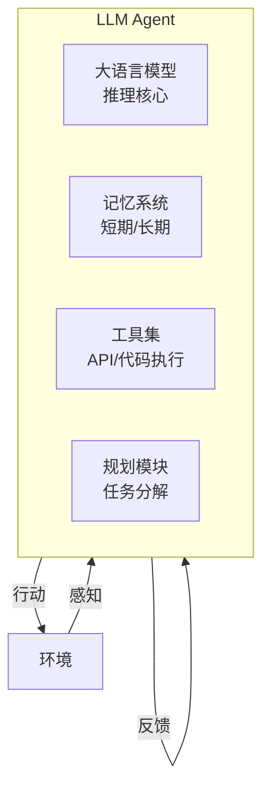

### 1.2 Agent 与传统 LLM 应用的区别

| 特性 | 传统 LLM 应用 | LLM Agent |
|------|--------------|-----------|
| 交互模式 | 单轮问答 | 多轮自主交互 |
| 能力边界 | 仅文本生成 | 可调用外部工具 |
| 执行方式 | 被动响应 | 主动规划执行 |
| 状态管理 | 无状态 | 有状态，带记忆 |
| 错误处理 | 无自我纠正 | 可反思改进 |

### 1.3 Agent 的核心能力

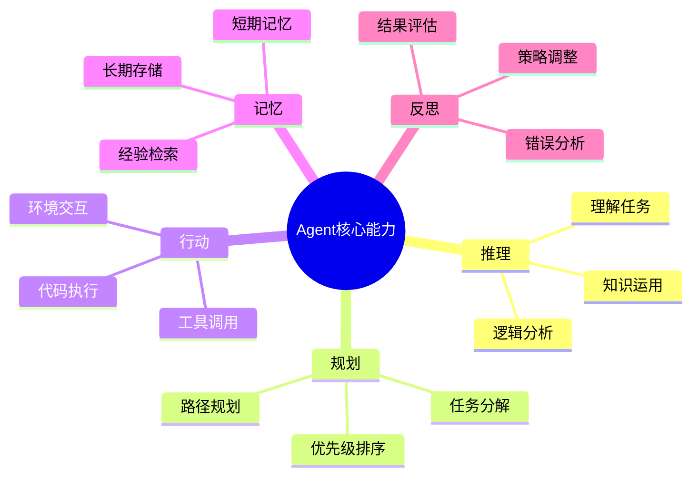

## 2. ReAct：推理与行动的结合

### 2.1 核心思想

**ReAct**（Reasoning and Acting）将推理（Thought）和行动（Action）交织在一起，让模型在执行任务时既能"思考"又能"动手"。

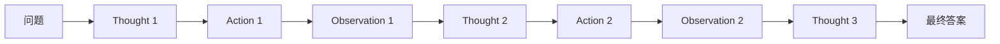

**三个核心组件**：

1. **Thought（思考）**：模型的推理过程，分析当前状态，决定下一步
2. **Action（行动）**：调用工具或执行操作
3. **Observation（观察）**：获取行动的结果

### 2.2 ReAct 工作流程

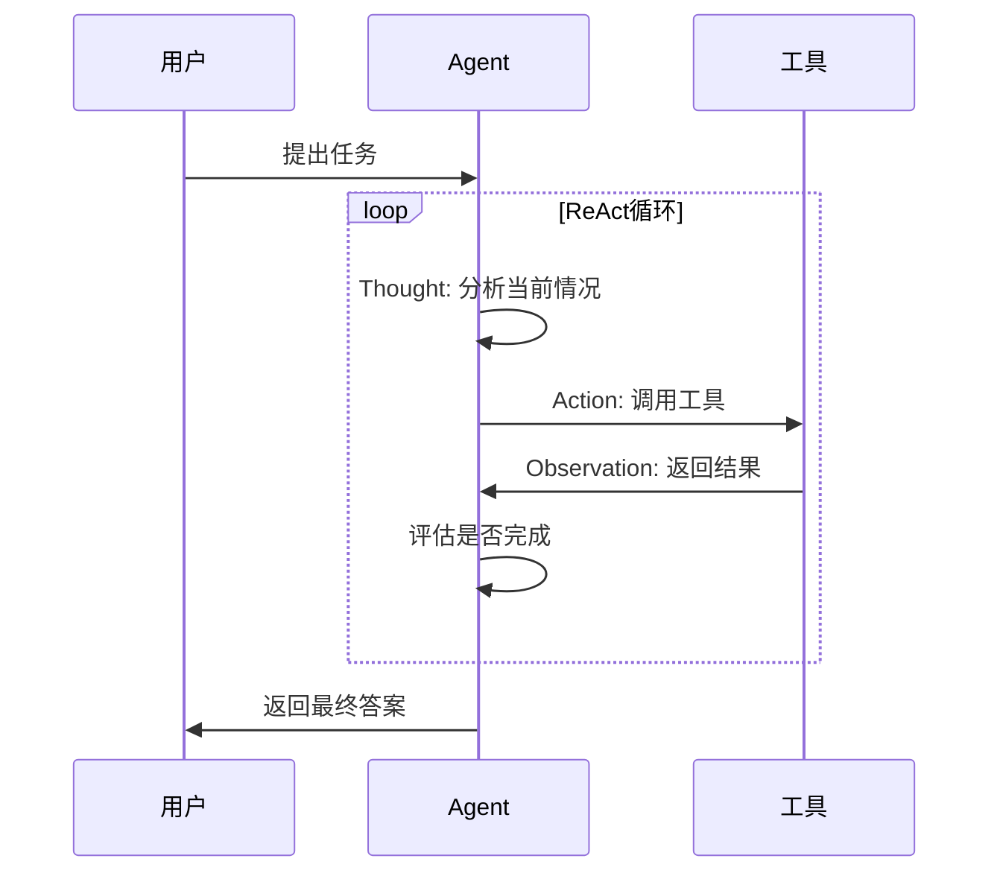

### 2.3 ReAct 实现

```python
from typing import Callable, Dict, List

class ReActAgent:
    def __init__(self, llm, tools: Dict[str, Callable], max_steps: int = 10):
        self.llm = llm
        self.tools = tools
        self.max_steps = max_steps
        self.history = []
        
    def run(self, task: str) -> str:
        """执行 ReAct 循环"""
        self.history = []
        
        for step in range(self.max_steps):
            # 生成 Thought 和 Action
            prompt = self._build_prompt(task)
            response = self.llm.generate(prompt)
            
            # 解析响应
            thought, action, action_input = self._parse_response(response)
            
            # 记录 Thought
            self.history.append(f"Thought {step+1}: {thought}")
            
            # 检查是否完成
            if action == "Finish":
                return action_input
            
            # 执行 Action
            if action in self.tools:
                observation = self.tools[action](action_input)
            else:
                observation = f"未知工具: {action}"
            
            # 记录 Action 和 Observation
            self.history.append(f"Action {step+1}: {action}[{action_input}]")
            self.history.append(f"Observation {step+1}: {observation}")
        
        return "达到最大步数限制"
    
    def _build_prompt(self, task: str) -> str:
        """构建提示词"""
        tools_desc = "\n".join([
            f"- {name}: {func.__doc__}" 
            for name, func in self.tools.items()
        ])
        
        history_text = "\n".join(self.history)
        
        return f"""
你是一个能够使用工具解决问题的智能助手。

可用工具：
{tools_desc}
- Finish: 当任务完成时使用，输入为最终答案

任务：{task}

{history_text}

请按以下格式输出：
Thought: 你的思考过程
Action: 工具名称
Action Input: 工具输入

"""
    
    def _parse_response(self, response: str) -> tuple:
        """解析模型响应"""
        thought = ""
        action = ""
        action_input = ""
        
        for line in response.split("\n"):
            if line.startswith("Thought:"):
                thought = line[8:].strip()
            elif line.startswith("Action:"):
                action = line[7:].strip()
            elif line.startswith("Action Input:"):
                action_input = line[13:].strip()
        
        return thought, action, action_input


# 定义工具
def search(query: str) -> str:
    """搜索互联网获取信息"""
    # 模拟搜索
    return f"搜索结果：关于 '{query}' 的信息..."

def calculator(expression: str) -> str:
    """计算数学表达式"""
    try:
        result = eval(expression)
        return str(result)
    except:
        return "计算错误"

def lookup(term: str) -> str:
    """查询知识库"""
    # 模拟知识库查询
    return f"'{term}' 的定义是..."

# 使用示例
tools = {
    "Search": search,
    "Calculator": calculator,
    "Lookup": lookup
}

agent = ReActAgent(llm, tools)
result = agent.run("2024年诺贝尔物理学奖得主是谁？他们的主要贡献是什么？")
```

### 2.4 ReAct 示例执行过程

```
任务：2024年美国总统大选的获胜者是谁？

Thought 1: 我需要搜索2024年美国总统大选的结果
Action: Search
Action Input: 2024 US presidential election winner

Observation 1: 2024年美国总统大选于11月5日举行，共和党候选人
唐纳德·特朗普获胜，将成为美国第47任总统。

Thought 2: 我已经获得了所需信息，可以给出最终答案
Action: Finish
Action Input: 2024年美国总统大选的获胜者是唐纳德·特朗普，
他将成为美国第47任总统。
```

### 2.5 ReAct 的优势与局限

| 优势 | 局限 |
|------|------|
| 推理过程可解释 | 可能陷入循环 |
| 可利用外部工具 | 依赖工具质量 |
| 适应复杂任务 | Token 消耗较大 |
| 支持多步推理 | 需要精心设计提示词 |

## 3. Reflexion：自我反思与改进

### 3.1 核心思想

**Reflexion** 赋予 Agent 自我反思能力，通过评估自身输出并生成改进策略来提升表现。

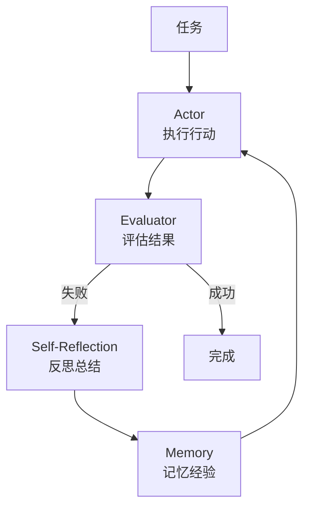

### 3.2 Reflexion 三要素

1. **Actor（执行者）**：执行任务的 Agent，可以是 ReAct 风格
2. **Evaluator（评估者）**：评估执行结果，判断成功/失败
3. **Self-Reflection（自我反思）**：分析失败原因，生成改进策略

### 3.3 Reflexion 实现

```python
class ReflexionAgent:
    def __init__(self, llm, tools: dict, max_trials: int = 3):
        self.llm = llm
        self.tools = tools
        self.max_trials = max_trials
        self.memory = []  # 存储反思经验
        
    def run(self, task: str, ground_truth: str = None) -> str:
        """执行 Reflexion 循环"""
        
        for trial in range(self.max_trials):
            # 1. Actor: 执行任务
            result = self._act(task)
            
            # 2. Evaluator: 评估结果
            is_success, feedback = self._evaluate(result, ground_truth)
            
            if is_success:
                return result
            
            # 3. Self-Reflection: 反思并记忆
            reflection = self._reflect(task, result, feedback)
            self.memory.append({
                "trial": trial + 1,
                "result": result,
                "feedback": feedback,
                "reflection": reflection
            })
        
        return f"尝试 {self.max_trials} 次后仍未成功"
    
    def _act(self, task: str) -> str:
        """执行任务"""
        # 构建包含历史反思的提示
        memory_text = self._format_memory()
        
        prompt = f"""
任务：{task}

历史经验：
{memory_text if memory_text else "无"}

请完成任务并给出答案：
"""
        return self.llm.generate(prompt)
    
    def _evaluate(self, result: str, ground_truth: str) -> tuple:
        """评估结果"""
        if ground_truth:
            # 有标准答案时直接比较
            is_success = self._compare(result, ground_truth)
            feedback = "正确" if is_success else f"期望答案：{ground_truth}"
        else:
            # 使用 LLM 评估
            is_success, feedback = self._llm_evaluate(result)
        
        return is_success, feedback
    
    def _reflect(self, task: str, result: str, feedback: str) -> str:
        """生成反思"""
        prompt = f"""
任务：{task}
我的回答：{result}
评估反馈：{feedback}

请分析失败原因并总结经验教训：
1. 哪里出错了？
2. 应该如何改进？
3. 下次应该注意什么？

反思总结：
"""
        return self.llm.generate(prompt)
    
    def _format_memory(self) -> str:
        """格式化记忆"""
        if not self.memory:
            return ""
        
        texts = []
        for m in self.memory:
            texts.append(f"""
尝试 {m['trial']}:
- 结果：{m['result'][:100]}...
- 反馈：{m['feedback']}
- 反思：{m['reflection']}
""")
        return "\n".join(texts)
    
    def _compare(self, result: str, ground_truth: str) -> bool:
        """比较答案"""
        # 简化比较，实际应用中可能更复杂
        return ground_truth.lower() in result.lower()
    
    def _llm_evaluate(self, result: str) -> tuple:
        """使用 LLM 评估"""
        prompt = f"""
评估以下回答的质量：
{result}

请判断回答是否合理完整，输出格式：
成功：是/否
反馈：评价说明
"""
        response = self.llm.generate(prompt)
        # 解析响应...
        return False, "需要改进"
```

### 3.4 Reflexion 示例

```
任务：写一个函数判断字符串是否是回文

===== 尝试 1 =====
def is_palindrome(s):
    return s == s[::-1]

评估：失败 - 未处理大小写和特殊字符
反思：函数没有考虑大小写敏感问题，也没有过滤非字母字符。
下次应该先预处理字符串。

===== 尝试 2 =====
def is_palindrome(s):
    s = s.lower()
    s = ''.join(c for c in s if c.isalnum())
    return s == s[::-1]

评估：成功
```

### 3.5 Reflexion 的应用场景

| 场景 | 说明 |
|------|------|
| 代码生成 | 根据测试结果反思改进代码 |
| 数学推理 | 检查计算步骤，修正错误 |
| 问答系统 | 验证答案，补充遗漏信息 |
| 决策任务 | 评估策略效果，调整方案 |

## 4. Tree of Thought：探索多条推理路径

### 4.1 核心思想

**Tree of Thought (ToT)** 将推理过程组织为树状结构，通过探索多条路径找到最优解决方案。

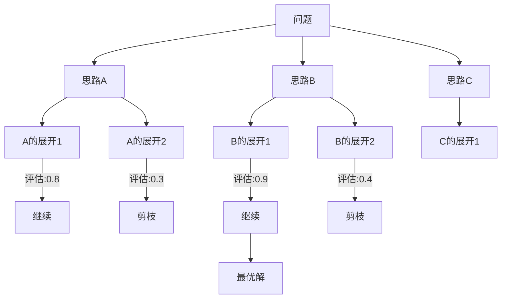

### 4.2 ToT vs CoT

| 特性 | Chain of Thought | Tree of Thought |
|------|------------------|-----------------|
| 结构 | 线性链 | 树状结构 |
| 路径数 | 单一路径 | 多条路径 |
| 回溯 | 不支持 | 支持 |
| 搜索 | 无 | BFS/DFS |
| 适用场景 | 简单推理 | 复杂决策 |

### 4.3 ToT 的三个核心操作

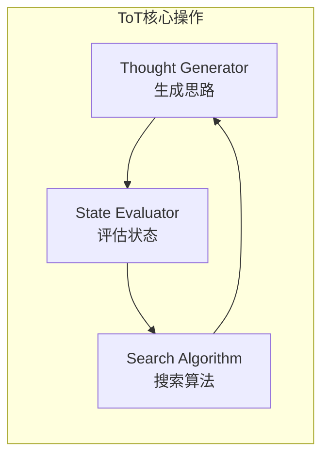

1. **Thought Generator**：生成当前状态下的可能思路
2. **State Evaluator**：评估每个思路的质量/潜力
3. **Search Algorithm**：决定探索顺序（BFS/DFS）

### 4.4 ToT 实现

```python
from typing import List, Tuple
import heapq

class TreeOfThought:
    def __init__(self, llm, max_depth: int = 5, beam_width: int = 3):
        self.llm = llm
        self.max_depth = max_depth
        self.beam_width = beam_width  # 每层保留的节点数
        
    def solve(self, problem: str) -> str:
        """使用 ToT 解决问题"""
        # 初始状态
        initial_state = {
            "problem": problem,
            "thoughts": [],
            "depth": 0
        }
        
        # BFS 搜索
        return self._bfs_search(initial_state)
    
    def _bfs_search(self, initial_state: dict) -> str:
        """广度优先搜索"""
        queue = [(0, initial_state)]  # (负分数, 状态)
        
        while queue:
            _, current_state = heapq.heappop(queue)
            
            # 检查是否达到终止条件
            if self._is_terminal(current_state):
                return self._format_solution(current_state)
            
            # 检查深度限制
            if current_state["depth"] >= self.max_depth:
                continue
            
            # 生成子节点
            children = self._generate_thoughts(current_state)
            
            # 评估并选择最优的 beam_width 个
            scored_children = []
            for child in children:
                score = self._evaluate_state(child)
                scored_children.append((score, child))
            
            # 保留得分最高的节点
            scored_children.sort(key=lambda x: x[0], reverse=True)
            for score, child in scored_children[:self.beam_width]:
                heapq.heappush(queue, (-score, child))
        
        return "未找到解决方案"
    
    def _generate_thoughts(self, state: dict) -> List[dict]:
        """生成可能的思路"""
        prompt = f"""
问题：{state['problem']}
当前推理过程：
{self._format_thoughts(state['thoughts'])}

请生成 3 个不同的下一步思路：
1. 
2. 
3. 
"""
        response = self.llm.generate(prompt)
        thoughts = self._parse_thoughts(response)
        
        children = []
        for thought in thoughts:
            child_state = {
                "problem": state["problem"],
                "thoughts": state["thoughts"] + [thought],
                "depth": state["depth"] + 1
            }
            children.append(child_state)
        
        return children
    
    def _evaluate_state(self, state: dict) -> float:
        """评估状态的质量"""
        prompt = f"""
问题：{state['problem']}
推理过程：
{self._format_thoughts(state['thoughts'])}

请评估这个推理过程的质量（0-10分）：
- 逻辑是否正确？
- 是否朝着解决方案前进？
- 是否遗漏重要信息？

评分：
"""
        response = self.llm.generate(prompt)
        try:
            score = float(response.strip().split()[0])
            return score / 10.0
        except:
            return 0.5
    
    def _is_terminal(self, state: dict) -> bool:
        """判断是否到达终止状态"""
        if not state["thoughts"]:
            return False
        
        last_thought = state["thoughts"][-1]
        # 检查是否包含最终答案
        return "最终答案" in last_thought or "答案是" in last_thought
    
    def _format_thoughts(self, thoughts: List[str]) -> str:
        """格式化思路列表"""
        if not thoughts:
            return "（暂无）"
        return "\n".join([f"{i+1}. {t}" for i, t in enumerate(thoughts)])
    
    def _format_solution(self, state: dict) -> str:
        """格式化最终解决方案"""
        return "\n".join([
            "推理过程：",
            self._format_thoughts(state["thoughts"]),
            "",
            f"答案：{state['thoughts'][-1]}"
        ])
    
    def _parse_thoughts(self, response: str) -> List[str]:
        """解析生成的思路"""
        thoughts = []
        for line in response.split("\n"):
            line = line.strip()
            if line and line[0].isdigit():
                # 移除数字前缀
                thought = line.split(".", 1)[-1].strip()
                if thought:
                    thoughts.append(thought)
        return thoughts[:3]  # 最多返回3个
```

### 4.5 ToT 示例：24点游戏

```
问题：使用 4, 9, 10, 13 四个数字和加减乘除运算得到 24

===== 思路探索 =====
层级1：
├── 思路A: 先尝试乘法 4 × 9 = 36 [评分: 0.6]
├── 思路B: 先尝试 13 - 9 = 4 [评分: 0.7]
└── 思路C: 先尝试 10 + 13 = 23 [评分: 0.5]

选择思路B继续（得分最高）...

层级2：
├── 思路B1: 4 × 4 = 16, 然后 16 + 10 = 26 [评分: 0.4]
├── 思路B2: 4 × 10 = 40, 然后... [评分: 0.5]
└── 思路B3: 4 × (10 - 4) = 24! [评分: 1.0]

===== 解决方案 =====
(13 - 9) × (10 - 4) = 4 × 6 = 24
```

### 4.6 搜索算法选择

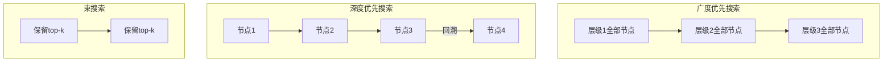

| 算法 | 优点 | 缺点 | 适用场景 |
|------|------|------|----------|
| BFS | 找到最短路径 | 内存消耗大 | 解空间较小 |
| DFS | 内存效率高 | 可能陷入深层 | 需要回溯 |
| Beam | 平衡效率和质量 | 可能错过最优 | 大多数场景 |

## 5. 高级 Agent 架构

### 5.1 多 Agent 协作

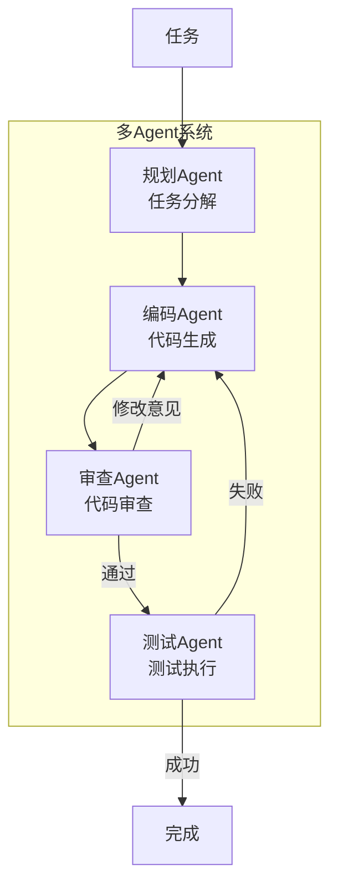

```python
class MultiAgentSystem:
    def __init__(self, agents: dict):
        self.agents = agents
        self.message_bus = []
        
    def run(self, task: str) -> str:
        """运行多 Agent 协作"""
        # 1. 规划 Agent 分解任务
        subtasks = self.agents["planner"].plan(task)
        
        for subtask in subtasks:
            # 2. 编码 Agent 实现
            code = self.agents["coder"].implement(subtask)
            
            # 3. 审查 Agent 审核
            review = self.agents["reviewer"].review(code)
            
            while not review["approved"]:
                # 根据反馈修改
                code = self.agents["coder"].revise(code, review["feedback"])
                review = self.agents["reviewer"].review(code)
            
            # 4. 测试 Agent 验证
            test_result = self.agents["tester"].test(code)
            
            if not test_result["passed"]:
                # 返回修复
                code = self.agents["coder"].fix(code, test_result["errors"])
        
        return self._aggregate_results()
```

### 5.2 工具增强 Agent

```python
class ToolAugmentedAgent:
    def __init__(self, llm):
        self.llm = llm
        self.tools = {}
        
    def register_tool(self, name: str, func: callable, schema: dict):
        """注册工具"""
        self.tools[name] = {
            "function": func,
            "schema": schema
        }
    
    def run(self, query: str) -> str:
        """执行查询"""
        # 决定是否需要工具
        tool_decision = self._decide_tool(query)
        
        if tool_decision["use_tool"]:
            # 调用工具
            tool_name = tool_decision["tool"]
            tool_input = tool_decision["input"]
            
            result = self.tools[tool_name]["function"](**tool_input)
            
            # 基于结果生成回答
            return self._generate_with_context(query, result)
        else:
            # 直接回答
            return self.llm.generate(query)
    
    def _decide_tool(self, query: str) -> dict:
        """决定使用哪个工具"""
        tools_desc = self._format_tools()
        
        prompt = f"""
用户查询：{query}

可用工具：
{tools_desc}

请决定是否需要使用工具：
- 如需使用，输出工具名称和输入参数
- 如不需要，输出 "不使用工具"
"""
        response = self.llm.generate(prompt)
        return self._parse_tool_decision(response)
```

### 5.3 记忆增强 Agent

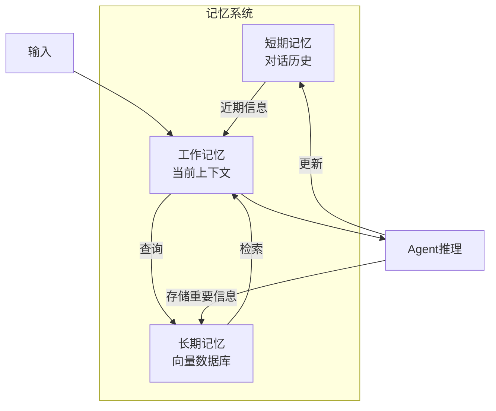

```python
class MemoryAugmentedAgent:
    def __init__(self, llm, vector_store):
        self.llm = llm
        self.vector_store = vector_store
        self.short_term = []  # 最近 k 轮对话
        
    def process(self, query: str) -> str:
        """处理查询"""
        # 1. 检索相关记忆
        relevant_memories = self.vector_store.search(query, k=5)
        
        # 2. 构建工作记忆
        working_memory = self._build_working_memory(
            query, 
            relevant_memories, 
            self.short_term[-5:]
        )
        
        # 3. 生成回答
        response = self.llm.generate(working_memory)
        
        # 4. 更新记忆
        self._update_memory(query, response)
        
        return response
    
    def _build_working_memory(self, query, memories, recent):
        """构建工作记忆"""
        return f"""
相关历史信息：
{self._format_memories(memories)}

最近对话：
{self._format_recent(recent)}

当前问题：{query}
"""
    
    def _update_memory(self, query: str, response: str):
        """更新记忆系统"""
        # 更新短期记忆
        self.short_term.append({"query": query, "response": response})
        
        # 判断是否值得存入长期记忆
        if self._is_important(query, response):
            self.vector_store.add(f"Q: {query}\nA: {response}")
```

## 6. Agent 实践指南

### 6.1 选择合适的框架

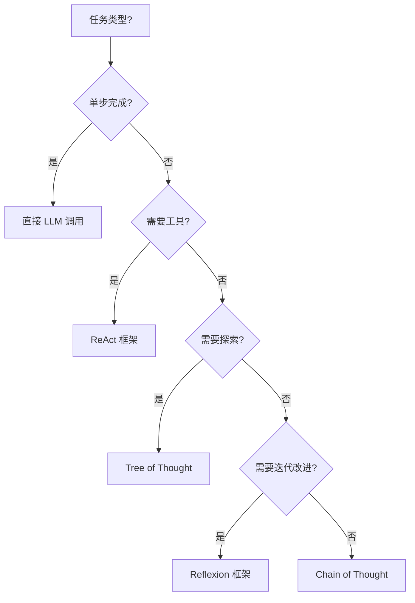

### 6.2 常见陷阱与解决方案

| 陷阱 | 表现 | 解决方案 |
|------|------|----------|
| 无限循环 | Agent 重复相同动作 | 设置最大步数，检测重复 |
| 工具滥用 | 不必要地调用工具 | 优化工具描述，添加判断逻辑 |
| 幻觉问题 | 编造不存在的信息 | 要求引用来源，添加验证步骤 |
| 上下文丢失 | 忘记之前的信息 | 实现记忆系统 |
| 规划失败 | 任务分解不合理 | 迭代规划，允许调整 |

### 6.3 评估 Agent 性能

```python
class AgentEvaluator:
    def evaluate(self, agent, test_cases: list) -> dict:
        """评估 Agent 性能"""
        results = {
            "success_rate": 0,
            "avg_steps": 0,
            "avg_tokens": 0,
            "error_types": {}
        }
        
        for case in test_cases:
            result = agent.run(case["input"])
            
            # 检查正确性
            is_correct = self._check_answer(result, case["expected"])
            
            # 记录统计
            if is_correct:
                results["success_rate"] += 1
            
            results["avg_steps"] += agent.step_count
            results["avg_tokens"] += agent.token_count
        
        # 计算平均值
        n = len(test_cases)
        results["success_rate"] /= n
        results["avg_steps"] /= n
        results["avg_tokens"] /= n
        
        return results
```

## 7. 本章小结

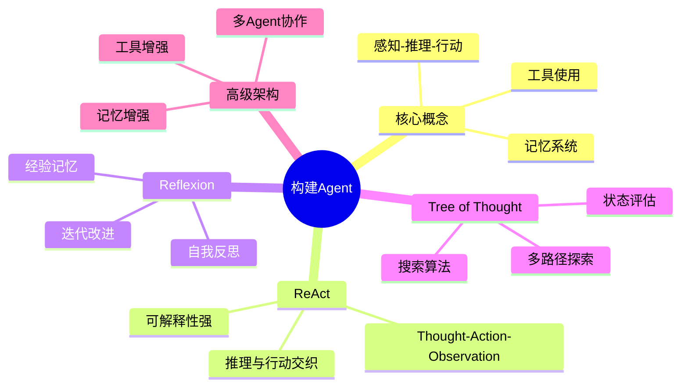

**核心要点**：
- Agent 是以 LLM 为核心的自主系统，具备推理、规划、行动和记忆能力
- ReAct 将推理和行动交织，适合需要工具调用的任务
- Reflexion 通过自我反思实现迭代改进
- Tree of Thought 探索多条推理路径，适合复杂决策问题
- 实际应用中常需要组合多种技术，并配合记忆系统

## 思考题

1. 如何设计一个能够自动选择使用 ReAct、Reflexion 还是 ToT 的元 Agent？
2. 在多 Agent 系统中，如何处理 Agent 之间的信息同步和冲突解决？
3. 如何评估一个 Agent 的"智能程度"？有哪些维度需要考虑？

## 延伸阅读

- [ReAct: Synergizing Reasoning and Acting in Language Models](https://arxiv.org/abs/2210.03629)
- [Reflexion: Language Agents with Verbal Reinforcement Learning](https://arxiv.org/abs/2303.11366)
- [Tree of Thoughts: Deliberate Problem Solving with Large Language Models](https://arxiv.org/abs/2305.10601)
- [LangChain Agents Documentation](https://python.langchain.com/docs/modules/agents/)

---

*本系列基础知识部分到此结束。希望这些内容能帮助你建立对 LLM 技术栈的全面理解。*
