# 构建 Agent：从推理到行动

大语言模型不仅能够生成文本，还能够作为"大脑"驱动智能代理（Agent）完成复杂任务。本文将介绍构建 LLM Agent 的核心框架，包括 ReAct、Reflexion 和 Tree of Thought。

## 1. 什么是 LLM Agent

### 1.1 定义

**LLM Agent** 是一个以大语言模型为核心的自主系统，能够感知环境、进行推理、制定计划并执行行动来完成目标任务。

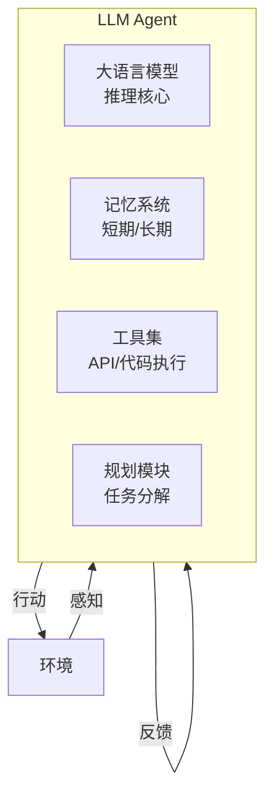

### 1.2 Agent 与传统 LLM 应用的区别

| 特性 | 传统 LLM 应用 | LLM Agent |
|------|--------------|-----------|
| 交互模式 | 单轮问答 | 多轮自主交互 |
| 能力边界 | 仅文本生成 | 可调用外部工具 |
| 执行方式 | 被动响应 | 主动规划执行 |
| 状态管理 | 无状态 | 有状态，带记忆 |
| 错误处理 | 无自我纠正 | 可反思改进 |

### 1.3 Agent 的核心能力

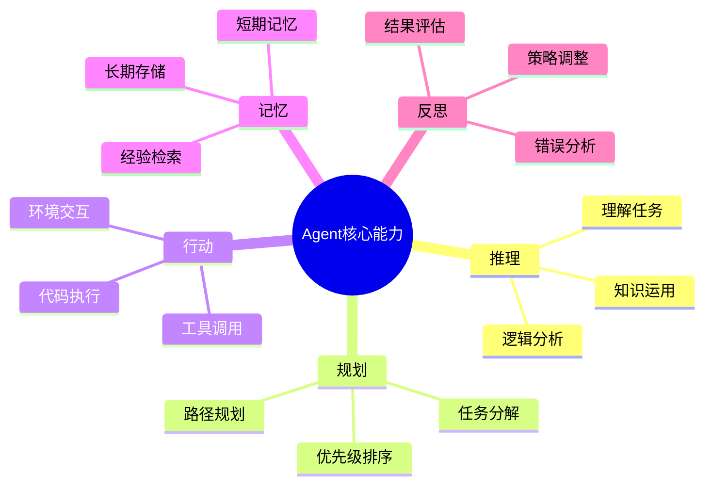

## 2. ReAct：推理与行动的结合

### 2.1 核心思想

**ReAct**（Reasoning and Acting）将推理（Thought）和行动（Action）交织在一起，让模型在执行任务时既能"思考"又能"动手"。

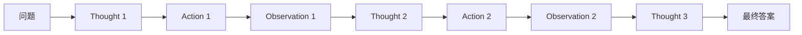

**三个核心组件**：

1. **Thought（思考）**：模型的推理过程，分析当前状态，决定下一步
2. **Action（行动）**：调用工具或执行操作
3. **Observation（观察）**：获取行动的结果

### 2.2 ReAct 工作流程

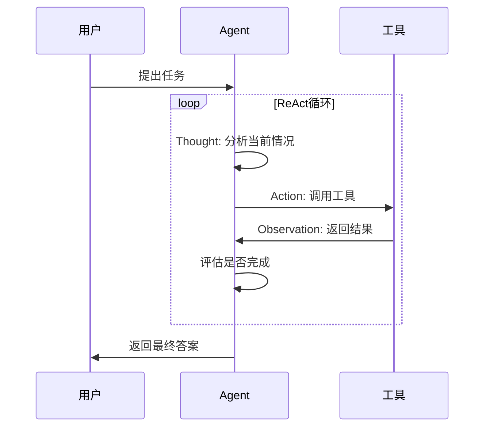

### 2.3 ReAct 实现要素

**思考（Thought）设计**：
- 当前状态分析
- 可用行动评估
- 下一步决策理由
- 目标完成度判断

**行动（Action）规范**：
- 工具名称标准化
- 参数格式统一
- 错误处理机制
- 执行结果验证

**观察（Observation）处理**：
- 结果格式标准化
- 错误信息提取
- 成功状态判断
- 反馈信息整合

### 2.4 ReAct 示例执行过程

```
任务：2024年美国总统大选的获胜者是谁？

Thought 1: 我需要搜索2024年美国总统大选的结果
Action: Search
Action Input: 2024 US presidential election winner

Observation 1: 2024年美国总统大选于11月5日举行，共和党候选人
唐纳德·特朗普获胜，将成为美国第47任总统。

Thought 2: 我已经获得了所需信息，可以给出最终答案
Action: Finish
Action Input: 2024年美国总统大选的获胜者是唐纳德·特朗普，
他将成为美国第47任总统。
```

### 2.5 ReAct++ (2025年发展)

**ReAct++** 是 2025 年 ReAct 框架的重要增强版本，主要改进包括：

- **自纠正推理循环**：减少 Agent 响应中的幻觉
- **自适应规划**：根据任务复杂度动态调整推理深度
- **工具使用效率提升**：智能选择最优工具组合
- **并行执行支持**：同时执行多个独立行动

### 2.6 ReAct 的优势与局限

| 优势 | 局限 |
|------|------|
| 推理过程可解释 | 可能陷入循环 |
| 可利用外部工具 | 依赖工具质量 |
| 适应复杂任务 | Token 消耗较大 |
| 支持多步推理 | 需要精心设计提示词 |

## 3. Reflexion：自我反思与改进

### 3.1 核心思想

**Reflexion** 赋予 Agent 自我反思能力，通过评估自身输出并生成改进策略来提升表现。

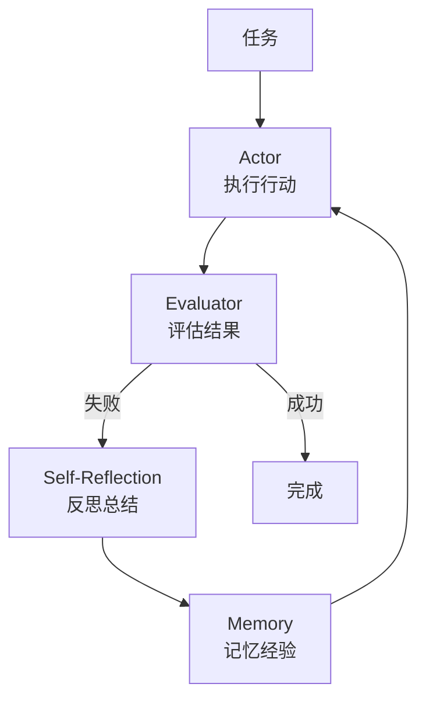

### 3.2 Reflexion 三要素

1. **Actor（执行者）**：执行任务的 Agent，可以是 ReAct 风格
2. **Evaluator（评估者）**：评估执行结果，判断成功/失败
3. **Self-Reflection（自我反思）**：分析失败原因，生成改进策略

### 3.3 Reflexion 工作机制

**执行阶段**：
- Actor 根据当前策略执行任务
- 记录执行过程和中间结果
- 生成可解释的推理轨迹

**评估阶段**：
- Evaluator 分析执行结果
- 对比期望输出和实际输出
- 判断任务完成质量

**反思阶段**：
- 反思模块分析失败原因
- 识别需要改进的关键点
- 生成具体的改进建议

### 3.4 Reflexion 示例

```
任务：写一个函数判断字符串是否是回文

===== 尝试 1 =====
def is_palindrome(s):
    return s == s[::-1]

评估：失败 - 未处理大小写和特殊字符
反思：函数没有考虑大小写敏感问题，也没有过滤非字母字符。
下次应该先预处理字符串。

===== 尝试 2 =====
def is_palindrome(s):
    s = s.lower()
    s = ''.join(c for c in s if c.isalnum())
    return s == s[::-1]

评估：成功
```

### 3.5 Reflexion 2025年增强

**元学习能力**：
- Agent 通过多次任务迭代持续改进
- 学习通用的问题解决策略
- 跨任务知识迁移

**自动错误恢复**：
- 通过强化学习实现自动纠错
- 实时监控执行过程
- 预防性错误检测

### 3.6 Reflexion 的应用场景

| 场景 | 说明 |
|------|------|
| 代码生成 | 根据测试结果反思改进代码 |
| 数学推理 | 检查计算步骤，修正错误 |
| 问答系统 | 验证答案，补充遗漏信息 |
| 决策任务 | 评估策略效果，调整方案 |

## 4. Tree of Thought：探索多条推理路径

### 4.1 核心思想

**Tree of Thought (ToT)** 将推理过程组织为树状结构，通过探索多条路径找到最优解决方案。

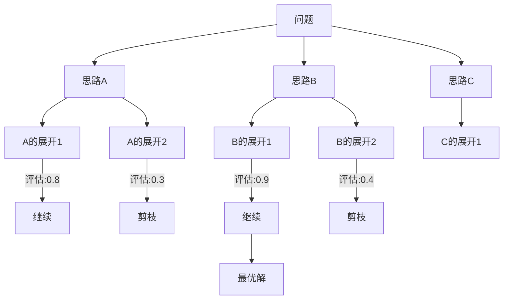

### 4.2 ToT vs CoT

| 特性 | Chain of Thought | Tree of Thought |
|------|------------------|-----------------|
| 结构 | 线性链 | 树状结构 |
| 路径数 | 单一路径 | 多条路径 |
| 回溯 | 不支持 | 支持 |
| 搜索 | 无 | BFS/DFS |
| 适用场景 | 简单推理 | 复杂决策 |

### 4.3 ToT 的三个核心操作

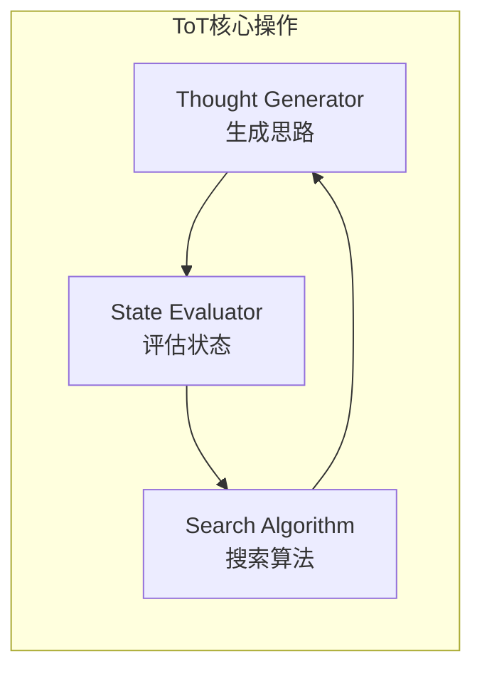

1. **Thought Generator**：生成当前状态下的可能思路
2. **State Evaluator**：评估每个思路的质量/潜力
3. **Search Algorithm**：决定探索顺序（BFS/DFS）

### 4.4 ToT-X (2025年发展)

**ToT-X** 是 Tree of Thought 的 2025 年增强版本，主要特性：

- **并行推理分支**：同时探索多个推理路径，提高决策速度
- **多智能体集成**：与多智能体系统结合，实现分布式问题解决
- **自适应剪枝**：基于实时评估动态调整搜索策略
- **层次化推理**：支持多层级的树状推理结构

### 4.5 ToT 示例：24点游戏

```
问题：使用 4, 9, 10, 13 四个数字和加减乘除运算得到 24

===== 思路探索 =====
层级1：
├── 思路A: 先尝试乘法 4 × 9 = 36 [评分: 0.6]
├── 思路B: 先尝试 13 - 9 = 4 [评分: 0.7]
└── 思路C: 先尝试 10 + 13 = 23 [评分: 0.5]

选择思路B继续（得分最高）...

层级2：
├── 思路B1: 4 × 4 = 16, 然后 16 + 10 = 26 [评分: 0.4]
├── 思路B2: 4 × 10 = 40, 然后... [评分: 0.5]
└── 思路B3: 4 × (10 - 4) = 24! [评分: 1.0]

===== 解决方案 =====
(13 - 9) × (10 - 4) = 4 × 6 = 24
```

### 4.6 搜索算法选择

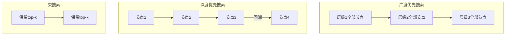

| 算法 | 优点 | 缺点 | 适用场景 |
|------|------|------|----------|
| BFS | 找到最短路径 | 内存消耗大 | 解空间较小 |
| DFS | 内存效率高 | 可能陷入深层 | 需要回溯 |
| Beam | 平衡效率和质量 | 可能错过最优 | 大多数场景 |

## 5. 高级 Agent 架构

### 5.1 多 Agent 协作

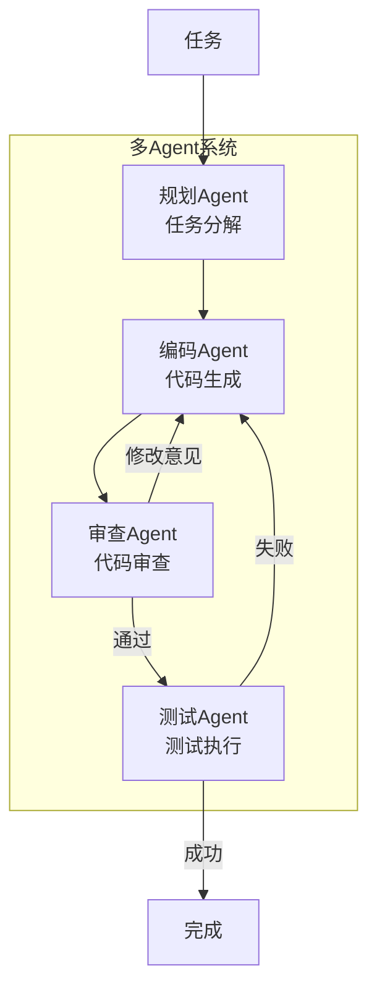

**协作模式**：

1. **串行协作**：Agent 按顺序执行，前一个输出作为下一个输入
2. **并行协作**：多个 Agent 同时工作，最后汇总结果
3. **层次协作**：主 Agent 协调多个子 Agent 的工作
4. **竞争协作**：多个 Agent 提出方案，选择最优结果

### 5.2 工具增强 Agent

工具是 Agent 扩展能力的关键。2025年的工具集成发展趋势：

**标准化工具接口**：
- 统一的工具调用协议
- 标准化的参数和返回格式
- 自动工具发现和注册
- 工具权限和安全控制

**智能工具选择**：
- 基于任务需求的工具推荐
- 工具组合优化
- 动态工具切换
- 工具使用效果评估

**工具链构建**：
- 多工具协同工作流
- 工具间数据传递优化
- 错误传播和恢复
- 工具执行监控

### 5.3 记忆增强 Agent

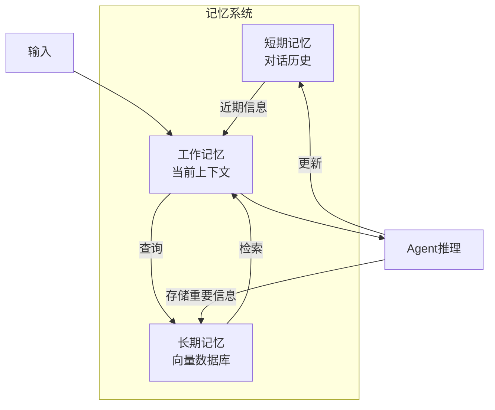

**记忆层次设计**：

1. **工作记忆**：当前任务的上下文信息
2. **短期记忆**：最近的交互历史
3. **长期记忆**：持久化的重要知识
4. **情景记忆**：特定场景的经验

**记忆管理策略**：

- **重要性过滤**：自动识别值得长期存储的信息
- **遗忘机制**：定期清理过时和低价值信息
- **关联检索**：基于语义相似度的智能检索
- **记忆融合**：多源记忆信息的整合

## 6. 2025年 Agent 框架发展

### 6.1 LangChain 2025

**新特性**：
- **多模态 Agent 支持**：文本、图像、音频的统一处理
- **增强的记忆管理**：长期上下文保持能力
- **动态工具选择**：更自主的工具使用行为
- **多智能体编排**：协作问题解决能力

**架构改进**：
- 模块化组件设计
- 更好的可扩展性
- 企业级部署支持
- 丰富的预构建 Agent 模板

### 6.2 AutoGen 2.0

**重大更新**：
- **分层智能体委托**：动态创建专门子智能体
- **改进的人机协作**：实时反馈循环
- **企业工作流优化**：自动化调试和代码生成
- **更好的可观测性**：详细的执行追踪

**新能力**：
- 跨平台智能体通信
- 智能体角色自学习
- 动态工作流调整
- 分布式任务执行

### 6.3 其他框架进展

**CrewAI**：
- 专门的多智能体协作框架
- 角色定义和任务分配
- 协作流程可视化

**MetaGPT**：
- 软件开发专用的多智能体系统
- 模拟真实软件开发团队
- 自动化代码生成和测试

**LlamaIndex Agents**：
- 基于 RAG 的智能体框架
- 强大的知识检索能力
- 细粒度的工具集成

## 7. Agent 实践指南

### 7.1 选择合适的框架

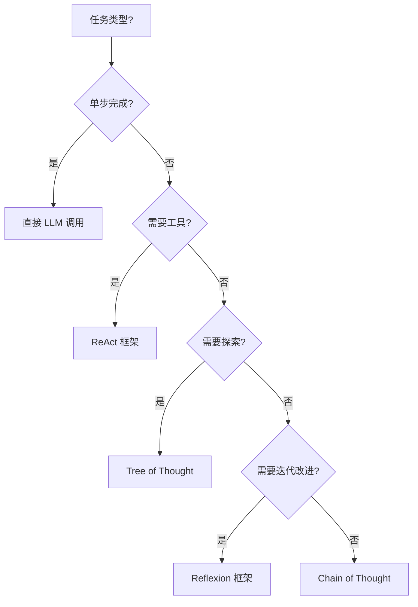

### 7.2 常见陷阱与解决方案

| 陷阱 | 表现 | 解决方案 |
|------|------|----------|
| 无限循环 | Agent 重复相同动作 | 设置最大步数，检测重复 |
| 工具滥用 | 不必要地调用工具 | 优化工具描述，添加判断逻辑 |
| 幻觉问题 | 编造不存在的信息 | 要求引用来源，添加验证步骤 |
| 上下文丢失 | 忘记之前的信息 | 实现记忆系统 |
| 规划失败 | 任务分解不合理 | 迭代规划，允许调整 |

### 7.3 Agent 设计原则

**模块化设计**：
- 功能组件解耦
- 可插拔的工具接口
- 标准化的消息格式
- 灵活的配置管理

**可观测性**：
- 详细的执行日志
- 性能指标监控
- 错误追踪和分析
- 用户行为分析

**安全性**：
- 输入验证和过滤
- 工具权限控制
- 敏感信息保护
- 审计和合规

**可扩展性**：
- 水平扩展支持
- 负载均衡机制
- 资源优化管理
- 弹性伸缩能力

### 7.4 评估 Agent 性能

**任务完成度**：
- 目标达成率
- 结果质量评估
- 用户满意度
- 效率指标

**智能行为评估**：
- 推理逻辑性
- 工具使用效率
- 错误恢复能力
- 学习适应能力

**系统性能**：
- 响应延迟
- 资源消耗
- 并发处理能力
- 稳定性和可靠性

## 8. Agent 应用场景

### 8.1 企业应用

**客服智能体**：
- 多轮对话处理
- 知识库检索
- 工单自动分类
- 情感分析和响应

**代码助手**：
- 代码生成和补全
- 自动化测试
- 代码审查
- 技术文档生成

**数据分析智能体**：
- 数据查询和分析
- 报告自动生成
- 异常检测
- 预测建模

### 8.2 研究应用

**科学发现智能体**：
- 文献检索和分析
- 假设生成和验证
- 实验设计
- 结果解释

**医疗诊断智能体**：
- 症状分析
- 诊断建议
- 治疗方案推荐
- 医学知识检索

### 8.3 创意应用

**内容创作智能体**：
- 文章写作
- 代码创作
- 艺术设计
- 音乐创作

**游戏智能体**：
- NPC 对话
- 任务生成
- 关卡设计
- 玩家行为分析

## 9. 本章小结

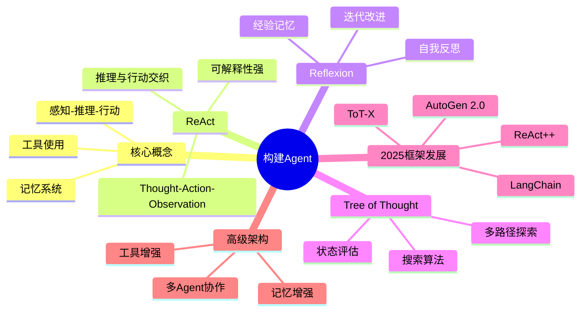

**核心要点**：
- Agent 是以 LLM 为核心的自主系统，具备推理、规划、行动和记忆能力
- ReAct 将推理和行动交织，适合需要工具调用的任务
- Reflexion 通过自我反思实现迭代改进，2025年增加了元学习能力
- Tree of Thought 探索多条推理路径，ToT-X 支持并行和分布式推理
- 2025年主流框架（LangChain、AutoGen 2.0）显著增强了多智能体协作能力
- 实际应用中常需要组合多种技术，并配合记忆系统和工具集成
- Agent 设计需要考虑模块化、可观测性、安全性和可扩展性

## 思考题

1. 如何设计一个能够自动选择使用 ReAct、Reflexion 还是 ToT 的元 Agent？
2. 在多 Agent 系统中，如何处理 Agent 之间的信息同步和冲突解决？
3. 如何评估一个 Agent 的"智能程度"？有哪些维度需要考虑？

## 延伸阅读

- [ReAct: Synergizing Reasoning and Acting in Language Models](https://arxiv.org/abs/2210.03629)
- [Reflexion: Language Agents with Verbal Reinforcement Learning](https://arxiv.org/abs/2303.11366)
- [Tree of Thoughts: Deliberate Problem Solving with Large Language Models](https://arxiv.org/abs/2305.10601)
- [LangChain Agents Documentation](https://python.langchain.com/docs/modules/agents/)
- [AutoGen: Multi-Agent Conversation Framework](https://github.com/microsoft/autogen)

---

*本系列基础知识部分到此结束。希望这些内容能帮助你建立对 LLM 技术栈的全面理解。*
