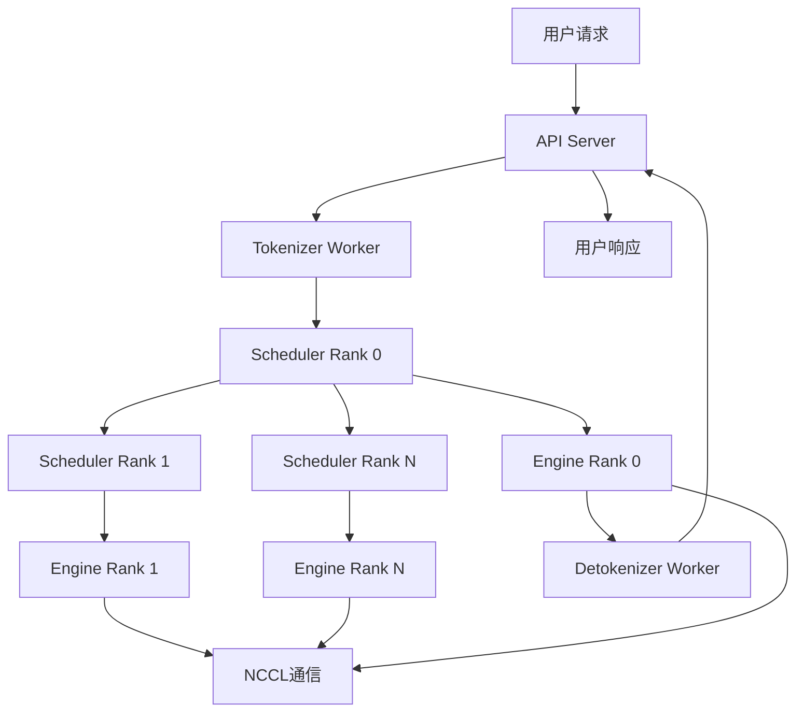
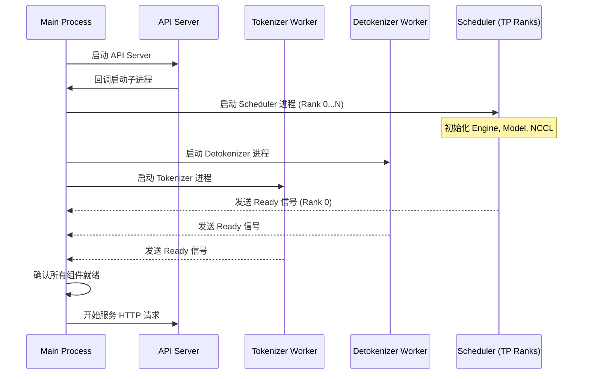
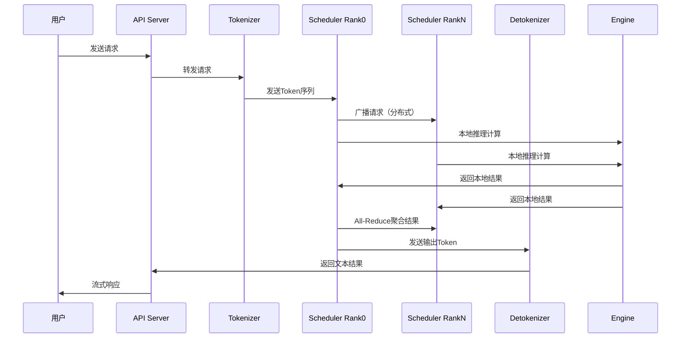
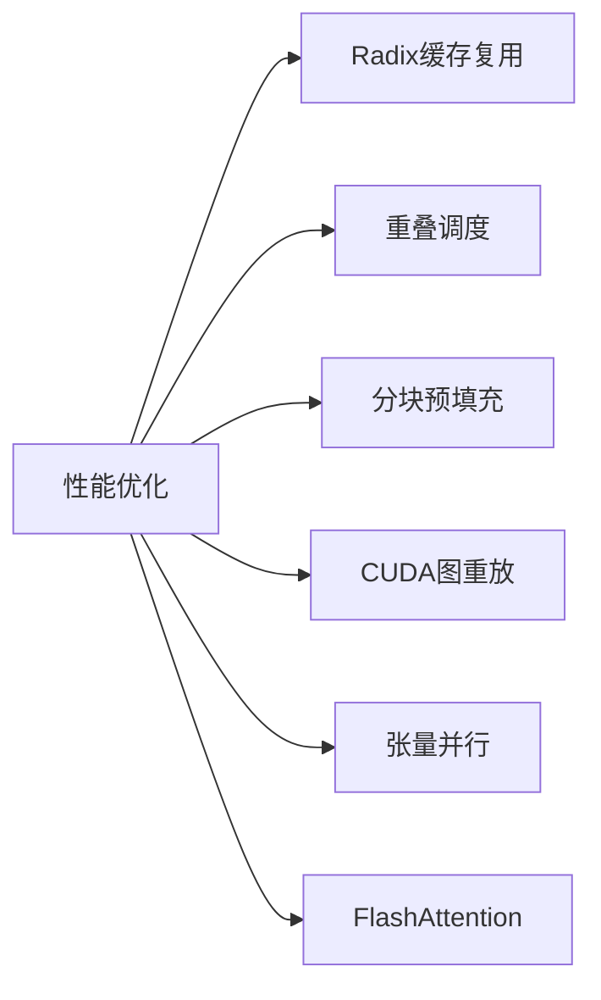
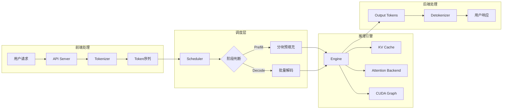

# 第一章：项目概述与架构设计

## 本章学习目标

通过本章学习，你将了解：
- Mini-SGLang 项目的定位和核心价值
- 系统整体架构和组件关系
- 关键技术特性和性能优化
- 项目代码组织结构

## 核心概念速查表

为了帮助初学者更好地理解后续内容，这里列出了本章涉及的关键术语：

| 术语 | 英文 | 解释 |
|------|------|------|
| **LLM 推理** | LLM Inference | 使用训练好的大语言模型生成文本的过程，通常分为 Prefill 和 Decode 两个阶段。 |
| **预填充阶段** | Prefill Phase | 推理的第一阶段，处理输入 Prompt，生成第一个 Token，并计算初始 KV Cache。计算密集型。 |
| **解码阶段** | Decode Phase | 推理的第二阶段，逐个生成后续 Token。依赖前一时刻的 KV Cache。内存带宽密集型。 |
| **KV 缓存** | KV Cache | 存储注意力机制中 Key 和 Value 矩阵的计算结果，避免在生成每个新 Token 时重复计算历史信息。 |
| **张量并行** | Tensor Parallelism (TP) | 一种模型并行策略，将模型权重的张量切分到多个 GPU 上并行计算，以降低单卡显存压力并加速计算。 |
| **Radix 树** | Radix Tree | 一种前缀树数据结构，Mini-SGLang 用它来高效管理和复用 KV Cache，特别适合多轮对话和共享前缀场景。 |
| **FlashAttention** | FlashAttention | 一种IO感知的精确注意力算法，通过减少 GPU 显存访问次数显著加速注意力计算，主要用于 Prefill 阶段。 |
| **FlashInfer** | FlashInfer | 一个高性能的 LLM 服务内核库，提供了针对 Decode 阶段优化的注意力算子和 KV Cache 管理。 |

## 背景知识

### LLM推理框架的发展背景

随着大语言模型（LLM）的快速发展，传统的推理框架面临以下挑战：
- **高内存消耗**：KV缓存占用大量显存
- **低吞吐量**：CPU调度开销影响整体性能
- **长序列处理**：长上下文推理效率低下
- **分布式扩展**：多GPU并行计算复杂度高

Mini-SGLang 作为 SGLang 的轻量级实现，旨在解决这些问题，提供一个**高性能、易理解**的LLM推理框架。

#### 为什么需要专门的推理框架？

LLM 推理过程包含两个截然不同的阶段，对硬件资源的需求也不同：

1.  **Prefill（预填充）阶段**：
    *   **任务**：处理用户输入的完整 Prompt，计算所有 Token 的 Attention，生成第一个输出 Token。
    *   **特征**：**计算密集型 (Compute-bound)**。由于可以并行处理所有输入 Token，GPU 利用率通常较高。
    *   **挑战**：长文本输入的计算量呈二次方增长 ($O(N^2)$)。

2.  **Decode（解码）阶段**：
    *   **任务**：自回归地逐个生成后续 Token。每生成一个 Token，都需要读取之前所有 Token 的 KV Cache。
    *   **特征**：**内存带宽密集型 (Memory-bound)**。每次只计算一个 Token，但需要搬运大量 KV Cache 数据，GPU 计算单元往往处于等待数据的状态。
    *   **挑战**：随着序列变长，KV Cache 占用显存越来越大，且内存带宽成为瓶颈。

传统的深度学习框架（如 PyTorch）主要为训练设计，难以同时优化这两个差异巨大的阶段。Mini-SGLang 通过**Radix Cache**、**FlashInfer** 等技术，专门针对这两个阶段进行了深度优化。

### 关键技术概念

- **KV缓存（Key-Value Cache）**：存储注意力计算中的键值对，避免重复计算
- **张量并行（Tensor Parallelism）**：将模型权重分布到多个GPU上并行计算
- **CUDA图重放**：预编译GPU计算图，减少CPU启动开销
- **Radix树缓存**：基于前缀树的高效缓存复用机制

## 系统架构概览

Mini-SGLang 采用**多进程分布式架构**，各组件通过 ZeroMQ 和 NCCL 进行通信。

### 整体架构图



### 系统启动流程

Mini-SGLang 采用多进程架构，启动过程由 `launch_server` 函数协调。以下是系统启动的核心流程：



### 核心组件说明

| 组件 | 功能描述 | 关键技术 |
|------|----------|----------|
| **API Server** | OpenAI兼容API接口 | FastAPI, HTTP流式响应 |
| **Tokenizer Worker** | 文本→Token转换 | HuggingFace Tokenizer |
| **Detokenizer Worker** | Token→文本转换 | 反向Tokenization |
| **Scheduler Worker** | 核心调度器（每个GPU一个） | 重叠调度，优先级调度 |
| **Engine** | 推理引擎执行单元 | CUDA图，注意力后端 |

## 请求处理流程



## 核心特性详解

### 1. 高性能优化技术



#### Radix缓存复用
- **原理**：基于前缀树（Radix Tree）的KV缓存管理
- **优势**：共享前缀的请求可以复用缓存，减少重复计算
- **应用场景**：多轮对话、批量相似请求

#### 重叠调度（Overlap Scheduling）
- **原理**：CPU调度与GPU计算并行执行
- **优势**：隐藏调度开销，提高系统吞吐量
- **技术来源**：基于NanoFlow论文的创新

#### 分块预填充（Chunked Prefill）
- **原理**：将长文本分成小块处理
- **优势**：降低峰值内存使用，支持长上下文
- **配置参数**：`--max-prefill-length`

### 2. 分布式架构优势

#### 张量并行（Tensor Parallelism）
- **实现方式**：模型权重分片到多个GPU
- **通信机制**：NCCL高性能通信库
- **扩展性**：支持2-8个GPU的并行推理

#### 多进程架构
- **隔离性**：各组件独立进程，故障隔离
- **可扩展性**：易于添加新组件和功能
- **调试友好**：可以独立调试每个进程

## 代码组织结构

```
minisgl/
├── core.py         # 核心数据结构（Req, Batch, Context, SamplingParams）
├── env.py          # 环境变量配置
├── distributed/    # 分布式通信和并行计算
│   ├── impl.py     # All-Reduce/All-Gather实现
│   └── info.py     # DistributedInfo分布式信息
├── layers/         # 神经网络层实现（支持TP）
│   ├── linear.py   # 线性层（Column/RowParallel）
│   ├── embedding.py# 嵌入层
│   ├── norm.py     # LayerNorm/RMSNorm
│   ├── rotary.py   # RoPE旋转位置编码
│   └── attention.py# 注意力层
├── models/         # 模型定义（Llama, Qwen3）
│   ├── llama.py    # Llama模型实现
│   ├── qwen3.py    # Qwen3模型实现
│   ├── weight.py   # 权重加载与分片
│   └── config.py   # 模型配置
├── attention/      # 注意力后端
│   ├── base.py     # 基类定义
│   ├── fa3.py      # FlashAttention3后端
│   └── fi.py       # FlashInfer后端
├── kvcache/        # KV缓存管理
│   ├── base.py     # 基类定义
│   ├── mha_pool.py # MHA KV缓存池
│   ├── naive_manager.py  # Naive缓存管理器
│   └── radix_manager.py  # Radix树缓存管理器
├── engine/         # 推理引擎
│   ├── engine.py   # Engine类实现
│   ├── graph.py    # CUDA图管理
│   ├── sample.py   # 采样逻辑
│   └── config.py   # 引擎配置
├── scheduler/      # 调度器系统
│   ├── scheduler.py# Scheduler类实现
│   ├── prefill.py  # Prefill阶段调度
│   ├── decode.py   # Decode阶段调度
│   ├── cache.py    # 缓存调度
│   └── io.py       # 输入输出处理
├── kernel/         # CUDA内核
│   ├── index.py    # 索引操作内核
│   ├── store.py    # 存储操作内核
│   └── pynccl.py   # NCCL Python绑定
├── server/         # API服务器
│   ├── api_server.py # FastAPI服务器
│   ├── launch.py   # 进程启动管理
│   └── args.py     # 命令行参数
├── message/        # 进程间通信协议
│   ├── frontend.py # 前端消息
│   ├── backend.py  # 后端消息
│   └── tokenizer.py# Tokenizer消息
├── tokenizer/      # Tokenizer服务
│   ├── tokenize.py # 分词实现
│   ├── detokenize.py # 反分词实现
│   └── server.py   # Tokenizer服务器
├── llm/            # Python接口
│   └── llm.py      # LLM类封装
├── utils/          # 工具函数
└── benchmark/      # 性能测试工具
```

### 关键模块说明

| 模块 | 核心类/函数 | 职责说明 |
|------|-------------|----------|
| **`minisgl.core`** | `Req`, `Batch`, `Context`, `SamplingParams` | 核心数据结构，管理请求状态、批处理和全局上下文 |
| **`minisgl.engine`** | `Engine` | 推理引擎，管理模型、KV缓存、注意力后端和CUDA图 |
| **`minisgl.scheduler`** | `Scheduler` | 调度器，实现重叠调度，管理Prefill/Decode阶段 |
| **`minisgl.kvcache`** | `RadixCacheManager`, `NaiveCacheManager` | KV缓存管理，支持Radix树和Naive两种策略 |
| **`minisgl.attention`** | `FA3Backend`, `FIBackend` | 注意力计算后端，支持FlashAttention3和FlashInfer |
| **`minisgl.distributed`** | `all_reduce`, `all_gather` | 分布式通信接口，封装NCCL操作 |
| **`minisgl.server`** | `launch_server`, `api_server` | 服务启动和API接口，提供OpenAI兼容端点 |

## 快速开始示例

### 单GPU推理
```bash
python -m minisgl --model "Qwen/Qwen3-0.6B"
```

### 多GPU张量并行
```bash
python -m minisgl --model "meta-llama/Llama-3.1-70B-Instruct" --tp 4
```

### 交互式Shell
```bash
python -m minisgl --model "Qwen/Qwen3-0.6B" --shell
```

## 性能基准测试

根据官方基准测试，Mini-SGLang在以下场景表现优异：

- **离线推理**：256个序列，输入长度100-1024，输出长度100-1024
- **在线服务**：1000个真实请求重放，32B模型在4xH200上运行
- **关键技术**：重叠调度相比传统调度提升显著

## 🧩 核心数据流概览



## 本章总结

本章介绍了Mini-SGLang项目的整体架构和核心特性：

| 方面 | 要点 |
|------|------|
| **项目定位** | 轻量级高性能LLM推理框架，代码量约5000行Python |
| **架构特点** | 多进程分布式设计，组件间通过ZMQ和NCCL通信 |
| **性能优化** | Radix缓存、重叠调度、分块预填充、CUDA图重放 |
| **注意力后端** | 支持FlashAttention3（Prefill）和FlashInfer（Decode） |
| **易用性** | OpenAI兼容API，支持交互式Shell |

### 章节导航

| 章节 | 主题 | 核心内容 |
|------|------|----------|
| 第一章 | 项目概述 | 架构设计、代码组织（本章） |
| 第二章 | 核心数据结构 | Req、Batch、Context、SamplingParams |
| 第三章 | 推理引擎 | Engine实现、CUDA图、模型前向 |
| 第四章 | KV缓存 | Radix树、Naive缓存、内存管理 |
| 第五章 | 注意力机制 | FlashAttention、FlashInfer后端 |
| 第六章 | 调度系统 | 重叠调度、Prefill/Decode管理 |
| 第七章 | 分布式系统 | 张量并行、NCCL通信 |
| 第八章 | 服务层 | API Server、进程管理 |

---

**下一章预告**：第二章将深入讲解核心数据结构与上下文管理机制，包括 `Req`、`Batch`、`Context` 和 `SamplingParams` 的设计与实现。