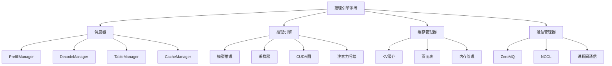
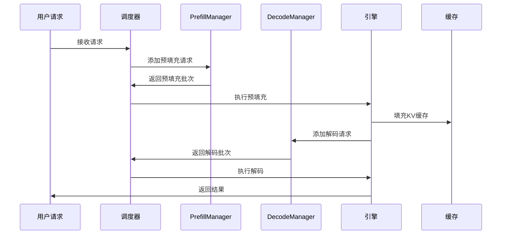
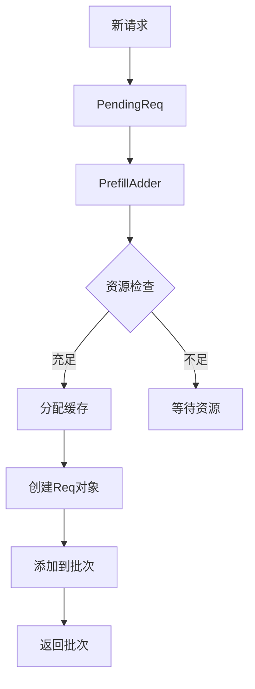
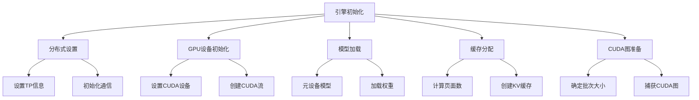
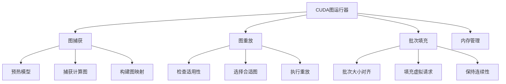
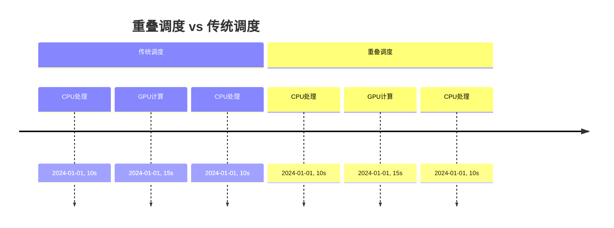
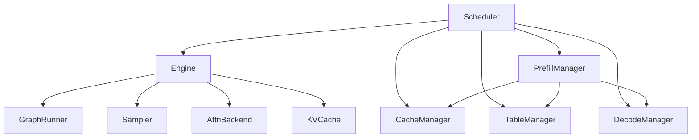

# 第四章：推理引擎与调度器系统

## 本章学习目标

通过本章学习，你将了解：
- Mini-SGLang 推理引擎的整体架构设计
- 调度器系统的核心算法和策略
- 重叠调度（Overlap Scheduling）的实现原理
- CUDA图重放技术的性能优化
- 预填充（Prefill）和解码（Decode）阶段的管理

## 核心概念速查表

| 术语 | 英文 | 解释 |
|------|------|------|
| **重叠调度** | Overlap Scheduling | 一种并行策略，让 CPU 在 GPU 执行当前批次计算的同时，准备下一个批次的数据，从而隐藏 CPU 调度开销。 |
| **CUDA 图** | CUDA Graph | NVIDIA 提供的一种优化技术，将一系列 GPU 操作（Kernel 启动、内存拷贝）录制成图，通过一次启动执行整个图，显著减少 CPU 启动开销。 |
| **分块预填充** | Chunked Prefill | 将长 Prompt 的预填充过程切分成多个小块，与 Decode 请求混合调度，避免长请求阻塞整个系统（Head-of-Line Blocking）。 |
| **Token 预算** | Token Budget | 调度器在每个步骤中允许处理的最大 Token 数量，用于控制显存使用和计算负载。 |
| **Head-of-Line Blocking** | Head-of-Line Blocking | 队头阻塞，指队列前面的长任务阻塞了后面短任务的执行。 |

## 背景知识

### LLM推理的调度挑战

在大规模LLM推理中，调度系统面临以下关键挑战：

1. **资源竞争**：多个请求共享GPU计算资源
2. **内存限制**：KV缓存内存的分配和回收
3. **延迟敏感**：需要保证单个请求的响应时间
4. **吞吐量优化**：最大化系统整体吞吐量
5. **动态负载**：请求到达时间和长度不可预测

### 关键技术概念

- **预填充（Prefill）**：处理输入token的注意力计算
- **解码（Decode）**：逐个token生成输出
- **批处理（Batching）**：将多个请求合并为一个批次
- **重叠调度**：CPU调度与GPU计算并行执行
- **CUDA图重放**：预编译GPU计算图减少启动开销

### 深入理解 CUDA Graph

在传统的 GPU 编程模式中，CPU 需要为每个 GPU Kernel 发送启动指令。对于 LLM 推理的 Decode 阶段，每次只生成一个 Token，涉及大量的微小 Kernel（如 LayerNorm, Activation, MatMul）。

- **问题**：CPU 启动 Kernel 的开销（Launch Overhead，约 10-20μs）可能比 GPU 执行 Kernel 的时间还长，导致 GPU 大量时间处于空闲等待状态。
- **解决方案**：CUDA Graph 将一系列操作录制成一个静态图。
    - **录制阶段**：CPU 发送指令，GPU 驱动不立即执行，而是构建依赖图。
    - **执行阶段**：CPU 只需发送一次 "Launch Graph" 指令，GPU 驱动自动处理图中的所有操作和依赖。
- **收益**：将 CPU 开销从 $N \times 10\mu s$ 降低到 $1 \times 10\mu s$，显著提升 Decode 阶段的吞吐量。

### 分块预填充 (Chunked Prefill) 的优势

传统的调度方式要么只做 Prefill，要么只做 Decode。当一个超长 Prompt（如 10k tokens）到来时，系统必须暂停所有 Decode 请求，专心处理这个 Prefill，导致其他用户的延迟飙升。

Chunked Prefill 将长 Prompt 切分成多个小块（如 512 tokens），每次只处理一块，并与 Decode 请求一起组成 Batch。
- **优势 1**：降低了 Decode 请求的等待时间（Latency）。
- **优势 2**：平衡了计算（Prefill 块）和内存（Decode）负载，提高了 GPU 利用率。

## 系统架构概览



### 核心组件关系



## 调度器系统详解

### 1. 调度器核心架构

#### 调度器类结构

```python
class Scheduler(SchedulerIOMixin):
    def __init__(self, config: SchedulerConfig):
        self.engine = Engine(config)           # 推理引擎
        self.table_manager = TableManager()    # 页面表管理
        self.cache_manager = CacheManager()     # 缓存管理
        self.decode_manager = DecodeManager()   # 解码管理
        self.prefill_manager = PrefillManager() # 预填充管理
        self.finished_reqs: Set[Req] = set()   # 完成请求集合
```

#### 调度器配置

```python
@dataclass(frozen=True)
class SchedulerConfig(EngineConfig):
    max_extend_tokens: int = 8192      # 最大扩展token数
    cache_type: str = "radix"          # 缓存类型
    offline_mode: bool = False         # 离线模式
    
    # ZeroMQ通信地址配置
    @property
    def zmq_backend_addr(self) -> str:
        return "ipc:///tmp/minisgl_0" + self._unique_suffix
```

### 2. 预填充管理器（PrefillManager）

#### 预填充请求处理



#### 分块预填充实现

```python
class PrefillAdder:
    """预填充加法器，负责资源分配和请求管理"""
    
    def _try_allocate_one(self, req: PendingReq) -> Tuple[BaseCacheHandle, int] | None:
        # 1. 检查缓存匹配
        handle, match_indices = self.cache_manager.match_req(req)
        
        # 2. 估算资源需求
        cached_len = handle.cached_len
        extend_len = req.input_len - cached_len
        estimated_len = extend_len + req.output_len
        
        # 3. 检查资源是否充足
        if estimated_len + self.reserved_size > self.cache_manager.available_size:
            return None
        
        # 4. 分配页面表索引
        table_idx = self.table_manager.allocate()
        return handle, table_idx
```

#### 分块处理机制

```python
def _add_one_req(self, pending_req: PendingReq, cache_handle: BaseCacheHandle, 
                 table_idx: int, cached_len: int) -> Req:
    """添加单个请求到批次"""
    
    remain_len = pending_req.input_len - cached_len
    chunk_size = min(self.token_budget, remain_len)
    is_chunked = chunk_size < remain_len
    
    # 选择请求类型：分块请求或普通请求
    CLS = ChunkedReq if is_chunked else Req
    
    # 更新资源预算
    self.token_budget -= chunk_size
    self.reserved_size += remain_len + pending_req.output_len
    
    return CLS(
        input_ids=pending_req.input_ids[: cached_len + chunk_size],
        table_idx=table_idx,
        cached_len=cached_len,
        output_len=pending_req.output_len,
        uid=pending_req.uid,
        cache_handle=cache_handle,
        sampling_params=pending_req.sampling_params,
    )
```

#### 分块预填充示意图

```mermaid
gantt
    title 传统调度 vs 分块预填充
    dateFormat s
    axisFormat %s
    
    section 传统调度
    长请求Prefill (10k) :active, p1, 0, 10s
    短请求Decode A    :crit, d1, 10, 1s
    短请求Decode B    :crit, d2, 11, 1s
    
    section 分块预填充
    Chunk 1 (2k) + Decode A/B :active, c1, 0, 2s
    Chunk 2 (2k) + Decode A/B :active, c2, 2, 2s
    Chunk 3 (2k) + Decode A/B :active, c3, 4, 2s
    Chunk 4 (2k) + Decode A/B :active, c4, 6, 2s
    Chunk 5 (2k) + Decode A/B :active, c5, 8, 2s
```



### 3. 解码管理器（DecodeManager）

#### 解码请求管理

```python
@dataclass
class DecodeManager:
    running_reqs: Set[Req] = field(default_factory=set)
    
    def add_reqs(self, reqs: Iterable[Req]) -> None:
        """添加可解码请求"""
        self.running_reqs.update(req for req in reqs if req.can_decode())
    
    def remove_req(self, req: Req) -> None:
        """移除完成请求"""
        self.running_reqs.discard(req)
    
    @property
    def inflight_tokens(self) -> int:
        """正在解码的token总数"""
        return sum(req.remain_len for req in self.running_reqs)
    
    def schedule_next_batch(self) -> Batch | None:
        """调度下一个解码批次"""
        if not self.runnable:
            return None
        return Batch(reqs=list(self.running_reqs), phase="decode")
```

### 4. 调度策略

#### 优先级调度算法

```python
def _schedule_next_batch(self) -> ForwardInput | None:
    """调度下一个批次（Prefill优先策略）"""
    
    # 1. 优先调度预填充请求
    batch = self.prefill_manager.schedule_next_batch(self.prefill_budget)
    
    # 2. 预填充预算用完后调度解码请求
    if batch is None:
        batch = self.decode_manager.schedule_next_batch()
    
    return self._prepare_batch(batch) if batch else None
```

#### 重叠调度实现

```python
def overlap_loop(self, last_data: ForwardData | None) -> ForwardData | None:
    """重叠调度主循环"""
    
    # 1. 非阻塞接收消息
    blocking = not (last_data or self.prefill_manager.runnable or self.decode_manager.runnable)
    for msg in self.receive_msg(blocking=blocking):
        self._process_one_msg(msg)
    
    # 2. 调度下一批次
    forward_input = self._schedule_next_batch()
    ongoing_data = None
    
    # 3. 并行执行：GPU计算 + CPU处理
    if forward_input is not None:
        with self.engine_stream_ctx:  # 在引擎流中执行
            self.engine.stream.wait_stream(self.stream)
            ongoing_data = (forward_input, self._forward(forward_input))
    
    # 4. 处理上一批次结果
    self._process_last_data(last_data, ongoing_data)
    return ongoing_data
```

## 推理引擎详解

### 1. 引擎初始化流程



#### 引擎初始化代码

```python
class Engine:
    def __init__(self, config: EngineConfig):
        # 1. 分布式设置
        set_tp_info(rank=config.tp_info.rank, size=config.tp_info.size)
        
        # 2. GPU设备初始化
        self.device = torch.device(f"cuda:{config.tp_info.rank}")
        torch.cuda.set_device(self.device)
        self.stream = torch.cuda.Stream()
        torch.cuda.set_stream(self.stream)
        
        # 3. 通信初始化
        self.tp_cpu_group = self._init_communication(config)
        
        # 4. 模型加载
        with torch.device("meta"), torch_dtype(config.dtype):
            self.model = create_model(config.model_path, config.model_config)
        self.model.load_state_dict(self._load_weight_state_dict(config))
        
        # 5. KV缓存分配
        self.num_pages = self._determine_num_pages(init_free_memory, config)
        self.kv_cache = create_kvcache(
            model_config=config.model_config,
            num_pages=self.num_pages + 1,  # +1 for dummy page
            device=self.device,
            dtype=self.dtype,
        )
        
        # 6. CUDA图初始化
        self.graph_runner = GraphRunner(
            stream=self.stream,
            device=self.device,
            model=self.model,
            attn_backend=self.attn_backend,
            cuda_graph_bs=config.cuda_graph_bs,
            cuda_graph_max_bs=config.cuda_graph_max_bs,
            free_memory=init_free_memory,
            max_seq_len=self.max_seq_len,
            vocab_size=self.model_config.vocab_size,
            dummy_req=self.dummy_req,
        )
```

### 2. 内存管理机制

#### 页面数计算算法

```python
def _determine_num_pages(self, old_free_memory: int, config: EngineConfig) -> int:
    """动态计算KV缓存页面数量"""
    
    # 1. 获取当前可用内存
    new_free_memory = self._sync_get_memory()[1]
    
    # 2. 计算每页缓存大小
    cache_per_page = (
        2  # key + value
        * self.model_config.head_dim
        * divide_even(self.model_config.num_kv_heads, config.tp_info.size)
        * config.page_size
        * self.dtype.itemsize
        * self.model_config.num_layers
    )
    
    # 3. 计算可用页面数
    num_pages = config.num_page_override
    if num_pages is None:
        model_memory = old_free_memory - new_free_memory
        available_memory = int(config.memory_ratio * old_free_memory) - model_memory
        num_pages = available_memory // cache_per_page
    
    assert num_pages > 1, "Not enough memory for KV cache"
    return num_pages
```

#### 内存平衡检查

```python
def _sync_get_memory(self) -> Tuple[int, int]:
    """同步获取所有TP Rank的内存使用情况"""
    
    torch.cuda.synchronize(self.device)
    torch.cuda.empty_cache()
    free_memory = get_free_memory(self.device)
    
    # 收集所有Rank的内存信息
    free_mem_tensor = torch.tensor([free_memory, -free_memory], device="cpu", dtype=torch.int64)
    torch.distributed.all_reduce(free_mem_tensor, op=torch.distributed.ReduceOp.MIN)
    
    min_free_memory = int(free_mem_tensor[0].item())
    max_free_memory = -int(free_mem_tensor[1].item())
    
    # 检查内存平衡性
    if max_free_memory - min_free_memory > 2 * 1024 * 1024 * 1024:
        raise RuntimeError("Memory across TP ranks are imbalanced")
    
    return min_free_memory, max_free_memory
```

### 3. 推理执行流程

#### 批次推理实现

```python
def forward_batch(self, batch: Batch, args: BatchSamplingArgs) -> ForwardOutput:
    """执行批次推理"""
    
    assert torch.cuda.current_stream() == self.stream
    
    # 1. 设置上下文并执行推理
    with self.ctx.forward_batch(batch):
        if self.graph_runner.can_use_cuda_graph(batch):
            logits = self.graph_runner.replay(batch)  # CUDA图重放
        else:
            logits = self.model.forward()  # 直接推理
    
    # 2. 更新请求状态
    for req in batch.reqs:
        req.complete_one()
    
    # 3. 采样下一个token
    next_tokens_gpu = self.sampler.sample(logits[: batch.size], args).to(torch.int32)
    next_tokens_cpu = next_tokens_gpu.to("cpu", non_blocking=True)
    
    # 4. 记录完成事件
    copy_done_event = torch.cuda.Event()
    copy_done_event.record()
    
    return ForwardOutput(next_tokens_gpu, next_tokens_cpu, copy_done_event)
```

## CUDA图优化技术

### 1. CUDA图运行器架构



### 2. 图捕获流程

```python
class GraphRunner:
    def __init__(self, stream, device, model, attn_backend, cuda_graph_bs, 
                 cuda_graph_max_bs, free_memory, max_seq_len, vocab_size, dummy_req):
        
        # 1. 确定CUDA图批次大小
        cuda_graph_bs = _determine_cuda_graph_bs(cuda_graph_bs, cuda_graph_max_bs, free_memory)
        
        # 2. 准备输出缓冲区
        self.max_graph_bs = max(cuda_graph_bs)
        self.logits = torch.empty((self.max_graph_bs, vocab_size), dtype=torch.float16, device=device)
        
        # 3. 初始化注意力后端图捕获
        self.attn_backend.init_capture_graph(max_seq_len=max_seq_len, bs_list=cuda_graph_bs)
        
        # 4. 预热和捕获图
        graph_list: List[Tuple[int, torch.cuda.CUDAGraph]] = []
        
        for bs in cuda_graph_bs:
            g = torch.cuda.CUDAGraph()
            
            # 准备批次
            if bs != self.max_graph_bs:
                batch = Batch(reqs=[dummy_req] * bs, phase="decode")
                self.attn_backend.prepare_for_capture(batch)
            
            # 捕获计算图
            with get_global_ctx().forward_batch(batch):
                self.logits[:bs] = model.forward()
                with torch.cuda.graph(g, pool=pool, stream=stream):
                    self.logits[:bs] = model.forward()
            
            graph_list.append((bs, g))
        
        # 5. 构建图映射表
        self.graph_map = dict(graph_list)
```

### 3. 图重放机制

```python
def can_use_cuda_graph(self, batch: Batch) -> bool:
    """检查批次是否可以使用CUDA图"""
    return batch.is_decode and batch.size <= self.max_graph_bs

def replay(self, batch: Batch) -> torch.Tensor:
    """重放CUDA图"""
    assert self.can_use_cuda_graph(batch)
    
    # 1. 获取对应批次大小的图
    g = self.graph_map[batch.padded_size]
    
    # 2. 准备注意力后端重放
    self.attn_backend.prepare_for_replay(batch)
    
    # 3. 执行图重放
    g.replay()
    
    # 4. 返回对应大小的logits
    return self.logits[: batch.size]
```

### 4. 批次填充策略

```python
def pad_batch(self, batch: Batch) -> int:
    """填充批次到合适的CUDA图大小"""
    
    # 1. 选择第一个可用的批次大小
    padded_size = next(bs for bs in self.graph_bs_list if bs >= batch.size)
    
    # 2. 使用虚拟请求填充批次
    batch.padded_reqs = batch.reqs + [self.dummy_req] * (padded_size - batch.size)
    
    return batch.padded_size - batch.size
```

## 数据流管理

### 1. Token数据流


#### Token加载和存储

```python
def _load_token_ids(self, input: ForwardInput) -> None:
    """加载token ID到设备内存"""
    batch, load_indices = input.batch, input.load_indices
    batch.input_ids = self.token_pool.view(-1)[load_indices]

def _write_token_ids(self, input: ForwardInput, output: ForwardOutput) -> None:
    """将采样结果写回token池"""
    self.token_pool.view(-1)[input.write_indices] = output.next_tokens_gpu
```

### 2. 索引管理

```python
def _make_2d_indices(table_2d: torch.Tensor, ranges: List[Tuple[int, int, int]]) -> torch.Tensor:
    """将2D表索引转换为1D索引序列"""
    
    assert table_2d.dim() == 2 and table_2d.is_contiguous()
    STRIDE = table_2d.stride(0)
    
    # 计算所需总大小
    needed_size = sum(end - begin for _, begin, end in ranges)
    indices_host = torch.empty(needed_size, dtype=torch.int32, pin_memory=True)
    
    # 构建索引序列
    offset = 0
    for entry, begin, end in ranges:
        length = end - begin
        offset += length
        torch.arange(
            begin + entry * STRIDE,
            end + entry * STRIDE,
            dtype=torch.int32,
            out=indices_host[offset - length : offset],
        )
    
    return indices_host.to(table_2d.device, non_blocking=True)
```

## 性能优化特性

### 1. 重叠调度优势



### 2. CUDA图性能提升

- **启动开销减少**：从毫秒级降低到微秒级
- **内存访问优化**：固定内存布局减少内存碎片
- **指令流水线**：预编译指令序列提高执行效率
- **资源复用**：图池机制支持多批次大小

## 本章总结

本章详细分析了Mini-SGLang的推理引擎和调度器系统：

### 核心设计亮点

1. **智能调度策略**：
   - Prefill优先策略确保新请求快速响应
   - 重叠调度隐藏CPU开销（可通过环境变量禁用）
   - 动态资源分配适应不同负载

2. **高性能推理引擎**：
   - 动态内存管理最大化缓存利用率
   - CUDA图重放显著减少启动开销
   - 分布式通信优化支持多GPU扩展

3. **精细资源管理**：
   - 分块预填充支持长序列处理
   - 引用计数防止缓存竞争
   - 内存平衡检查确保分布式稳定性

### 调度器组件依赖关系



### 环境变量配置

| 环境变量 | 功能 | 默认值 |
|----------|------|--------|
| `MINISGL_DISABLE_OVERLAP_SCHEDULING` | 禁用重叠调度 | 0（启用） |
| `MINISGL_PYNCCL_MAX_BUFFER_SIZE` | NCCL最大缓冲区 | 自动 |

---

**下一章预告**：第五章将深入分析KV缓存管理系统和Radix树优化技术，这是实现高性能LLM推理的关键组件。

---

**技术要点回顾**：
- 调度器采用Prefill优先策略，确保新请求快速响应
- 重叠调度技术将CPU开销隐藏在GPU计算中
- CUDA图重放将推理启动时间从毫秒级降至微秒级
- 动态内存管理根据实际可用内存分配KV缓存