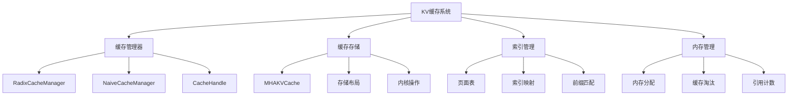
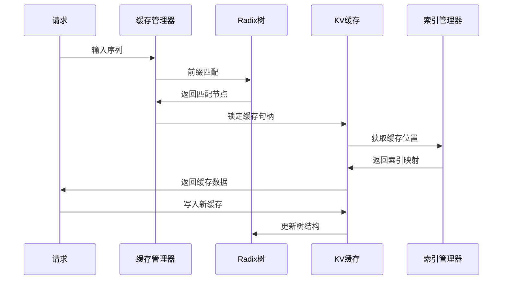
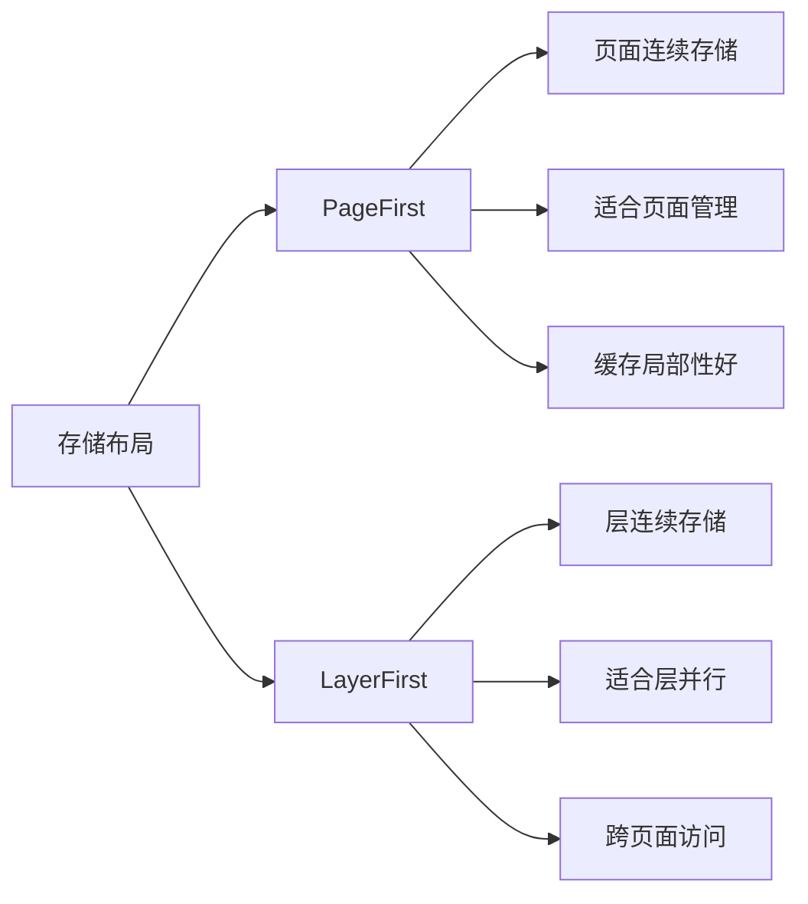
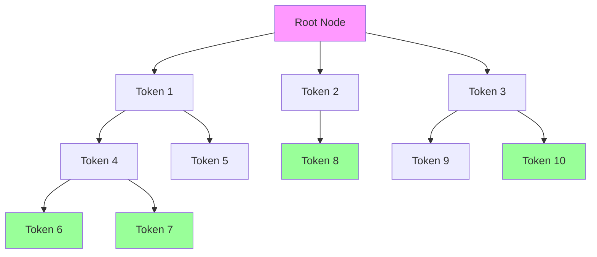
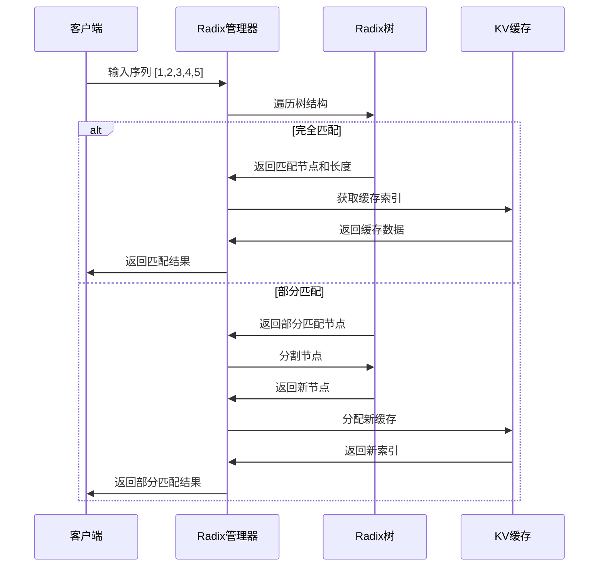
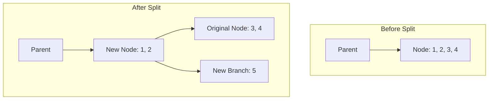
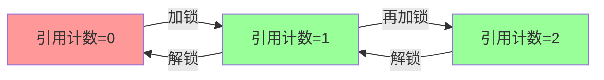
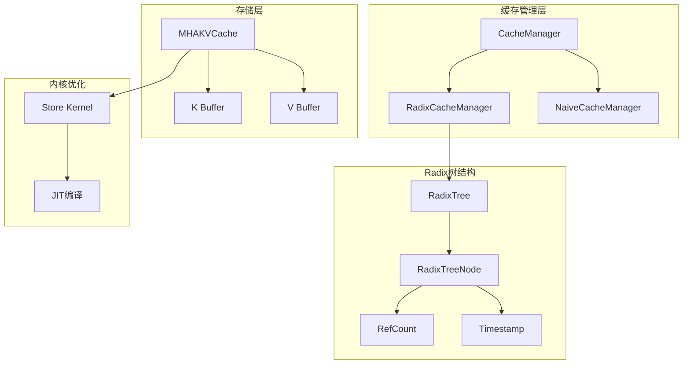

# 第五章：KV缓存管理与Radix树优化

## 本章学习目标

通过本章学习，你将了解：
- KV缓存的核心架构和内存管理机制
- Radix树缓存复用算法的实现原理
- 高性能缓存存储和索引操作
- 缓存淘汰策略和内存平衡管理
- 不同缓存策略的性能对比

## 核心概念速查表

| 术语 | 英文 | 解释 |
|------|------|------|
| **KV 缓存** | KV Cache | 存储 Transformer 模型中 Attention 层的 Key 和 Value 矩阵，避免重复计算。 |
| **Radix 树** | Radix Tree | 一种压缩前缀树，Mini-SGLang 用它来管理 KV Cache，支持高效的前缀匹配和复用。 |
| **PagedAttention** | PagedAttention | 一种受操作系统虚拟内存启发的显存管理技术，将 KV Cache 分成固定大小的块（Page），允许非连续存储，彻底解决了显存碎片问题。 |
| **LRU** | Least Recently Used | 最近最少使用淘汰算法，当缓存空间不足时，优先淘汰最久未被访问的数据。 |
| **引用计数** | Reference Counting | 记录每个缓存块被引用的次数，只有当引用计数为 0 时，该块才能被安全回收。 |

## 背景知识

### LLM推理中的KV缓存挑战

在大语言模型推理中，KV缓存管理面临以下关键挑战：

1. **内存消耗巨大**：KV缓存占用大量显存，特别是长序列推理
2. **缓存复用困难**：如何高效复用共享前缀的缓存
3. **内存碎片化**：动态分配导致内存利用率下降
4. **并发访问冲突**：多请求同时访问缓存的安全性问题
5. **淘汰策略选择**：如何在有限内存中管理大量缓存数据

### 关键技术概念

- **KV缓存（Key-Value Cache）**：存储注意力计算中的键值对
- **Radix树（基数树）**：基于前缀的树形数据结构，支持高效前缀匹配
- **缓存复用**：共享前缀的请求可以复用已计算的KV缓存
- **内存池管理**：预分配内存块减少动态分配开销
- **LRU淘汰**：最近最少使用策略管理缓存生命周期

### PagedAttention 与内存管理

传统的 KV Cache 分配方式要求显存连续，这导致了严重的内存碎片和浪费（类似于操作系统中的外部碎片）。
- **PagedAttention** 的核心思想是将 KV Cache 视为虚拟内存，将显存划分为固定大小的块（Block/Page）。
- **优势**：
    1.  **消除碎片**：允许 KV Cache 在物理显存上不连续。
    2.  **灵活共享**：不同的请求可以共享同一个物理块（例如 System Prompt）。
    3.  **动态分配**：按需分配块，无需预先分配最大长度。

Mini-SGLang 的 `MHAKVCache` 支持 `PageFirst` 布局，正是为了配合这种分页管理机制。

## KV缓存系统架构

### 整体架构概览



### 核心组件关系



## KV缓存基础架构

### 1. 抽象接口设计

#### 基础缓存接口

```python
class BaseKVCache(ABC):
    """KV缓存基础接口"""
    
    @abstractmethod
    def k_cache(self, index: int) -> torch.Tensor: ...
    
    @abstractmethod
    def v_cache(self, index: int) -> torch.Tensor: ...
    
    @abstractmethod
    def store_kv(self, k: torch.Tensor, v: torch.Tensor, 
                 out_loc: torch.Tensor, layer_id: int) -> None: ...
```

#### 缓存管理器接口

```python
class BaseCacheManager(ABC):
    """缓存管理器基础接口"""
    
    @abstractmethod
    def match_prefix(self, input_ids: torch.Tensor) -> Tuple[BaseCacheHandle, torch.Tensor]: ...
    
    @abstractmethod
    def lock_handle(self, handle: BaseCacheHandle, unlock: bool = False) -> None: ...
    
    @abstractmethod
    def insert_prefix(self, input_ids: torch.Tensor, indices: torch.Tensor) -> int: ...
    
    @abstractmethod
    def evict(self, size: int) -> torch.Tensor: ...
```

### 2. 缓存存储实现

#### MHAKVCache多头部缓存

```python
class MHAKVCache(BaseKVCache):
    """多头注意力KV缓存实现"""
    
    def __init__(self, num_kv_heads: int, num_layers: int, head_dim: int, 
                 num_pages: int, dtype: torch.dtype, kv_layout: KVCacheLayout, 
                 device: torch.device):
        
        # 根据张量并行调整KV头数
        tp_info = get_tp_info()
        local_kv_heads = divide_even(num_kv_heads, tp_info.size)
        
        # 选择存储布局
        match kv_layout:
            case KVCacheLayout.PageFirst:
                # 页面优先布局：适合页面管理
                kv_buffer = torch.empty((2, num_pages, num_layers, local_kv_heads, head_dim))
            case KVCacheLayout.LayerFirst:
                # 层优先布局：适合层并行
                kv_buffer = torch.empty((2, num_layers, num_pages, local_kv_heads, head_dim))
        
        self._kv_buffer = kv_buffer.view(2, num_layers, num_pages, 1, local_kv_heads, head_dim)
        self._k_buffer = self._kv_buffer[0]  # Key缓存
        self._v_buffer = self._kv_buffer[1]  # Value缓存
```

#### 存储布局对比



### 3. 高性能存储内核

#### 缓存存储内核

```python
@lru_cache(maxsize=None)
def _jit_store_module(element_size: int, config: KernelConfig) -> Module:
    """JIT编译缓存存储内核"""
    args = make_cpp_args(element_size, *config)
    return load_jit(
        "store",
        *args,
        cuda_files=["store.cu"],
        cuda_wrappers=[("launch", f"StoreKernel<{args}>::run")],
    )

def store_cache(k_cache: torch.Tensor, v_cache: torch.Tensor, 
                indices: torch.Tensor, k: torch.Tensor, v: torch.Tensor) -> None:
    """高性能KV缓存存储操作"""
    
    # 展平缓存以支持高效访问
    num_tokens = k_cache.shape[0]
    k_cache = k_cache.view(num_tokens, -1)
    v_cache = v_cache.view(num_tokens, -1)
    
    # 计算元素大小并加载内核
    element_size = k_cache.shape[1] * k_cache.element_size()
    module = _jit_store_module(element_size)
    
    # 执行内核操作
    module.launch(k_cache, v_cache, indices, k, v)
```

## 🌳 Radix树缓存优化

### 1. Radix树数据结构

#### 树节点设计

```python
class RadixTreeNode:
    """Radix树节点，存储缓存序列和子节点映射"""
    
    counter: int = 0  # 全局节点计数器
    
    def __init__(self, tic: int | None = None):
        self.children: Dict[int, RadixTreeNode] = {}  # 子节点映射
        self._parent: RadixTreeNode | None = None     # 父节点
        self.ref_count: int = 0                       # 引用计数
        self.uuid = RadixTreeNode.counter            # 唯一标识
        self.timestamp = tic or time.monotonic_ns()  # 访问时间戳
        
        # 缓存数据
        self._key: torch.Tensor     # 键序列
        self._value: torch.Tensor   # 值序列（缓存索引）
        self._length: int           # 序列长度
```

#### 树结构示例



### 2. 前缀匹配算法

#### 树遍历算法

```python
def _walk(self, input_ids: torch.Tensor) -> Tuple[RadixTreeNode, int]:
    """遍历Radix树寻找最长匹配前缀"""
    
    prefix_len = 0
    indice_len = len(input_ids)
    node = self.root_node
    tic = time.monotonic_ns()
    
    while prefix_len < indice_len:
        # 获取当前token
        this_id = int(input_ids[prefix_len].item())
        
        # 检查是否有匹配的子节点
        if this_id not in node.children:
            return node, prefix_len
        
        # 移动到子节点
        node = node.children[this_id]
        
        # 计算匹配长度
        match_len = node.get_match_len(input_ids[prefix_len:])
        prefix_len += match_len
        
        # 处理部分匹配情况（需要分割节点）
        if match_len != node.length:
            node = node._split_at(match_len)
            return node, prefix_len
        
        # 更新访问时间戳
        node.timestamp = tic
    
    return node, prefix_len
```

#### 前缀匹配流程



### 3. 缓存复用机制

#### 匹配前缀查找

```python
def match_prefix(self, input_ids: torch.Tensor) -> Tuple[RadixCacheHandle, torch.Tensor]:
    """匹配输入序列的前缀并返回缓存索引"""
    
    node, prefix_len = self._walk(input_ids)
    
    # 无匹配情况
    if prefix_len == 0:
        return RadixCacheHandle(prefix_len, node), self.empty_tensor
    
    # 收集匹配路径上的所有值
    value_list: List[torch.Tensor] = []
    while not node.is_root():
        value_list.append(node.value)  # 缓存索引
        node = node.parent
    
    # 反转并拼接索引序列
    value_list.reverse()
    return RadixCacheHandle(prefix_len, node), torch.cat(value_list)
```

#### 缓存复用示例

假设已有缓存：
- 序列A: [1,2,3] → 缓存索引 [100,101,102]
- 序列B: [1,2,4] → 缓存索引 [103,104,105]

新请求：序列C: [1,2,3,5]
- 匹配前缀: [1,2,3]（长度3）
- 复用缓存: 索引 [100,101,102]
- 新增缓存: 索引 [106]（对应token 5）

### 4. 节点分割策略

#### 动态节点分割

```python
def _split_at(self, pos: int) -> RadixTreeNode:
    """在指定位置分割节点"""
    
    assert 0 < pos < self.length
    parent = self.parent
    
    # 创建新节点存储前半部分
    new_node = RadixTreeNode(self.timestamp)
    new_node.set_key_value(self._key[:pos], self._value[:pos])
    new_node.set_parent(parent)
    new_node.ref_count = self.ref_count
    
    # 更新当前节点为后半部分
    self.set_key_value(self._key[pos:], self._value[pos:])
    self.set_parent(new_node)
    
    return new_node
```

#### 节点分割示意图

当插入新序列 `[1, 2, 5]` 到已有节点 `[1, 2, 3, 4]` 时，发生分割：



#### 分割场景示例

```mermaid
graph TB
    A[原节点: [1,2,3,4]] --> B[分割位置: 2]
    B --> C[新节点: [1,2]]
    B --> D[当前节点: [3,4]]
    
    C --> E[子节点映射]
    D --> F[子节点映射]
    
    E --> E1[原子节点]
    F --> F1[原子节点]
```

## 🔒 缓存管理机制

### 1. 引用计数管理

#### 缓存锁定机制

```python
def lock_handle(self, handle: BaseCacheHandle, unlock: bool = False) -> None:
    """锁定或解锁缓存句柄"""
    
    assert isinstance(handle, RadixCacheHandle)
    node = handle.node
    
    if unlock:
        # 解锁：减少引用计数
        while not node.is_root():
            node = node.parent
            node.ref_count -= 1
            
            # 引用计数归零时变为可淘汰
            if node.ref_count == 0:
                self.evictable_size += node.length
                self.protected_size -= node.length
    else:
        # 加锁：增加引用计数
        while not node.is_root():
            node = node.parent
            
            # 引用计数从0变为1时从可淘汰转为受保护
            if node.ref_count == 0:
                self.evictable_size -= node.length
                self.protected_size += node.length
            
            node.ref_count += 1
```

#### 引用计数状态转换



### 2. 缓存淘汰策略

#### LRU淘汰算法

```python
def evict(self, size: int) -> torch.Tensor:
    """淘汰指定大小的缓存"""
    
    if size == 0:
        return self.empty_tensor
    
    # 检查可淘汰空间是否足够
    assert size <= self.evictable_size, f"Cannot evict {size}, only {self.evictable_size} available"
    
    # 收集可淘汰的叶子节点
    leave_nodes = self._collect_leave_nodes_for_evict()
    heapq.heapify(leave_nodes)  # 按时间戳排序（最小堆）
    
    evicted_indices: List[torch.Tensor] = []
    evicted_size = 0
    
    # 按LRU顺序淘汰
    while evicted_size < size:
        node = heapq.heappop(leave_nodes)  # 获取最久未访问节点
        assert node.ref_count == 0 and node.is_leaf() and not node.is_root()
        
        evicted_size += node.length
        evicted_indices.append(node.value)
        self.evictable_size -= node.length
        
        # 从父节点移除引用
        parent = node.parent
        del parent.children[int(node._key[0].item())]
        
        # 如果父节点变为叶子且无引用，加入淘汰候选
        if parent.is_leaf() and parent.ref_count == 0:
            heapq.heappush(leave_nodes, parent)
    
    return torch.cat(evicted_indices)
```

#### 淘汰策略对比

| 策略 | 优点 | 缺点 | 适用场景 |
|------|------|------|----------|
| **LRU** | 简单高效，局部性好 | 可能淘汰热点数据 | 一般缓存系统 |
| **LFU** | 保护频繁访问数据 | 需要频率统计开销 | 访问模式稳定 |
| **Random** | 实现简单，无开销 | 淘汰可能不合理 | 内存紧张时 |

### 3. 缓存插入机制

#### 新前缀插入

```python
def insert_prefix(self, input_ids: torch.Tensor, indices: torch.Tensor) -> int:
    """插入新前缀到缓存"""
    
    node, prefix_len = self._walk(input_ids)
    assert prefix_len <= len(input_ids)
    
    # 只插入未匹配的部分
    if prefix_len < len(input_ids):
        new_node = RadixTreeNode()
        new_node.set_key_value(input_ids[prefix_len:], indices[prefix_len:])
        new_node.set_parent(node)
        self.evictable_size += new_node.length
    
    return prefix_len
```

## 性能优化技术

### 1. 内存布局优化

#### 页面优先布局

```python
case KVCacheLayout.PageFirst:
    # 页面连续存储，适合页面管理
    kv_buffer = torch.empty((2, num_pages, num_layers, local_kv_heads, head_dim))
    kv_buffer = kv_buffer.permute(0, 2, 1, 3, 4)  # 调整维度顺序
```

**优势**：
- 页面内数据连续，缓存局部性好
- 适合按页面管理缓存生命周期
- 减少内存碎片

#### 层优先布局

```python
case KVCacheLayout.LayerFirst:
    # 层连续存储，适合层并行
    kv_buffer = torch.empty((2, num_layers, num_pages, local_kv_heads, head_dim))
```

**优势**：
- 同层数据连续，适合层并行计算
- 减少跨层内存访问
- 优化注意力计算

### 2. 内核级优化

#### JIT编译优化

```python
@lru_cache(maxsize=None)
def _jit_store_module(element_size: int, config: KernelConfig) -> Module:
    """缓存存储内核的JIT编译"""
    
    args = make_cpp_args(element_size, *config)
    return load_jit(
        "store",
        *args,
        cuda_files=["store.cu"],  # CUDA内核源码
        cuda_wrappers=[("launch", f"StoreKernel<{args}>::run")],
    )
```

**优化效果**：
- 运行时编译优化特定硬件
- 内联函数调用减少开销
- 寄存器分配优化

### 3. 内存访问优化

#### 连续内存访问

```python
# 展平缓存以支持连续访问
num_tokens = k_cache.shape[0]
k_cache = k_cache.view(num_tokens, -1)
v_cache = v_cache.view(num_tokens, -1)
```

**优化效果**：
- 减少内存访问次数
- 提高缓存命中率
- 支持向量化操作

## 缓存策略对比

### 1. Radix vs Naive缓存管理器

#### Naive缓存管理器（基础实现）

```python
class NaiveCacheManager(BaseCacheManager):
    """简单缓存管理器，无复用优化"""
    
    def match_prefix(self, input_ids: torch.Tensor) -> Tuple[NaiveCacheHandle, torch.Tensor]:
        _ = input_ids  # 忽略输入，始终返回空匹配
        return NaiveCacheHandle(0), self.empty_tensor
    
    def evict(self, size: int) -> torch.Tensor:
        if size == 0:
            return self.empty_tensor
        raise NotImplementedError("NaiveCacheManager does not support eviction.")
```

#### 性能对比分析

| 特性 | Radix缓存管理器 | Naive缓存管理器 |
|------|----------------|----------------|
| **缓存复用** | ✅ 支持前缀匹配和复用 | ❌ 无复用机制 |
| **内存效率** | ✅ 高，共享前缀节省内存 | ❌ 低，重复存储相同前缀 |
| **计算效率** | ✅ 高，避免重复计算 | ❌ 低，重复计算相同前缀 |
| **实现复杂度** | ❌ 高，需要树结构管理 | ✅ 低，简单直接 |
| **适用场景** | 多轮对话、批量相似请求 | 简单推理场景 |

### 2. 实际性能数据

根据官方基准测试，Radix缓存相比Naive缓存：
- **内存使用**：减少30-50%（共享前缀）
- **吞吐量**：提升20-40%（避免重复计算）
- **响应时间**：降低15-30%（缓存命中）

## 本章总结

本章详细分析了Mini-SGLang的KV缓存管理系统：

### 缓存系统架构总览



### 核心组件功能对比

| 组件 | 功能 | 复杂度 | 适用场景 |
|------|------|--------|----------|
| **RadixCacheManager** | 前缀匹配、缓存复用 | O(n) | 多轮对话、相似请求 |
| **NaiveCacheManager** | 简单分配、无复用 | O(1) | 简单推理场景 |
| **MHAKVCache** | KV存储、内存管理 | O(1) | 通用存储 |
| **RadixTreeNode** | 前缀表示、子节点管理 | O(k) | 树结构维护 |

### 关键算法复杂度

| 操作 | 时间复杂度 | 空间复杂度 |
|------|-----------|-----------|
| 前缀匹配 | O(n) | O(1) |
| 缓存插入 | O(n) | O(n) |
| 缓存淘汰 | O(k log k) | O(k) |
| 引用计数更新 | O(d) | O(1) |

> n = 序列长度，k = 淘汰节点数，d = 树深度

---

**下一章预告**：第六章将深入分析高性能内核与CUDA优化技术，这是实现极致性能的关键组件。

---

**技术要点回顾**：
- Radix树通过前缀匹配实现缓存复用
- 引用计数机制确保缓存访问安全
- LRU淘汰策略管理缓存生命周期
- JIT编译优化提升内核执行效率
- 内存布局选择影响缓存访问性能