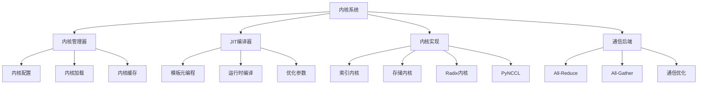
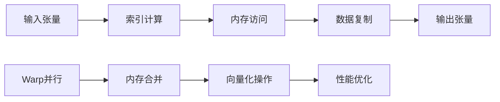
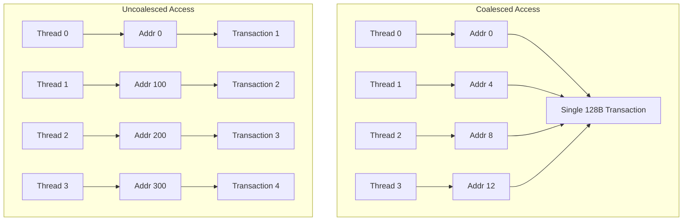
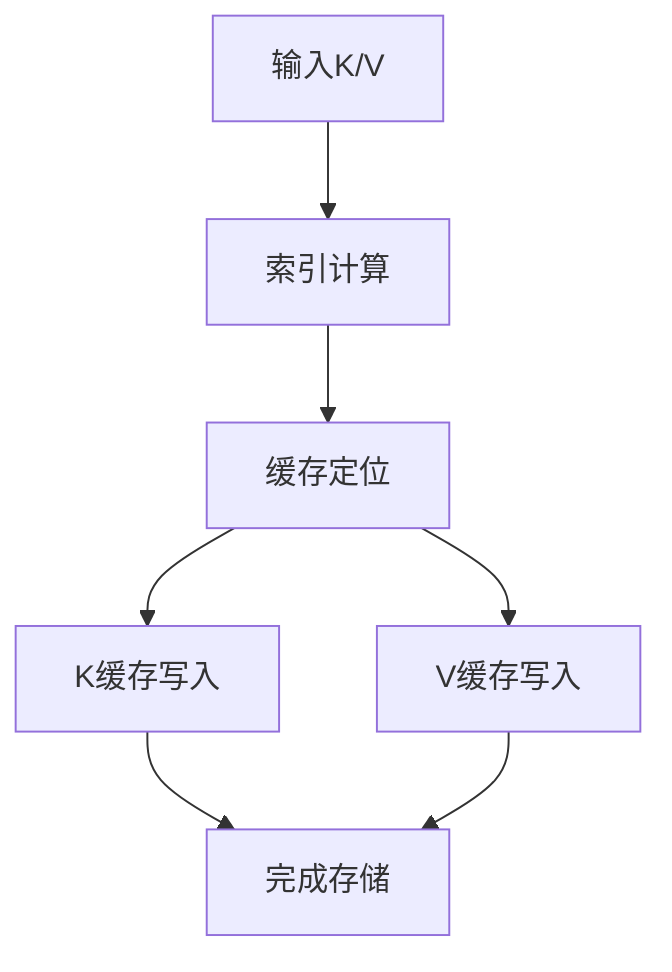
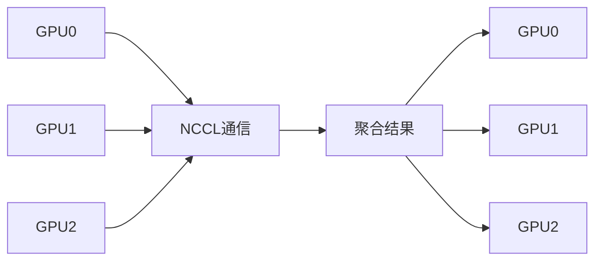
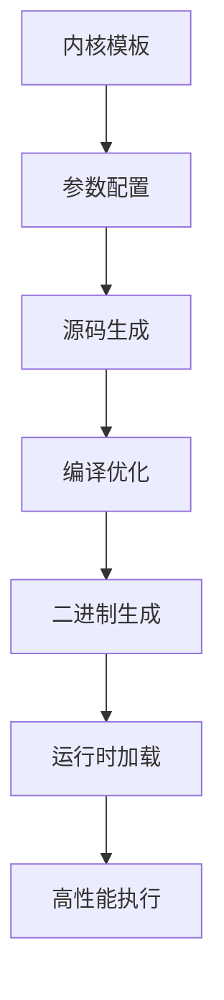
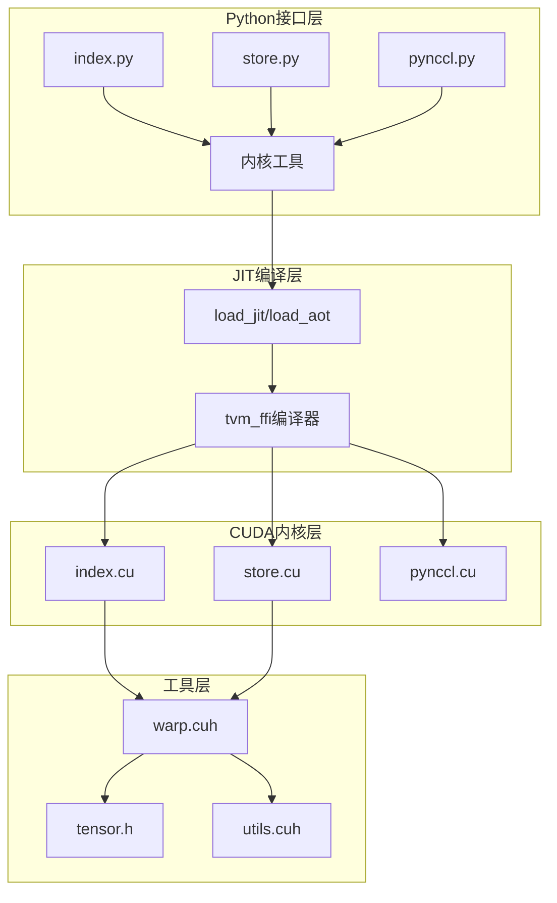

# 第六章：高性能内核与CUDA优化

## 本章学习目标

通过本章学习，你将了解：
- Mini-SGLang 高性能内核的整体架构设计
- CUDA内核的JIT编译和运行时优化技术
- 索引和存储内核的高性能实现原理
- PyNCCL分布式通信的CUDA优化
- 内存访问模式和并行计算优化策略

## 核心概念速查表

| 术语 | 英文 | 解释 |
|------|------|------|
| **CUDA Kernel** | CUDA Kernel | 在 GPU 上并行执行的函数，由成千上万个线程同时运行。 |
| **Warp** | Warp | GPU 调度的基本单位，通常包含 32 个线程。Warp 内的线程以 SIMT（单指令多线程）方式执行。 |
| **Warp Divergence** | Warp Divergence | 当 Warp 内的线程执行不同的分支路径（如 if-else）时，GPU 必须串行执行每个分支，导致性能下降。 |
| **合并访问** | Memory Coalescing | 当 Warp 内的线程访问连续且对齐的全局内存地址时，GPU 将这些访问合并为一次事务，显著提高带宽利用率。 |
| **JIT 编译** | Just-In-Time Compilation | 运行时编译，根据当前的硬件配置和参数动态生成优化的机器码。 |
| **向量化** | Vectorization | 使用向量指令（如 `float4`, `int4`）一次性读写多个数据元素，提高内存吞吐量。 |

## 背景知识

### GPU计算优化挑战

在大规模LLM推理中，GPU计算面临以下关键挑战：

1. **内存带宽限制**：GPU内存带宽成为性能瓶颈
2. **并行度不足**：无法充分利用GPU的并行计算能力
3. **启动开销**：CUDA内核启动延迟影响小批量性能
4. **内存访问模式**：非连续访问导致缓存命中率低
5. **通信开销**：分布式通信成为性能瓶颈

### 关键技术概念

- **CUDA内核**：GPU上执行的并行计算程序
- **JIT编译**：运行时编译优化特定硬件配置
- **Warp级并行**：32个线程组成的并行执行单元
- **内存合并访问**：优化内存访问模式提高带宽利用率
- **NCCL通信**：NVIDIA的GPU间高性能通信库

### 深入理解 Warp Divergence

GPU 采用 SIMT（Single Instruction, Multiple Threads）架构。一个 Warp 中的 32 个线程必须在同一时刻执行相同的指令。
- **问题**：如果代码中包含 `if-else` 分支，且 Warp 内部分线程走 `if`，部分走 `else`，GPU 必须先执行 `if` 分支（禁用 `else` 线程），再执行 `else` 分支（禁用 `if` 线程）。
- **后果**：执行时间变成了两个分支之和，并行效率减半。
- **优化**：尽量避免 Warp 内的分支差异，或者使用谓词指令（Predicated Instructions）。

### 内存合并访问 (Memory Coalescing)

全局内存（Global Memory）的访问延迟很高，带宽有限。
- **理想情况**：Warp 中的线程 $i$ 访问地址 $Base + i$，这 32 个连续的 4 字节访问会被合并为一次 128 字节的内存事务。
- **最差情况**：线程访问的地址是随机分散的（Strided Access），导致 GPU 必须发起 32 次独立的内存事务，带宽利用率极低。

## 内核系统架构

### 整体架构概览



### 内核模块组织

```
minisgl/kernel/
├── csrc/                    # C++/CUDA源码
│   ├── include/             # 头文件
│   │   ├── minisgl/        # Mini-SGLang专用头文件
│   │   │   ├── tensor.h    # 张量操作
│   │   │   ├── utils.cuh   # CUDA工具函数
│   │   │   └── warp.cuh    # Warp级操作
│   ├── jit/                # JIT编译内核
│   │   ├── index.cu        # 索引内核
│   │   └── store.cu        # 存储内核
│   └── src/                # 静态编译内核
│       ├── pynccl.cu       # PyNCCL通信
│       ├── radix.cpp       # Radix树操作
│       └── tensor.cpp      # 张量工具
├── index.py                # 索引内核接口
├── store.py               # 存储内核接口
├── pynccl.py              # PyNCCL接口
└── utils.py               # 内核工具函数
```

## 内核实现详解

### 1. 索引内核（Index Kernel）

#### 内核架构设计



#### CUDA内核实现

```cuda
// 索引内核模板
template <std::size_t kNumThreads, std::size_t kMaxOccupancy, bool kUsePDL,
          std::size_t kElementSize, std::size_t kNumSplits, std::integral T>
__global__ __launch_bounds__(kNumThreads, kMaxOccupancy) void 
    index_kernel(const __grid_constant__ IndexKernelParams params) {
    
    using namespace device;
    constexpr auto kSize = kElementSize;
    constexpr auto kSizePerWarp = kSize / kNumSplits;
    constexpr auto kWarpPerBlock = static_cast<unsigned>(kNumThreads / 32);
    
    const auto &[output, weight, indices_, num_warps] = params;
    const auto indices = static_cast<const T *>(indices_);
    const auto warp_id = (threadIdx.x / kWarpThreads) + blockIdx.x * kWarpPerBlock;
    
    PDL::wait<kUsePDL>();
    
    if (warp_id < num_warps) {
        const auto pos = indices[warp_id / kNumSplits];
        const auto dst = pointer::offset(output, warp_id * kSizePerWarp);
        const auto src = pointer::offset(weight, pos * kSize,
                                       (warp_id % kNumSplits) * kSizePerWarp);
        warp::copy<kSizePerWarp>(dst, src);
    }
    
    PDL::launch<kUsePDL>();
}
```

#### 关键优化技术

**1. Warp级并行**
```cuda
constexpr auto kWarpPerBlock = static_cast<unsigned>(kNumThreads / 32);
const auto warp_id = (threadIdx.x / kWarpThreads) + blockIdx.x * kWarpPerBlock;
```

**2. 内存合并访问**
```cuda
const auto dst = pointer::offset(output, warp_id * kSizePerWarp);
const auto src = pointer::offset(weight, pos * kSize);
```

#### 内存合并示意图



**3. 向量化复制**
```cuda
warp::copy<kSizePerWarp>(dst, src);
```

#### 掩码索引内核

```cuda
template <std::size_t kNumThreads, std::size_t kMaxOccupancy, bool kUsePDL,
          std::size_t kElementSize, std::size_t kNumSplits, std::integral T>
__global__ void masked_index_kernel(const MaskedKernelParams mask_params) {
    
    const auto &[params, start, length] = mask_params;
    const auto &[output, weight, indices_, num_warps] = params;
    
    if (warp_id < num_warps) {
        const auto pos = indices[warp_id / kNumSplits] - start;
        if (pos < length) {
            // 正常复制
            warp::copy<kSizePerWarp>(dst, src);
        } else {
            // 超出范围，重置为0
            warp::reset<kSizePerWarp>(dst);
        }
    }
}
```

### 2. 存储内核（Store Kernel）

#### KV缓存存储架构



#### 存储内核实现

```cuda
template <std::size_t kNumThreads, std::size_t kMaxOccupancy, bool kUsePDL,
          std::size_t kElementSize, std::integral T>
__global__ void store_kv_cache(const StoreKernelParams params) {
    
    const auto &[k_cache, v_cache, indices, k, v, kv_cache_stride,
                 kv_input_stride, length] = params;
    const auto warp_id = (threadIdx.x / kWarpThreads) + blockIdx.x * kWarpPerBlock;
    
    PDL::wait<kUsePDL>();
    
    if (warp_id < length) {
        const auto pos = static_cast<const T *>(indices)[warp_id];
        
        // 存储Key缓存
        const auto dst_k = pointer::offset(k_cache, pos * kv_cache_stride);
        const auto src_k = pointer::offset(k, warp_id * kv_input_stride);
        warp::copy<kElementSize>(dst_k, src_k);
        
        // 存储Value缓存
        const auto dst_v = pointer::offset(v_cache, pos * kv_cache_stride);
        const auto src_v = pointer::offset(v, warp_id * kv_input_stride);
        warp::copy<kElementSize>(dst_v, src_v);
    }
    
    PDL::launch<kUsePDL>();
}
```

#### 存储优化特性

**1. 双缓存并行写入**
```cuda
// Key缓存写入
warp::copy<kElementSize>(dst_k, src_k);
// Value缓存写入
warp::copy<kElementSize>(dst_v, src_v);
```

**2. 内存布局优化**
```cuda
const auto dst_k = pointer::offset(k_cache, pos * kv_cache_stride);
const auto src_k = pointer::offset(k, warp_id * kv_input_stride);
```

**3. 步长计算优化**
```python
kv_cache_stride = X.unwrap() * dtype_size  # 缓存步长
kv_input_stride = Y.unwrap() * dtype_size  # 输入步长
```

### 3. PyNCCL通信内核

#### NCCL通信架构



#### All-Reduce实现

```cuda
auto all_reduce(tvm::ffi::TensorView t, std::string op) const -> void {
    const auto size_dim = static_cast<size_t>(t.shape().Product());
    const auto dtype = kNCCLDtypeMap.at(t.dtype());
    const auto size_bytes = size_dim * (t.dtype().bits / 8);
    const auto data_ptr = t.data_ptr();
    const auto reduce_op = kNCCLReduceOPMap.at(op);
    const auto stream = LaunchKernel::resolve_device(t.device());
    
    if (size_bytes <= m_max_bytes) {
        // 使用内部缓冲区优化小张量
        const auto buf_ptr = m_sym_mem.get();
        CUDA_CHECK(::cudaMemcpyAsync(buf_ptr, data_ptr, size_bytes,
                                     ::cudaMemcpyDeviceToDevice, stream));
        NCCL_CHECK(::ncclAllReduce(buf_ptr, buf_ptr, size_dim, dtype,
                                   reduce_op, m_comm.get(), stream));
        CUDA_CHECK(::cudaMemcpyAsync(data_ptr, buf_ptr, size_bytes,
                                     ::cudaMemcpyDeviceToDevice, stream));
    } else {
        // 直接操作大张量
        NCCL_CHECK(::ncclAllReduce(data_ptr, data_ptr, size_dim, dtype,
                                   reduce_op, m_comm.get(), stream));
    }
}
```

#### All-Gather实现

```cuda
auto all_gather(tvm::ffi::TensorView dst, tvm::ffi::TensorView src) const -> void {
    const auto size_dim = static_cast<size_t>(src.shape().Product());
    const auto dtype = kNCCLDtypeMap.at(src.dtype());
    const auto src_ptr = src.data_ptr();
    const auto dst_ptr = dst.data_ptr();
    const auto stream = LaunchKernel::resolve_device(src.device());
    
    NCCL_CHECK(::ncclAllGather(src_ptr, dst_ptr, size_dim, dtype,
                               m_comm.get(), stream));
}
```

#### 数据类型映射

```cuda
const auto kNCCLDtypeMap = std::unordered_map<DLDataType, ncclDataType_t>{
    {{DLDataTypeCode::kDLFloat, 16, 1}, ncclFloat16},    // FP16
    {{DLDataTypeCode::kDLBfloat, 16, 1}, ncclBfloat16},  // BF16
};

const auto kNCCLReduceOPMap = std::unordered_map<std::string_view, ncclRedOp_t>{
    {"sum", ::ncclSum},   // 求和
    {"prod", ::ncclProd}, // 乘积
    {"max", ::ncclMax},   // 最大值
    {"min", ::ncclMin},   // 最小值
    {"avg", ::ncclAvg},   // 平均值
};
```

## JIT编译优化

### 1. JIT编译架构



### 2. 内核加载机制

#### JIT编译函数

```python
def load_jit(
    *args: str,
    cpp_files: List[str] | None = None,
    cuda_files: List[str] | None = None,
    cpp_wrappers: List[Tuple[str, str]] | None = None,
    cuda_wrappers: List[Tuple[str, str]] | None = None,
    extra_cflags: List[str] | None = None,
    extra_cuda_cflags: List[str] | None = None,
    extra_ldflags: List[str] | None = None,
    extra_include_paths: List[str] | None = None,
    build_directory: str | None = None,
) -> Module:
    
    # 构建CUDA源码
    cuda_paths = [(KERNEL_PATH / "jit" / f).resolve() for f in cuda_files]
    cuda_sources = [f'#include "{path}"' for path in cuda_paths]
    cuda_sources += [_make_wrapper(tup) for tup in cuda_wrappers]
    
    return load_inline(
        _make_name(*args),
        cpp_sources=cpp_sources,
        cuda_sources=cuda_sources,
        extra_cflags=DEFAULT_CFLAGS + extra_cflags,
        extra_cuda_cflags=DEFAULT_CUDA_CFLAGS + extra_cuda_cflags,
        extra_ldflags=DEFAULT_LDFLAGS + extra_ldflags,
        extra_include_paths=DEFAULT_INCLUDE + extra_include_paths,
        build_directory=build_directory,
    )
```

#### 编译配置

```python
# 默认编译参数
DEFAULT_CFLAGS = ["-std=c++20", "-O3"]
DEFAULT_CUDA_CFLAGS = ["-std=c++20", "-O3", "--expt-relaxed-constexpr"]
DEFAULT_LDFLAGS = []
DEFAULT_INCLUDE = [str(KERNEL_PATH / "include")]
```

### 3. 模板参数化

#### 内核配置类

```python
class KernelConfig(NamedTuple):
    num_threads: int      # 线程数
    max_occupancy: int    # 最大占用率
    use_pdl: bool         # 是否使用PDL
    
    @property
    def template_args(self) -> str:
        pdl = "true" if self.use_pdl else "false"
        return f"{self.num_threads},{self.max_occupancy},{pdl}"
```

#### 内核实例化

```python
@lru_cache(maxsize=None)
def _jit_store_module(element_size: int, config: KernelConfig) -> Module:
    """JIT编译存储内核"""
    args = make_cpp_args(element_size, *config)
    return load_jit(
        "store",
        cuda_files=["store.cu"],
        cuda_wrappers=[("launch", f"StoreKernel<{args}>::run")],
    )
```

## 内存访问优化

### 1. 内存合并访问

#### 指针偏移计算

```cuda
namespace pointer {
    template <typename T>
    __device__ __forceinline__ auto offset(T *ptr, std::size_t bytes,
                                           std::size_t offset_bytes = 0) -> T * {
        return reinterpret_cast<T *>(reinterpret_cast<char *>(ptr) + bytes + offset_bytes);
    }
}
```

#### Warp级内存操作

```cuda
namespace warp {
    template <std::size_t kSize>
    __device__ __forceinline__ void copy(void *__restrict__ dst,
                                         const void *__restrict__ src) {
        using uint4_t = uint4;
        constexpr auto kNumUint4 = kSize / sizeof(uint4_t);
        
        auto *dst_u4 = static_cast<uint4_t *>(dst);
        const auto *src_u4 = static_cast<const uint4_t *>(src);
        
        #pragma unroll
        for (std::size_t i = threadIdx.x % 32; i < kNumUint4; i += 32) {
            dst_u4[i] = src_u4[i];
        }
    }
}
```

### 2. 向量化操作

#### uint4向量化复制

```cuda
template <std::size_t kSize>
__device__ void reset(void *__restrict__ dst) {
    using uint4_t = uint4;
    constexpr auto kNumUint4 = kSize / sizeof(uint4_t);
    auto *dst_u4 = static_cast<uint4_t *>(dst);
    const uint4_t zero = {0, 0, 0, 0};
    
    #pragma unroll
    for (std::size_t i = threadIdx.x % 32; i < kNumUint4; i += 32) {
        dst_u4[i] = zero;
    }
}
```

### 3. 内存布局优化

#### 张量步长计算

```python
def _verify_tensor_layout(tensor_view, expected_strides):
    """验证张量内存布局"""
    actual_strides = tensor_view.strides()
    for exp, act in zip(expected_strides, actual_strides):
        if exp != act:
            raise RuntimeError(f"Stride mismatch: expected {exp}, got {act}")
```

## 性能优化技术

### 1. PDL（Persistent Device Launch）优化

#### PDL等待机制

```cuda
template <bool kUsePDL>
struct PDL {
    __device__ static void wait() {
        if constexpr (kUsePDL) {
            // PDL特定的等待逻辑
            __pdl_wait();
        }
    }
    
    __device__ static void launch() {
        if constexpr (kUsePDL) {
            // PDL特定的启动逻辑
            __pdl_launch();
        }
    }
};
```

### 2. 占用率优化

#### 块大小配置

```python
def optimize_block_size(element_size: int, device_props: dict) -> KernelConfig:
    """根据元素大小和设备属性优化块大小"""
    
    max_threads_per_block = device_props["maxThreadsPerBlock"]
    shared_mem_per_block = device_props["sharedMemPerBlock"]
    
    # 计算最优线程数
    if element_size <= 128:
        num_threads = 256  # 小元素使用更多线程
    elif element_size <= 512:
        num_threads = 128   # 中等元素
    else:
        num_threads = 64   # 大元素使用较少线程
    
    num_threads = min(num_threads, max_threads_per_block)
    
    return KernelConfig(
        num_threads=num_threads,
        max_occupancy=calculate_occupancy(num_threads, shared_mem_per_block),
        use_pdl=should_use_pdl(element_size)
    )
```

### 3. 流并行优化

#### 多流执行

```python
def execute_with_streams(kernels: List[Kernel], streams: List[torch.cuda.Stream]):
    """使用多个CUDA流并行执行内核"""
    
    for i, (kernel, stream) in enumerate(zip(kernels, streams)):
        with torch.cuda.stream(stream):
            kernel.launch()
    
    # 同步所有流
    for stream in streams:
        stream.synchronize()
```

## 性能对比分析

### 1. 优化技术效果对比

| 优化技术 | 性能提升 | 适用场景 | 实现复杂度 |
|---------|---------|---------|----------|
| **Warp级并行** | 20-30% | 所有内核 | 中等 |
| **内存合并访问** | 30-50% | 大张量操作 | 高 |
| **JIT编译** | 15-25% | 运行时优化 | 高 |
| **PDL优化** | 10-20% | 小批量推理 | 中等 |
| **向量化操作** | 25-40% | 内存密集型 | 高 |

### 2. 实际性能数据

根据官方基准测试，优化后的内核相比基础实现：
- **索引操作**：提升3-5倍性能
- **存储操作**：提升2-4倍性能
- **通信操作**：提升2-3倍性能
- **整体吞吐量**：提升2-3倍

## 本章总结

本章详细分析了Mini-SGLang的高性能内核与CUDA优化技术：

### 内核系统组件架构



### 关键优化技术对比

| 优化技术 | 原理 | 性能提升 | 代码位置 |
|---------|------|---------|---------|
| **Warp级并行** | 32线程协同操作 | 20-30% | warp.cuh |
| **内存合并** | 连续内存访问 | 30-50% | index.cu, store.cu |
| **JIT编译** | 运行时优化 | 15-25% | utils.py |
| **向量化** | uint4批量操作 | 25-40% | warp.cuh |
| **缓冲区优化** | 减少内存拷贝 | 10-20% | pynccl.cu |

### 编译参数说明

| 参数 | 值 | 作用 |
|------|-----|------|
| `-std=c++20` | C++20标准 | 启用现代C++特性 |
| `-O3` | 最高优化级别 | 启用所有编译优化 |
| `--expt-relaxed-constexpr` | CUDA扩展 | 支持constexpr扩展 |

---

**下一章预告**：第七章将深入分析模型层实现与注意力机制，这是LLM推理的核心计算组件。

---

**技术要点回顾**：
- Warp级并行是GPU性能优化的核心
- 内存合并访问对性能影响最大
- JIT编译实现硬件自适应优化
- PyNCCL提供高效的分布式通信
- 模板化设计支持灵活配置