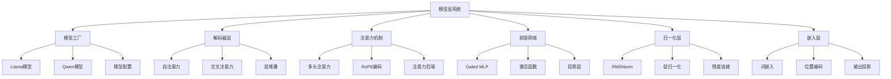
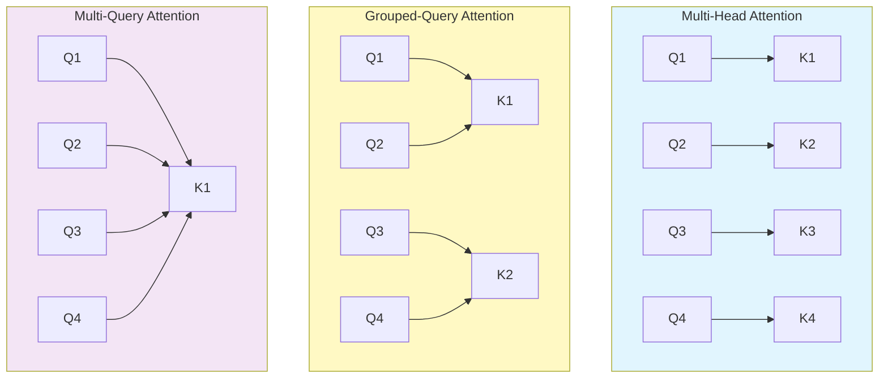
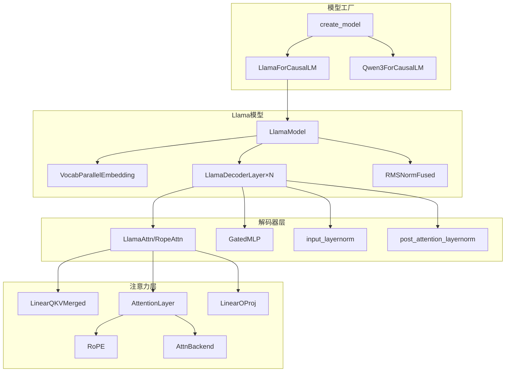

# 第七章：模型层实现与注意力机制

## 本章学习目标

通过本章学习，你将了解：
- Mini-SGLang 模型层的整体架构设计
- 多头注意力机制的核心实现原理
- 旋转位置编码（RoPE）的数学原理和优化
- 前馈网络（FFN）的Gated MLP实现
- 张量并行在模型层的具体应用
- 高性能注意力后端的选择和集成

## 核心概念速查表

| 术语 | 英文 | 解释 |
|------|------|------|
| **Transformer** | Transformer | 现代 LLM 的基础架构，完全基于注意力机制，包含 Encoder 和 Decoder（LLM 通常只用 Decoder）。 |
| **RoPE** | Rotary Positional Embeddings | 旋转位置编码，通过旋转向量来编码相对位置信息，具有良好的外推性。 |
| **GQA** | Grouped-Query Attention | 分组查询注意力，介于 MHA 和 MQA 之间，多个 Query 头共享一组 KV 头，平衡了性能和显存占用。 |
| **MLP** | Multilayer Perceptron | 多层感知机，在 Transformer 中作为前馈网络（FFN），通常包含两层线性变换和激活函数。 |
| **RMSNorm** | Root Mean Square Normalization | 均方根层归一化，LayerNorm 的简化版本，去除了均值中心化，计算更高效。 |
| **SiLU** | Sigmoid Linear Unit | 一种平滑的非线性激活函数，定义为 $x \cdot \sigma(x)$，在 Llama 等模型中广泛使用。 |

## 背景知识

### LLM模型架构基础

现代大语言模型通常采用Transformer架构，包含以下核心组件：

1. **嵌入层（Embedding Layer）**：将token ID映射为向量表示
2. **注意力层（Attention Layer）**：计算token间的依赖关系
3. **前馈网络（FFN Layer）**：非线性变换增强表示能力
4. **层归一化（Layer Normalization）**：稳定训练和推理过程
5. **输出投影（Output Projection）**：将隐藏状态映射到词表空间

### 关键技术概念

- **多头注意力（Multi-Head Attention）**：并行计算多个注意力头
- **旋转位置编码（RoPE）**：相对位置编码技术
- **分组查询注意力（GQA）**：共享KV头的注意力变体
- **张量并行（Tensor Parallelism）**：模型权重分片到多个GPU
- **FlashAttention**：IO感知的高性能注意力算法

### GQA vs MHA vs MQA

为了减少 KV Cache 的显存占用并加速解码，现代 LLM（如 Llama-2/3）广泛采用 GQA。

1.  **MHA (Multi-Head Attention)**: 每个 Query 头都有自己独立的 Key/Value 头。显存占用最大，质量最好。
2.  **MQA (Multi-Query Attention)**: 所有 Query 头共享同一组 Key/Value 头。显存占用最小，但可能损失模型能力。
3.  **GQA (Grouped-Query Attention)**: 将 Query 头分组，每组共享一组 Key/Value 头。是 MHA 和 MQA 的折中方案。

### SiLU 激活函数

SiLU（也称为 Swish）定义为：

```
SiLU(x) = x · σ(x) = x / (1 + e^(-x))
```

特点：
- **平滑性**：处处可导，有利于梯度传播。
- **非单调性**：在负半轴有轻微的负值，有助于保留一些负信息。
- **自门控**：$x$ 控制了 $\sigma(x)$ 门的开启程度。

## 模型层架构概览

### 整体架构设计



### 模型工厂模式

```python
def create_model(model_path: str, model_config: ModelConfig) -> BaseLLMModel:
    """根据模型路径创建对应的模型实例"""
    model_name = model_path.lower()
    
    if "llama" in model_name:
        from .llama import LlamaForCausalLM
        return LlamaForCausalLM(model_config)
    elif "qwen3" in model_name:
        from .qwen3 import Qwen3ForCausalLM
        return Qwen3ForCausalLM(model_config)
    else:
        raise ValueError(f"Unsupported model: {model_path}")
```

## 模型配置系统

### 配置数据结构

```python
@dataclass(frozen=True)
class ModelConfig:
    num_layers: int              # 层数
    num_qo_heads: int           # Query/Output头数
    num_kv_heads: int           # Key/Value头数
    head_dim: int               # 头维度
    hidden_size: int            # 隐藏层大小
    vocab_size: int             # 词表大小
    intermediate_size: int      # 中间层大小
    rms_norm_eps: float         # RMS Norm参数
    rotary_config: RotaryConfig  # 旋转位置编码配置
    hidden_act: str             # 激活函数
    tie_word_embeddings: bool   # 是否绑定词嵌入

@dataclass(frozen=True)
class RotaryConfig:
    head_dim: int                # 头维度
    rotary_dim: int              # 旋转维度
    max_position: int           # 最大位置
    base: float                  # 基础频率
    scaling: Dict[str, float] | None  # 缩放配置
```

### HuggingFace配置适配

```python
@classmethod
def from_hf(cls, config: LlamaConfig) -> ModelConfig:
    """从HuggingFace配置转换为Mini-SGLang配置"""
    
    num_kv_heads = getattr(config, "num_key_value_heads", config.num_attention_heads)
    head_dim = getattr(config, "head_dim", config.hidden_size // config.num_attention_heads)
    tie_word_embeddings = getattr(config, "tie_word_embeddings", False)
    
    return cls(
        num_layers=config.num_hidden_layers,
        num_qo_heads=config.num_attention_heads,
        num_kv_heads=num_kv_heads,
        head_dim=head_dim,
        hidden_size=config.hidden_size,
        vocab_size=config.vocab_size,
        intermediate_size=config.intermediate_size,
        hidden_act=config.hidden_act,
        rms_norm_eps=config.rms_norm_eps,
        tie_word_embeddings=tie_word_embeddings,
        rotary_config=RotaryConfig(
            head_dim=head_dim,
            rotary_dim=head_dim,
            max_position=config.max_position_embeddings,
            base=config.rope_theta,
            scaling=getattr(config, "rope_scaling", None),
        ),
    )
```

## 🧠 Llama模型实现详解

### 1. 模型整体架构

```python
class LlamaForCausalLM(BaseLLMModel):
    def __init__(self, config: ModelConfig):
        self.model = LlamaModel(config)        # 主干模型
        self.lm_head = ParallelLMHead(         # 语言模型头
            num_embeddings=config.vocab_size,
            embedding_dim=config.hidden_size,
            tie_word_embeddings=config.tie_word_embeddings,
            tied_embedding=self.model.embed_tokens if config.tie_word_embeddings else None,
        )
        super().__init__()

    def forward(self) -> torch.Tensor:
        ctx = get_global_ctx()
        output = self.model.forward(ctx.batch.input_ids)
        with nvtx.range("LMHead"):
            logits = self.lm_head.forward(output)
        return logits
```

### 2. 主干模型实现

```python
class LlamaModel(BaseOP):
    def __init__(self, config: ModelConfig):
        self.embed_tokens = VocabParallelEmbedding(
            num_embeddings=config.vocab_size,
            embedding_dim=config.hidden_size,
        )
        self.layers = OPList([
            LlamaDecoderLayer(config, layer_id) 
            for layer_id in range(config.num_layers)
        ])
        self.norm = RMSNormFused(
            size=config.hidden_size,
            eps=config.rms_norm_eps,
        )

    def forward(self, input_ids: torch.Tensor) -> torch.Tensor:
        with nvtx.range("Embedding"):
            x = self.embed_tokens.forward(input_ids)
        
        residual: torch.Tensor | None = None
        for layer in self.layers.op_list:
            with nvtx.range(f"Layer_{layer._layer_id}"):
                x, residual = layer.forward(x, residual)
        
        return self.norm.forward(x, residual)[0]
```

### 3. 解码器层实现

```python
class LlamaDecoderLayer(BaseOP):
    def __init__(self, config: ModelConfig, layer_id: int):
        self.self_attn = RopeAttn(config, layer_id)     # 自注意力
        self.mlp = GatedMLP(config)                     # 前馈网络
        self.input_layernorm = RMSNormFused(            # 输入归一化
            size=config.hidden_size,
            eps=config.rms_norm_eps,
        )
        self.post_attention_layernorm = RMSNormFused(    # 后注意力归一化
            size=config.hidden_size,
            eps=config.rms_norm_eps,
        )
        self._layer_id = layer_id

    def forward(self, x: torch.Tensor, residual: torch.Tensor | None = None):
        # 输入归一化
        x, residual = self.input_layernorm.forward(x, residual)
        
        # 自注意力计算
        with nvtx.range(f"MHA_{self._layer_id}"):
            x = self.self_attn.forward(x)
        
        # 后注意力归一化
        x, residual = self.post_attention_layernorm.forward(x, residual)
        
        # 前馈网络
        with nvtx.range(f"MLP_{self._layer_id}"):
            x = self.mlp.forward(x)
        
        return x, residual
```

## 注意力机制实现

### 1. 注意力层架构

```python
class RopeAttn(BaseOP):
    def __init__(self, config: ModelConfig, layer_id: int):
        head_dim = config.head_dim
        
        # QKV投影层
        self.qkv_proj = LinearQKVMerged(
            hidden_size=config.hidden_size,
            head_dim=config.head_dim,
            num_qo_heads=config.num_qo_heads,
            num_kv_heads=config.num_kv_heads,
            has_bias=False,
        )
        
        # QK归一化（可选）
        self.has_qk_norm = False
        if self.has_qk_norm:
            self.q_norm = RMSNorm(head_dim, eps=config.rms_norm_eps)
            self.k_norm = RMSNorm(head_dim, eps=config.rms_norm_eps)
        
        # 注意力计算层
        self.attn = AttentionLayer(
            layer_id=layer_id,
            head_dim=head_dim,
            num_qo_heads=config.num_qo_heads,
            num_kv_heads=config.num_kv_heads,
            rotary_config=config.rotary_config,
            q_norm=self.q_norm,
            k_norm=self.k_norm,
        )
        
        # 输出投影层
        self.o_proj = LinearOProj(
            head_dim * config.num_qo_heads,
            config.hidden_size,
            has_bias=False,
        )

    def forward(self, x: torch.Tensor) -> torch.Tensor:
        qkv = self.qkv_proj.forward(x)     # QKV投影
        del x
        o = self.attn.forward(qkv)         # 注意力计算
        return self.o_proj.forward(o)      # 输出投影
```

### 2. 注意力计算核心

```python
class AttentionLayer(StateLessOP):
    def __init__(self, layer_id: int, num_qo_heads: int, num_kv_heads: int, 
                 head_dim: int, rotary_config: RotaryConfig):
        
        assert num_qo_heads % num_kv_heads == 0  # GQA比例检查
        
        self.layer_id = layer_id
        self.head_dim = head_dim
        
        # 张量并行分片
        tp_size = get_tp_info().size
        self.num_qo_heads = divide_even(num_qo_heads, tp_size)
        self.num_kv_heads = divide_even(num_kv_heads, tp_size)
        
        self.qo_attn_dim = self.num_qo_heads * head_dim
        self.kv_attn_dim = self.num_kv_heads * head_dim
        
        # 旋转位置编码
        self.rotary = get_rope(
            head_dim=head_dim,
            rotary_dim=rotary_config.rotary_dim,
            max_position=rotary_config.max_position,
            base=rotary_config.base,
            rope_scaling=tuple(rotary_config.scaling.items()) if rotary_config.scaling else None,
        )

    def forward(self, qkv: torch.Tensor) -> torch.Tensor:
        ctx = get_global_ctx()
        metadata = ctx.batch.attn_metadata
        
        # 分割QKV张量
        q, k, v = qkv.split([self.qo_attn_dim, self.kv_attn_dim, self.kv_attn_dim], dim=-1)
        
        # QK归一化（可选）
        if self.q_norm is not None:
            self.q_norm.forward_inplace(q.view(-1, self.num_qo_heads, self.head_dim))
        if self.k_norm is not None:
            self.k_norm.forward_inplace(k.view(-1, self.num_kv_heads, self.head_dim))
        
        # 应用旋转位置编码
        if self.rotary:
            q, k = self.rotary.forward(metadata.positions, q, k)
        
        # 重塑Q张量
        q = q.view(-1, self.num_qo_heads, self.head_dim)
        
        # 调用注意力后端
        o = ctx.attn_backend.forward(q, k, v, self.layer_id, ctx.batch)
        
        return o.view(-1, self.qo_attn_dim)
```

#### GQA 架构对比图



### 3. 旋转位置编码（RoPE）

#### 数学原理

旋转位置编码将位置信息编码为旋转矩阵：

```
对于位置m的查询向量q和位置n的键向量k：
RoPE(q, m) = q * e^(i*mθ)
RoPE(k, n) = k * e^(i*nθ)

注意力分数：
q·k = Re[q * conj(k) * e^(i*(m-n)θ)]
```

#### 实现优势

- **相对位置编码**：只依赖相对位置(m-n)
- **外推能力**：支持超出训练长度的位置
- **计算效率**：可分解为旋转操作
- **兼容性**：与现有注意力机制兼容

## 🧪 前馈网络实现

### 1. Gated MLP架构

```python
class GatedMLP(BaseOP):
    def __init__(self, config: ModelConfig):
        # 门控和上投影合并层
        self.gate_up_proj = LinearColParallelMerged(
            config.hidden_size,
            [config.intermediate_size, config.intermediate_size],
            has_bias=False,
        )
        
        # 激活函数选择
        match config.hidden_act:
            case "silu":
                self.act_fn = silu_and_mul  # SiLU门控激活
            case act_fn:
                raise ValueError(f"Unsupported activation function: {act_fn}")
        
        # 下投影层
        self.down_proj = LinearRowParallel(
            config.intermediate_size,
            config.hidden_size,
            has_bias=False,
        )

    def forward(self, x: torch.Tensor) -> torch.Tensor:
        gate_up = self.gate_up_proj.forward(x)  # 门控和上投影
        del x
        y = self.act_fn(gate_up)               # 激活函数
        del gate_up
        return self.down_proj.forward(y)        # 下投影
```

### 2. SiLU门控激活

```python
def silu_and_mul(x: torch.Tensor) -> torch.Tensor:
    """SiLU门控激活：gate * up_proj"""
    gate, up = x.chunk(2, dim=-1)
    return torch.nn.functional.silu(gate) * up
```

### 3. 前馈网络流程

```mermaid
graph LR
    A[输入x] --> B[Gate/Up投影]
    B --> C[SiLU激活]
    C --> D[门控乘法]
    D --> E[Down投影]
    E --> F[输出y]
    
    B --> B1[分割gate/up]
    C --> C1[gate = SiLU(gate)]
    D --> D1[y = gate * up]
```

## 张量并行实现

### 1. 线性层并行策略

#### 列并行（Column Parallel）

```python
class LinearColParallelMerged(_LinearTPImpl):
    def __init__(self, input_size: int, output_sizes: List[int], has_bias: bool):
        tp_info = get_tp_info()
        
        # 输出维度按TP大小分片
        tp_output_sizes = [divide_even(size, tp_info.size) for size in output_sizes]
        output_size = sum(output_sizes)
        tp_output_size = sum(tp_output_sizes)
        
        super().__init__(input_size, output_size, input_size, tp_output_size, has_bias)
```

#### 行并行（Row Parallel）

```python
class LinearRowParallel(_LinearTPImpl):
    def __init__(self, input_size: int, output_size: int, has_bias: bool):
        tp_info = get_tp_info()
        
        # 输入维度按TP大小分片
        local_input_size = divide_even(input_size, tp_info.size)
        local_output_size = output_size
        self._comm = DistributedCommunicator()
        self._tp_size = tp_info.size
        
        super().__init__(input_size, output_size, local_input_size, local_output_size, has_bias)

    def forward(self, x: torch.Tensor) -> torch.Tensor:
        y = F.linear(x, self.weight, self.bias)
        if self._tp_size > 1:
            y = self._comm.all_reduce(y)  # All-Reduce聚合结果
        return y
```

### 2. QKV合并投影

```python
class LinearQKVMerged(_LinearTPImpl):
    def __init__(self, hidden_size: int, head_dim: int, 
                 num_qo_heads: int, num_kv_heads: int, has_bias: bool):
        
        tp_info = get_tp_info()
        
        # 计算GQA比例
        GQA_ratio = divide_even(num_qo_heads, num_kv_heads)
        local_num_kv = divide_even(num_kv_heads, tp_info.size)
        
        full_isize = hidden_size
        full_osize = (GQA_ratio + 2) * num_kv_heads * head_dim  # Q + K + V
        local_isize = hidden_size
        local_osize = (GQA_ratio + 2) * local_num_kv * head_dim
        
        super().__init__(full_isize, full_osize, local_isize, local_osize, has_bias)
```

### 3. 输出投影并行

```python
class LinearOProj(_LinearTPImpl):
    def __init__(self, input_size: int, output_size: int, has_bias: bool):
        tp_info = get_tp_info()
        
        full_isize = input_size
        full_osize = output_size
        local_isize = divide_even(input_size, tp_info.size)  # 输入分片
        local_osize = output_size                            # 输出不分片
        
        self._comm = DistributedCommunicator()
        self._tp_size = tp_info.size
        
        super().__init__(full_isize, full_osize, local_isize, local_osize, has_bias)

    def forward(self, x: torch.Tensor) -> torch.Tensor:
        y = F.linear(x, self.weight, self.bias)
        if self._tp_size > 1:
            y = self._comm.all_reduce(y)  # All-Reduce聚合
        return y
```

## 注意力后端系统

### 1. 后端选择策略

```python
def _resolve_auto_backend(config: ModelConfig) -> str:
    """根据GPU架构自动选择最优注意力后端"""
    
    if is_sm100_supported():  # Blackwell架构
        return "fi"           # FlashInfer
    elif is_sm90_supported(): # Hopper架构
        return "fa3,fi"       # 混合后端：预填充用FA3，解码用FI
    else:                     # 前Hopper架构
        return "fi"           # FlashInfer
```

### 2. 混合后端支持

```python
def create_attention_backend(config: ModelConfig, kvcache: BaseKVCache, 
                           backend: str, page_table: torch.Tensor) -> BaseAttnBackend:
    
    if backend == "auto":
        backend = _resolve_auto_backend(config)
    
    if "," in backend:  # 混合后端
        assert backend.count(",") == 1, "Only one comma is allowed in hybrid backend"
        p_backend, d_backend = backend.split(",", 1)
        
        if p_backend != d_backend:
            # 创建预填充和解码后端
            p_backend = create_attention_backend(config, kvcache, p_backend, page_table)
            d_backend = create_attention_backend(config, kvcache, d_backend, page_table)
            return HybridBackend(p_backend, d_backend)
        
        backend = p_backend  # 相同后端，回退到单后端
    
    return SUPPORTED_ATTENTION_BACKENDS[backend](config, kvcache, page_table)
```

### 3. 支持的后端类型

| 后端 | 全称 | 优势 | 适用场景 |
|------|------|------|----------|
| **FI** | FlashInfer | 高性能，内存高效 | 所有场景 |
| **FA3** | FlashAttention v3 | 极致性能，IO优化 | 预填充阶段 |
| **混合** | FI + FA3 | 平衡性能 | 生产环境 |

## 性能优化特性

### 1. 内存管理优化

#### 张量生命周期管理

```python
def forward(self, x: torch.Tensor) -> torch.Tensor:
    gate_up = self.gate_up_proj.forward(x)
    del x  # 及时释放输入张量
    y = self.act_fn(gate_up)
    del gate_up  # 及时释放中间张量
    return self.down_proj.forward(y)
```

#### 内存池复用

- **KV缓存复用**：Radix树支持前缀共享
- **张量池化**：预分配内存减少动态分配
- **梯度检查点**：选择性保存中间结果

### 2. 计算优化

#### 算子融合

```python
# RMSNorm融合实现
class RMSNormFused(BaseOP):
    def forward(self, x: torch.Tensor, residual: torch.Tensor | None = None):
        # 融合归一化和残差连接
        if residual is not None:
            x = x + residual
        
        # 融合RMSNorm计算
        variance = x.pow(2).mean(-1, keepdim=True)
        x = x * torch.rsqrt(variance + self.eps)
        
        return x, x if residual is None else residual
```

#### 向量化操作

- **Warp级并行**：32线程并行计算
- **内存合并访问**：连续内存访问模式
- **指令级并行**：SIMD指令优化

### 3. 通信优化

#### 重叠计算通信

```python
def forward(self, x: torch.Tensor) -> torch.Tensor:
    y = F.linear(x, self.weight, self.bias)
    if self._tp_size > 1:
        # 异步All-Reduce
        y = self._comm.all_reduce(y)
    return y
```

#### 通信模式选择

- **All-Reduce**：行并行输出聚合
- **All-Gather**：列并行结果收集
- **点对点通信**：特定模式优化

## 本章总结

本章详细分析了Mini-SGLang的模型层实现和注意力机制：

### 模型层组件架构



### 张量并行分片策略

| 层类型 | 输入分片 | 输出分片 | 通信操作 |
|--------|---------|---------|----------|
| **QKV投影** | 无 | 按头数 | 无 |
| **O投影** | 按头数 | 无 | All-Reduce |
| **Gate/Up投影** | 无 | 按TP大小 | 无 |
| **Down投影** | 按TP大小 | 无 | All-Reduce |
| **词嵌入** | 无 | 按词表 | All-Reduce |

### 注意力后端对比

| 后端 | 预填充性能 | 解码性能 | 推荐场景 |
|------|-----------|---------|---------|
| **FlashAttention3** |  |  | Hopper+ 预填充 |
| **FlashInfer** |  |  | 通用解码 |
| **混合(fa3,fi)** |  |  | 生产推荐 |

---

**下一章预告**：第八章将分析API服务器与系统集成，这是将推理引擎封装为生产级服务的关键组件。

---

**技术要点回顾**：
- 模型工厂模式支持多种架构
- 注意力后端系统自动选择最优实现
- 张量并行实现高效的分布式推理
- 内存管理优化确保资源高效利用
- 算子融合减少内存传输开销