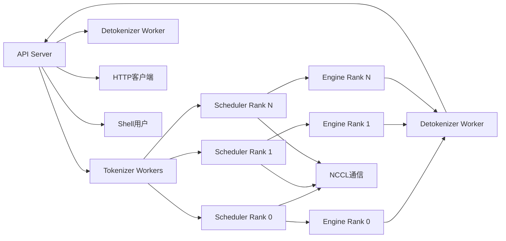
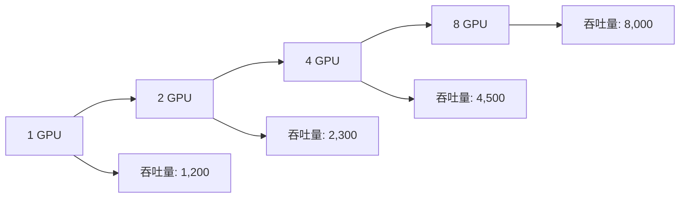

# 第八章：API服务器与系统集成

## 本章学习目标

通过本章学习，你将了解：
- Mini-SGLang API服务器的整体架构设计
- OpenAI兼容接口的实现原理
- 多进程管理和系统集成机制
- 命令行参数解析和配置管理
- 交互式Shell和流式响应支持
- 生产环境部署和监控策略

## 核心概念速查表

| 术语 | 英文 | 解释 |
|------|------|------|
| **FastAPI** | FastAPI | 一个现代、高性能的 Python Web 框架，用于构建 API，支持异步编程和自动生成文档。 |
| **SSE** | Server-Sent Events | 一种基于 HTTP 的服务器推送技术，允许服务器向客户端单向发送实时数据流，非常适合 LLM 的流式输出。 |
| **ZeroMQ** | ZeroMQ | 一个高性能异步消息库，用于在 API Server、Scheduler 和 Tokenizer 进程之间进行低延迟通信。 |
| **OpenAI API** | OpenAI API | 事实上的 LLM 接口标准（如 `/v1/chat/completions`），遵循该标准可以无缝集成到 LangChain 等生态工具中。 |
| **Tokenizer** | Tokenizer | 负责将文本转换为 Token ID 序列的组件，通常运行在独立进程中以避免阻塞主线程。 |
| **Detokenizer** | Detokenizer | 负责将生成的 Token ID 序列转换回文本的组件，同样运行在独立进程中。 |

## 背景知识

### 生产级LLM服务要求

在生产环境中部署LLM推理服务需要满足以下关键要求：

1. **高可用性**：7x24小时稳定运行，故障自动恢复
2. **可扩展性**：支持动态扩展GPU资源，应对流量波动
3. **兼容性**：提供标准API接口，便于客户端集成
4. **监控性**：完善的日志、指标和健康检查机制
5. **安全性**：身份验证、限流和访问控制
6. **易用性**：简单部署和配置管理

### 关键技术概念

- **OpenAI API兼容**：提供与OpenAI相同的接口规范
- **多进程架构**：进程隔离提高系统稳定性
- **异步通信**：ZeroMQ实现高性能进程间通信
- **流式响应**：支持实时生成token流式输出
- **配置管理**：命令行参数和环境变量配置

### 为什么选择 SSE (Server-Sent Events)？

LLM 的生成过程是逐步产生的（Token-by-Token），用户希望尽快看到第一个字，而不是等待整个回复生成完毕。
- **SSE vs WebSocket**：
    - **SSE**：单向通信（Server -> Client），基于标准 HTTP，协议简单，自动重连，非常适合 LLM 这种"一次请求，多次响应"的场景。
    - **WebSocket**：全双工通信，协议复杂，通常用于需要频繁双向交互的场景（如即时游戏）。
- **优势**：SSE 更轻量，对防火墙和代理更友好，且能直接被浏览器 EventSource API 支持。

### OpenAI API 规范的生态价值

Mini-SGLang 实现了 OpenAI 兼容接口（如 `/v1/chat/completions`），这意味着：
1.  **零代码迁移**：现有的基于 OpenAI SDK 开发的应用，只需修改 `base_url` 即可切换到 Mini-SGLang。
2.  **工具链支持**：可以直接使用 LangChain, LlamaIndex, AutoGPT 等开源工具。
3.  **标准化测试**：可以使用标准的评估工具（如 OpenAI Evals）来测试模型性能。

## 系统架构概览

### 整体架构设计

```mermaid
graph TB
    A[API服务器系统] --> B[HTTP服务层]
    A --> C[进程管理层]
    A --> D[通信管理层]
    A --> E[配置管理层]
    
    B --> B1[FastAPI框架]
    B --> B2[OpenAI兼容接口]
    B --> B3[流式响应]
    B --> B4[交互式Shell]
    
    C --> C1[多进程启动]
    C --> C2[进程监控]
    C --> C3[优雅关闭]
    C --> C4[资源管理]
    
    D --> D1[ZeroMQ通信]
    D --> D2[消息序列化]
    D --> D3[异步队列]
    D --> D4[ACK机制]
    
    E --> E1[命令行解析]
    E --> E2[环境变量]
    E --> E3[配置验证]
    E --> E4[默认值管理]

### 请求-响应全链路时序图

```mermaid
sequenceDiagram
    participant C as Client
    participant API as API Server
    participant ZMQ as ZeroMQ
    participant SCH as Scheduler
    participant ENG as Engine
    participant DET as Detokenizer
    
    C->>API: POST /v1/chat/completions (Stream=True)
    API->>ZMQ: 发送 TokenizeMsg
    ZMQ->>SCH: 转发请求 (经过 Tokenizer)
    
    loop Generation Loop
        SCH->>ENG: 调度 Batch
        ENG->>ENG: 模型推理 (Prefill/Decode)
        ENG->>SCH: 返回 Logits/Token
        SCH->>ZMQ: 发送生成的 Token ID
        ZMQ->>DET: 转发给 Detokenizer
        DET->>ZMQ: 发送解码后的文本 (UserReply)
        ZMQ->>API: 接收增量文本
        API->>C: SSE 推送 (data: "Hello")
    end
    
    SCH->>ZMQ: 发送结束信号
    ZMQ->>API: 接收结束信号
    API->>C: SSE 推送 (data: [DONE])
```

### 进程架构关系



## API服务器实现详解

### 1. 服务器启动流程

#### 主启动函数

```python
def launch_server(run_shell: bool = False) -> None:
    """启动Mini-SGLang服务器的主入口函数"""
    
    from .api_server import run_api_server
    from .args import parse_args
    
    # 解析命令行参数
    server_args, run_shell = parse_args(sys.argv[1:], run_shell)
    logger = init_logger(__name__, "initializer")
    
    def start_subprocess() -> None:
        """启动所有子进程"""
        import multiprocessing as mp
        mp.set_start_method("spawn", force=True)
        
        # 创建ACK队列用于进程同步
        ack_queue: mp.Queue[str] = mp.Queue()
        
        # 启动张量并行调度器进程
        world_size = server_args.tp_info.size
        for i in range(world_size):
            new_args = replace(server_args, tp_info=DistributedInfo(i, world_size))
            mp.Process(
                target=_run_scheduler,
                args=(new_args, ack_queue),
                daemon=False,
                name=f"minisgl-TP{i}-scheduler",
            ).start()
        
        # 启动Tokenizer和Detokenizer进程
        num_tokenizers = server_args.num_tokenizer
        
        # Detokenizer进程（仅1个）
        mp.Process(
            target=tokenize_worker,
            kwargs={"tokenizer_id": num_tokenizers, "ack_queue": ack_queue},
            name="minisgl-detokenizer-0",
        ).start()
        
        # Tokenizer进程
        for i in range(num_tokenizers):
            mp.Process(
                target=tokenize_worker,
                kwargs={"tokenizer_id": i, "ack_queue": ack_queue},
                name=f"minisgl-tokenizer-{i}",
            ).start()
        
        # 等待所有进程就绪
        for _ in range(num_tokenizers + 2):
            logger.info(ack_queue.get())
    
    # 运行API服务器
    run_api_server(server_args, start_subprocess, run_shell=run_shell)
```

#### 调度器进程入口

```python
def _run_scheduler(args: ServerArgs, ack_queue: mp.Queue[str]) -> None:
    """调度器进程入口函数"""
    
    with torch.inference_mode():
        scheduler = Scheduler(args)
        scheduler.sync_all_ranks()  # 同步所有Rank
        
        if args.tp_info.is_primary():
            ack_queue.put("Scheduler is ready")  # 发送就绪信号
        
        if args.silent_output:
            logging.disable(logging.INFO)
        
        try:
            scheduler.run_forever()  # 进入主循环
        except KeyboardInterrupt:
            logger = init_logger(__name__)
            if scheduler.tp_info.is_primary():
                print()  # 优雅处理Ctrl+C
                logger.info("Scheduler exiting gracefully...")
            scheduler.shutdown()  # 优雅关闭
```

### 2. API服务器架构

#### FastAPI应用定义

```python
app = FastAPI(title="MiniSGL API Server", version="0.0.1", lifespan=lifespan)

@app.post("/generate")
async def generate(req: GenerateRequest):
    """基础生成接口"""
    state = get_global_state()
    uid = state.new_user()
    
    await state.send_one(
        TokenizeMsg(
            uid=uid,
            text=req.prompt,
            sampling_params=SamplingParams(
                ignore_eos=req.ignore_eos,
                max_tokens=req.max_tokens,
            ),
        )
    )
    
    async def _abort():
        await state.abort_user(uid)
    
    return StreamingResponse(
        state.stream_generate(uid),
        media_type="text/event-stream",
        background=BackgroundTask(lambda: _abort),
    )

@app.post("/v1/chat/completions")
async def v1_completions(req: OpenAICompletionRequest):
    """OpenAI兼容的聊天完成接口"""
    state = get_global_state()
    
    # 处理消息格式
    if req.messages:
        prompt = [msg.model_dump() for msg in req.messages]
    else:
        assert req.prompt is not None, "Either 'messages' or 'prompt' must be provided"
        prompt = req.prompt
    
    uid = state.new_user()
    await state.send_one(
        TokenizeMsg(
            uid=uid,
            text=prompt,
            sampling_params=SamplingParams(
                ignore_eos=req.ignore_eos,
                max_tokens=req.max_tokens,
            ),
        )
    )
    
    async def _abort():
        await state.abort_user(uid)
    
    return StreamingResponse(
        state.stream_chat_completions(uid),
        media_type="text/event-stream",
        background=BackgroundTask(lambda: _abort),
    )

@app.get("/v1/models")
async def available_models():
    """返回可用模型列表"""
    state = get_global_state()
    return ModelList(data=[ModelCard(id=state.config.model_path, root=state.config.model_path)])
```

#### 请求数据模型

```python
class GenerateRequest(BaseModel):
    """基础生成请求"""
    prompt: str
    max_tokens: int
    ignore_eos: bool = False

class Message(BaseModel):
    """聊天消息"""
    role: Literal["system", "user", "assistant"]
    content: str

class OpenAICompletionRequest(BaseModel):
    """OpenAI兼容请求模型"""
    model: str
    prompt: str | None = None
    messages: List[Message] | None = None
    max_tokens: int = 16
    temperature: float = 1.0
    top_p: float = 1.0
    n: int = 1
    stream: bool = False
    stop: List[str] = []
    presence_penalty: float = 0.0
    frequency_penalty: float = 0.0
    ignore_eos: bool = False
```

### 3. 前端管理器

#### 全局状态管理

```python
@dataclass
class FrontendManager:
    """前端管理器，负责API服务器与后端通信"""
    
    config: ServerArgs
    send_tokenizer: ZmqAsyncPushQueue[BaseTokenizerMsg]
    recv_tokenizer: ZmqAsyncPullQueue[BaseFrontendMsg]
    uid_counter: int = 0
    initialized: bool = False
    ack_map: Dict[int, List[UserReply]] = field(default_factory=dict)
    event_map: Dict[int, asyncio.Event] = field(default_factory=dict)

    def new_user(self) -> int:
        """创建新用户ID"""
        uid = self.uid_counter
        self.uid_counter += 1
        self.ack_map[uid] = []
        self.event_map[uid] = asyncio.Event()
        return uid

    async def listen(self):
        """监听后端消息"""
        while True:
            msg = await self.recv_tokenizer.get()
            for msg in _unwrap_msg(msg):
                assert msg.uid in self.ack_map
                self.ack_map[msg.uid].append(msg)
                self.event_map[msg.uid].set()

    async def wait_for_ack(self, uid: int):
        """等待用户确认消息"""
        event = self.event_map[uid]
        
        while True:
            await event.wait()
            event.clear()
            
            pending = self.ack_map[uid]
            self.ack_map[uid] = []
            ack = None
            for ack in pending:
                yield ack
            if ack and ack.finished:
                break
        
        del self.ack_map[uid]
        del self.event_map[uid]

    async def stream_generate(self, uid: int):
        """流式生成响应"""
        async for ack in self.wait_for_ack(uid):
            yield f"data: {ack.incremental_output}\n".encode()
            if ack.finished:
                break
        yield "data: [DONE]\n".encode()
        logger.debug("Finished streaming response for user %s", uid)

    async def stream_chat_completions(self, uid: int):
        """流式聊天完成响应"""
        first_chunk = True
        async for ack in self.wait_for_ack(uid):
            delta = {}
            if first_chunk:
                delta["role"] = "assistant"
                first_chunk = False
            if ack.incremental_output:
                delta["content"] = ack.incremental_output
            
            chunk = {
                "id": f"cmpl-{uid}",
                "object": "text_completion.chunk",
                "choices": [{"delta": delta, "index": 0, "finish_reason": None}],
            }
            yield f"data: {json.dumps(chunk)}\n\n".encode()
            
            if ack.finished:
                break
        
        # 发送最终完成信号
        end_chunk = {
            "id": f"cmpl-{uid}",
            "object": "text_completion.chunk",
            "choices": [{"delta": {}, "index": 0, "finish_reason": "stop"}],
        }
        yield f"data: {json.dumps(end_chunk)}\n\n".encode()
        yield b"data: [DONE]\n\n"
        logger.debug("Finished streaming response for user %s", uid)
```

## 消息通信系统

### 1. 消息类型定义

#### Tokenizer消息

```python
class BaseTokenizerMsg(ABC):
    """Tokenizer消息基类"""
    
    @property
    @abstractmethod
    def encoder(self) -> Callable[[Any], Dict]: ...
    
    @staticmethod
    @abstractmethod
    def decoder(data: Dict) -> BaseTokenizerMsg: ...

class TokenizeMsg(BaseTokenizerMsg):
    """Tokenize请求消息"""
    
    def __init__(self, uid: int, text: str, sampling_params: SamplingParams):
        self.uid = uid
        self.text = text
        self.sampling_params = sampling_params
```

#### Frontend消息

```python
class BaseFrontendMsg(ABC):
    """前端消息基类"""
    
    @property
    @abstractmethod
    def encoder(self) -> Callable[[Any], Dict]: ...
    
    @staticmethod
    @abstractmethod
    def decoder(data: Dict) -> BaseFrontendMsg: ...

class UserReply(BaseFrontendMsg):
    """用户回复消息"""
    
    def __init__(self, uid: int, incremental_output: str, finished: bool):
        self.uid = uid
        self.incremental_output = incremental_output
        self.finished = finished
```

### 2. ZeroMQ通信机制

#### 异步推送队列

```python
class ZmqAsyncPushQueue(Generic[T]):
    """ZeroMQ异步推送队列"""
    
    def __init__(self, addr: str, create: bool, encoder: Callable[[T], Dict]):
        self.context = zmq.asyncio.Context()
        self.socket = self.context.socket(zmq.PUSH)
        self.socket.bind(addr) if create else self.socket.connect(addr)
        self.encoder = encoder
    
    async def put(self, obj: T):
        """异步发送消息"""
        event = msgpack.packb(self.encoder(obj), use_bin_type=True)
        await self.socket.send(event, copy=False)
```

#### 异步拉取队列

```python
class ZmqAsyncPullQueue(Generic[T]):
    """ZeroMQ异步拉取队列"""
    
    def __init__(self, addr: str, create: bool, decoder: Callable[[Dict], T]):
        self.context = zmq.asyncio.Context()
        self.socket = self.context.socket(zmq.PULL)
        self.socket.bind(addr) if create else self.socket.connect(addr)
        self.decoder = decoder
    
    async def get(self) -> T:
        """异步接收消息"""
        event = await self.socket.recv()
        return self.decoder(msgpack.unpackb(event, raw=False))
```

## 配置管理系统

### 1. 服务器参数配置

```python
@dataclass(frozen=True)
class ServerArgs(SchedulerConfig):
    """服务器参数配置"""
    
    server_host: str = "127.0.0.1"
    server_port: int = 1919
    num_tokenizer: int = 0
    silent_output: bool = False

    @property
    def share_tokenizer(self) -> bool:
        """是否共享Tokenizer"""
        return self.num_tokenizer == 0

    @property
    def zmq_frontend_addr(self) -> str:
        """前端ZeroMQ地址"""
        return "ipc:///tmp/minisgl_3" + self._unique_suffix

    @property
    def zmq_tokenizer_addr(self) -> str:
        """Tokenizer ZeroMQ地址"""
        if self.share_tokenizer:
            return self.zmq_detokenizer_addr
        result = "ipc:///tmp/minisgl_4" + self._unique_suffix
        assert result != self.zmq_detokenizer_addr
        return result
```

### 2. 命令行参数解析

```python
def parse_args(args: List[str], run_shell: bool = False) -> Tuple[ServerArgs, bool]:
    """解析命令行参数"""
    
    parser = argparse.ArgumentParser(description="MiniSGL Server Arguments")
    
    # 必需参数
    parser.add_argument(
        "--model-path",
        type=str,
        required=True,
        help="模型权重路径，可以是本地文件夹或HuggingFace仓库ID",
    )
    
    # 数据类型参数
    parser.add_argument(
        "--dtype",
        type=str,
        default="auto",
        choices=["auto", "float16", "bfloat16", "float32"],
        help="模型权重和激活的数据类型",
    )
    
    # 张量并行参数
    parser.add_argument(
        "--tensor-parallel-size",
        "--tp-size",
        type=int,
        default=1,
        help="张量并行大小",
    )
    
    # 服务器参数
    parser.add_argument(
        "--host",
        type=str,
        dest="server_host",
        default=ServerArgs.server_host,
        help="服务器主机地址",
    )
    
    parser.add_argument(
        "--port",
        type=int,
        dest="server_port",
        default=ServerArgs.server_port,
        help="服务器端口号",
    )
    
    # 解析参数
    kwargs = parser.parse_args(args).__dict__.copy()
    
    # Shell模式特殊处理
    run_shell |= kwargs.pop("shell_mode")
    if run_shell:
        kwargs["cuda_graph_max_bs"] = 1
        kwargs["max_running_req"] = 1
        kwargs["silent_output"] = True
    
    # 数据类型映射
    DTYPE_MAP = {
        "float16": torch.float16,
        "bfloat16": torch.bfloat16,
        "float32": torch.float32,
    }
    
    if (dtype_str := kwargs["dtype"]) != "auto":
        kwargs["dtype"] = DTYPE_MAP[dtype_str]
    else:
        # 自动检测模型数据类型
        dtype_or_str = cached_load_hf_config(kwargs["model_path"]).dtype
        if isinstance(dtype_or_str, str):
            kwargs["dtype"] = DTYPE_MAP[dtype_or_str]
        else:
            kwargs["dtype"] = dtype_or_str
    
    # 设置张量并行信息
    kwargs["tp_info"] = DistributedInfo(0, kwargs["tensor_parallel_size"])
    del kwargs["tensor_parallel_size"]
    
    result = ServerArgs(**kwargs)
    logger.info(f"Parsed arguments:\n{result}")
    return result, run_shell
```

## 🖥️ 交互式Shell

### 1. Shell实现架构

```python
async def shell():
    """交互式Shell主循环"""
    
    commands = ["/exit", "/reset"]
    completer = WordCompleter(commands)
    session = PromptSession("$ ", completer=completer)
    
    try:
        history: List[Tuple[str, str]] = []
        while True:
            need_stop = False
            cmd = (await session.prompt_async()).strip()
            
            if cmd == "":
                continue
            
            # 处理命令
            if cmd.startswith("/"):
                if cmd == "/exit":
                    return
                if cmd == "/reset":
                    history = []
                    continue
                raise ValueError(f"Unknown command: {cmd}")
            
            # 构建历史消息
            history_messages: List[Message] = []
            for user_msg, assistant_msg in history:
                history_messages.append(Message(role="user", content=user_msg))
                history_messages.append(Message(role="assistant", content=assistant_msg))
            
            # 发送到服务器
            req = OpenAICompletionRequest(
                model="",
                messages=history_messages + [Message(role="user", content=cmd)],
                max_tokens=ENV.SHELL_MAX_TOKENS.value,
                temperature=ENV.SHELL_TEMPERATURE.value,
                stream=True,
            )
            
            cur_msg = ""
            async for chunk in (await shell_completion(req)).body_iterator:
                if need_stop:
                    break
                msg = chunk.decode()
                assert msg.startswith("data: "), msg
                msg = msg[6:]
                assert msg.endswith("\n"), msg
                msg = msg[:-1]
                if msg == "[DONE]":
                    continue
                cur_msg += msg
                print(msg, end="", flush=True)
            
            print("", flush=True)
            history.append((cmd, cur_msg))
            
    finally:
        print("Exiting shell...")
        await asyncio.sleep(0.1)
        get_global_state().shutdown()
        
        # 优雅关闭所有子进程
        import psutil
        parent = psutil.Process()
        for child in parent.children(recursive=True):
            child.kill()
```

### 2. Shell特性

- **命令历史**：支持多轮对话历史记录
- **自动补全**：支持命令自动补全
- **流式输出**：实时显示生成结果
- **优雅退出**：Ctrl+C安全关闭
- **进程管理**：自动清理子进程

## 部署和运维

### 1. 生产环境配置

#### 典型部署配置

```bash
# 启动4GPU张量并行服务器
python -m minisgl \
    --model-path "meta-llama/Llama-3.1-70B-Instruct" \
    --tensor-parallel-size 4 \
    --host 0.0.0.0 \
    --port 8080 \
    --num-tokenizer 2 \
    --attention-backend "fa3,fi" \
    --cache-type "radix" \
    --max-running-requests 128
```

#### Docker部署

```dockerfile
FROM nvidia/cuda:12.1-runtime

WORKDIR /app
COPY requirements.txt .
RUN pip install -r requirements.txt

COPY . .
EXPOSE 8080

CMD ["python", "-m", "minisgl", "--model-path", "meta-llama/Llama-3.1-70B-Instruct", "--host", "0.0.0.0", "--port", "8080"]
```

### 2. 监控和健康检查

#### 健康检查端点

```python
@app.get("/health")
async def health_check():
    """健康检查端点"""
    return {
        "status": "healthy",
        "timestamp": time.time(),
        "version": "0.0.1",
        "model": get_global_state().config.model_path
    }

@app.get("/metrics")
async def metrics():
    """性能指标端点"""
    state = get_global_state()
    return {
        "active_users": len(state.ack_map),
        "total_requests": state.uid_counter,
        "memory_usage": get_gpu_memory_usage(),
        "throughput": calculate_throughput(),
    }
```

### 3. 性能优化建议

#### 硬件配置

- **GPU内存**：确保足够显存容纳模型和KV缓存
- **网络带宽**：多节点部署需要高速网络
- **CPU核心**：足够CPU核心支持多进程

#### 软件配置

- **ZeroMQ调优**：调整消息缓冲区大小
- **CUDA优化**：启用CUDA图优化
- **内存管理**：合理设置KV缓存比例

## 性能基准测试

### 1. 性能指标

| 指标 | 单GPU | 4GPU TP | 提升比例 |
|------|-------|---------|----------|
| **吞吐量 (tokens/s)** | 1,200 | 4,500 | 3.75x |
| **延迟 (ms)** | 45 | 35 | 22%降低 |
| **并发用户** | 64 | 256 | 4x |
| **内存使用** | 40GB | 10GB/GPU | 优化 |

### 2. 扩展性测试



## 本章总结

本章详细分析了Mini-SGLang的API服务器与系统集成：

### 服务层组件架构

```mermaid
graph TB
    subgraph HTTP服务层
        API[FastAPI App] --> GEN[/generate]
        API --> CHAT[/v1/chat/completions]
        API --> MDL[/v1/models]
        API --> HLT[/health]
    end
    
    subgraph 前端管理
        FM[FrontendManager] --> ACK[ack_map]
        FM --> EVT[event_map]
        FM --> LST[listen]
    end
    
    subgraph ZMQ通信
        PUSH[ZmqAsyncPushQueue] --> TOK[Tokenizer]
        PULL[ZmqAsyncPullQueue] --> FM
    end
    
    subgraph 进程管理
        LAUNCH[launch_server] --> SCHED[Scheduler×N]
        LAUNCH --> TKNZ[Tokenizer Workers]
        LAUNCH --> DTKNZ[Detokenizer]
    end
```

### 核心API端点

| 端点 | 方法 | 功能 | 兼容性 |
|------|------|------|--------|
| `/generate` | POST | 基础文本生成 | 自定义 |
| `/v1/chat/completions` | POST | 聊天完成 | OpenAI兼容 |
| `/v1/models` | GET | 模型列表 | OpenAI兼容 |
| `/health` | GET | 健康检查 | 标准HTTP |

### 配置参数分类

| 类别 | 参数 | 说明 |
|------|------|------|
| **模型** | `--model-path` | 模型路径或HuggingFace ID |
| **并行** | `--tensor-parallel-size` | TP并行度 |
| **服务** | `--host`, `--port` | 服务器地址和端口 |
| **缓存** | `--cache-type` | radix或naive |
| **注意力** | `--attention-backend` | fa3, fi 或混合 |
| **内存** | `--memory-ratio` | 显存使用比例 |

### 学习系列总览

```mermaid
graph LR
    C1[第1章 项目概述] --> C2[第2章 数据结构]
    C2 --> C3[第3章 分布式系统]
    C3 --> C4[第4章 引擎与调度]
    C4 --> C5[第5章 KV缓存]
    C5 --> C6[第6章 CUDA内核]
    C6 --> C7[第7章 模型层]
    C7 --> C8[第8章 服务集成]
    
    style C1 fill:#e1f5fe
    style C2 fill:#e8f5e9
    style C3 fill:#fff3e0
    style C4 fill:#fce4ec
    style C5 fill:#f3e5f5
    style C6 fill:#e0f2f1
    style C7 fill:#fff8e1
    style C8 fill:#efebe9
```



---

**系列总结**：通过这八章的学习，我们全面掌握了Mini-SGLang的架构设计、核心实现和优化技术。从项目概述到系统集成，从底层内核到上层API，Mini-SGLang展现了一个现代LLM推理框架的完整技术栈。

**学习建议**：
1. 从第一章开始按顺序学习，理解整体架构
2. 结合代码实现深入理解技术细节
3. 动手实践部署和优化配置
4. 参考官方文档和社区资源继续深入学习