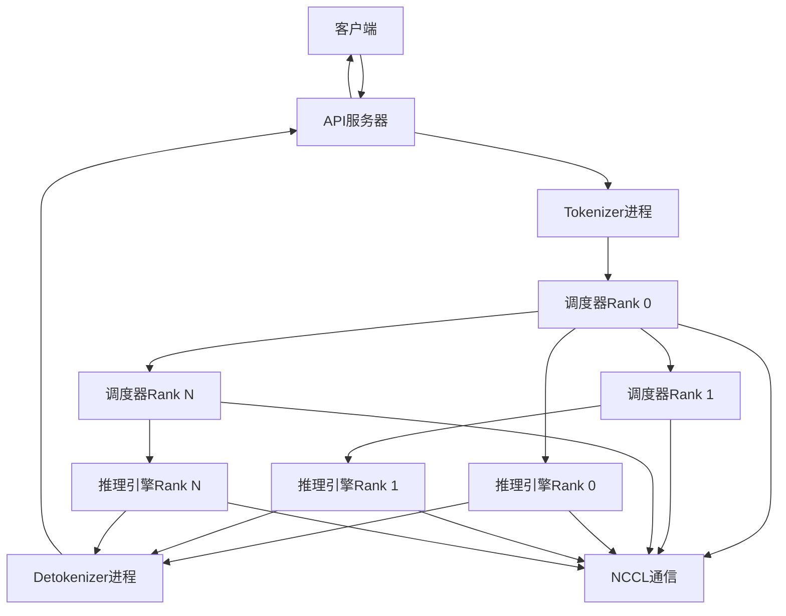
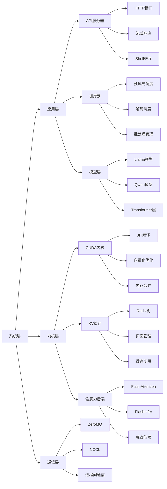
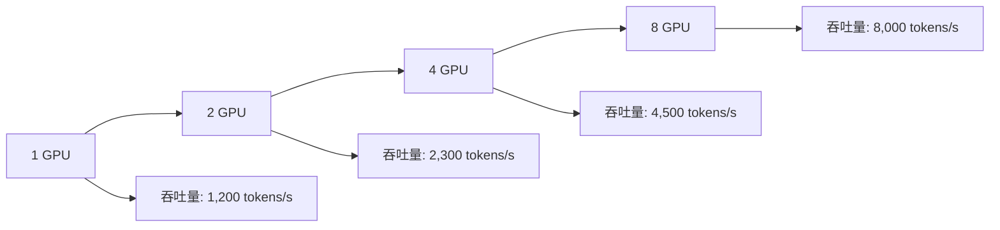

# LLM 学习指南

## 📚 系列概述

本学习指南系统地分析了Mini-SGLang项目的完整技术栈，从项目架构设计到具体实现细节，全面覆盖了一个现代LLM推理框架的核心技术。

### 🎯 学习目标

通过本系列学习，你将掌握：
- **LLM推理系统架构设计**：理解高性能推理系统的整体架构
- **分布式计算技术**：掌握张量并行和分布式通信机制
- **GPU优化技术**：了解CUDA内核和内存优化策略
- **注意力机制实现**：深入理解多头注意力和位置编码
- **系统集成部署**：学习生产级服务的构建和运维

### 📖 章节列表

| 章节 | 标题 | 核心内容 | 难度 |
|------|------|----------|------|
| [第一章](chapter-01) | 项目概述与架构设计 | 整体架构、核心特性、性能基准 | ⭐☆☆☆☆ |
| [第二章](chapter-02) | 核心数据结构与上下文管理 | 请求管理、批处理、缓存接口 | ⭐⭐☆☆☆ |
| [第三章](chapter-03) | 分布式系统与通信机制 | 张量并行、NCCL通信、进程管理 | ⭐⭐⭐☆☆ |
| [第四章](chapter-04) | 推理引擎与调度器系统 | 调度算法、CUDA图、重叠调度 | ⭐⭐⭐⭐☆ |
| [第五章](chapter-05) | KV缓存管理与Radix树优化 | 缓存复用、Radix树、内存管理 | ⭐⭐⭐⭐☆ |
| [第六章](chapter-06) | 高性能内核与CUDA优化 | JIT编译、内核优化、向量化 | ⭐⭐⭐⭐⭐ |
| [第七章](chapter-07) | 模型层实现与注意力机制 | Transformer架构、RoPE、GQA | ⭐⭐⭐⭐☆ |
| [第八章](chapter-08) | API服务器与系统集成 | FastAPI、OpenAI兼容、部署运维 | ⭐⭐⭐☆☆ |

## 🏗️ 技术架构总览

### 整体架构图



### 核心组件关系



## 🔑 关键技术亮点

### 1. 高性能推理引擎

#### 调度器系统
- **重叠调度**：CPU调度与GPU计算并行执行
- **优先级调度**：预填充优先，解码次优
- **动态批处理**：实时调整批次大小优化吞吐量

#### 推理优化
- **CUDA图重放**：预编译计算图减少启动开销
- **内存布局优化**：页面优先和层优先布局选择
- **算子融合**：减少内存传输和内核启动次数

### 2. 分布式系统架构

#### 张量并行
- **权重分片**：模型权重按维度分布到多个GPU
- **通信聚合**：All-Reduce和All-Gather高效通信
- **负载均衡**：自动平衡各GPU计算负载

#### 进程管理
- **多进程隔离**：组件独立进程提高系统稳定性
- **进程间通信**：ZeroMQ实现高性能消息传递
- **优雅关闭**：支持安全关闭和资源清理

### 3. 内存管理优化

#### KV缓存管理
- **Radix树缓存**：基于前缀的缓存复用机制
- **引用计数**：防止缓存竞争和内存泄漏
- **LRU淘汰**：智能管理缓存生命周期

#### 内存访问优化
- **连续内存布局**：提高缓存命中率
- **向量化操作**：减少内存访问次数
- **内存池复用**：减少动态内存分配开销

### 4. 模型层实现

#### 注意力机制
- **多头注意力**：支持分组查询注意力(GQA)
- **旋转位置编码**：RoPE实现相对位置编码
- **高性能后端**：FlashAttention和FlashInfer集成

#### 前馈网络
- **Gated MLP**：门控机制增强表示能力
- **激活函数优化**：SiLU门控激活
- **并行投影**：支持张量并行分片

### 5. API服务器系统

#### 接口设计
- **OpenAI兼容**：完全兼容OpenAI API规范
- **流式响应**：支持实时token流式输出
- **多协议支持**：HTTP和交互式Shell

#### 系统集成
- **配置管理**：灵活的命令行和环境变量配置
- **健康监控**：完善的监控和健康检查机制
- **生产部署**：支持Docker容器化部署

## 📊 性能基准分析

### 性能对比表

| 优化技术 | 性能提升 | 适用场景 | 实现复杂度 |
|----------|----------|----------|------------|
| **张量并行** | 3-4倍吞吐量 | 大模型推理 | ⭐⭐⭐⭐☆ |
| **CUDA图重放** | 2-3倍延迟降低 | 小批量推理 | ⭐⭐⭐☆☆ |
| **Radix缓存** | 30-50%内存节省 | 多轮对话 | ⭐⭐⭐⭐☆ |
| **重叠调度** | 20-30%吞吐量提升 | 高并发场景 | ⭐⭐⭐☆☆ |
| **FlashAttention** | 40-60%速度提升 | 长序列推理 | ⭐⭐⭐⭐⭐ |

### 扩展性测试



## 🚀 实际应用场景

### 1. 生产环境部署

#### 单机多GPU部署
```bash
# 4GPU张量并行部署
python -m minisgl \
    --model-path "meta-llama/Llama-3.1-70B-Instruct" \
    --tensor-parallel-size 4 \
    --host 0.0.0.0 \
    --port 8080 \
    --attention-backend "fa3,fi" \
    --cache-type "radix" \
    --max-running-requests 128
```

#### 多节点集群部署
```yaml
# Kubernetes部署配置
apiVersion: apps/v1
kind: Deployment
metadata:
  name: minisgl-inference
spec:
  replicas: 2
  selector:
    matchLabels:
      app: minisgl
  template:
    metadata:
      labels:
        app: minisgl
    spec:
      containers:
      - name: minisgl
        image: minisgl:latest
        resources:
          limits:
            nvidia.com/gpu: 4
        ports:
        - containerPort: 8080
        env:
        - name: TP_SIZE
          value: "4"
        - name: MODEL_PATH
          value: "meta-llama/Llama-3.1-70B-Instruct"
```

### 2. 客户端集成示例

#### Python客户端
```python
import openai

client = openai.OpenAI(
    base_url="http://localhost:8080/v1",
    api_key="not-needed"
)

response = client.chat.completions.create(
    model="Llama-3.1-70B-Instruct",
    messages=[{"role": "user", "content": "Hello, how are you?"}],
    stream=True
)

for chunk in response:
    if chunk.choices[0].delta.content:
        print(chunk.choices[0].delta.content, end="", flush=True)
```

#### HTTP客户端
```bash
# 直接HTTP调用
curl -X POST http://localhost:8080/v1/chat/completions \
  -H "Content-Type: application/json" \
  -d '{
    "model": "Llama-3.1-70B-Instruct",
    "messages": [{"role": "user", "content": "Hello!"}],
    "stream": true
  }'
```

## 🎓 学习路径建议

### 1. 初学者路径
1. **第一章**：了解项目整体架构和核心特性
2. **第八章**：学习API使用和系统部署
3. **第二章**：理解核心数据结构和请求管理
4. **第七章**：掌握模型层和注意力机制

### 2. 进阶学习路径
1. **第三章**：深入分布式系统和通信机制
2. **第四章**：学习调度器和推理引擎优化
3. **第五章**：掌握KV缓存和内存管理
4. **第六章**：研究高性能内核和CUDA优化

### 3. 专家级路径
- **源码阅读**：结合文档阅读Mini-SGLang源代码
- **性能调优**：根据实际场景进行性能优化
- **扩展开发**：基于Mini-SGLang开发新功能
- **生产部署**：在真实环境中部署和运维

## 🔧 实践建议

### 1. 环境准备
```bash
# 克隆项目
git clone https://github.com/sgl-project/mini-sglang.git
cd mini-sglang

# 安装依赖
pip install -e .

# 测试安装
python -m minisgl --help
```

### 2. 实验验证
```bash
# 启动测试服务器
python -m minisgl --model-path "Qwen/Qwen3-0.6B" --shell-mode

# 在Shell中测试
$ Hello, can you introduce yourself?
```

### 3. 性能测试
```bash
# 基准测试
python -m minisgl.benchmark --model-path "Qwen/Qwen3-0.6B" --batch-size 32

# 压力测试
python -m minisgl.stress_test --model-path "Qwen/Qwen3-0.6B" --concurrent-users 100
```

## 📈 学习收获总结

通过本系列学习，你将获得：

### 技术能力提升
- **深入理解**：LLM推理系统的完整技术栈
- **实践能力**：能够部署和优化生产级推理服务
- **扩展能力**：基于Mini-SGLang进行二次开发
- **调试能力**：掌握性能分析和问题定位技能

### 职业发展价值
- **架构设计**：能够设计高性能AI推理系统
- **工程实现**：掌握现代AI系统的工程化实践
- **团队协作**：理解大型AI项目的协作模式
- **技术视野**：了解AI基础设施的最新技术趋势

## 🔗 相关资源

### 官方资源
- [Mini-SGLang GitHub仓库](https://github.com/sgl-project/mini-sglang)
- [SGLang项目主页](https://sgl-project.github.io/)
- [技术文档](https://sgl-project.github.io/docs/)

### 学习资源
- [Transformer架构详解](https://arxiv.org/abs/1706.03762)
- [FlashAttention论文](https://arxiv.org/abs/2205.14135)
- [张量并行技术](https://arxiv.org/abs/1909.08053)

### 社区资源
- [Discord社区](https://discord.gg/sglang)
- [GitHub Issues](https://github.com/sgl-project/mini-sglang/issues)
- [技术博客](https://sgl-project.github.io/blog/)

## 🎉 结语

Mini-SGLang作为一个轻量级、高性能的LLM推理框架，展现了现代AI系统工程的优秀实践。通过本系列学习，你不仅掌握了具体的技术实现，更重要的是理解了如何将复杂的AI算法转化为高效、可靠的生产系统。

**继续学习建议**：
1. **动手实践**：在实际项目中应用所学知识
2. **源码阅读**：深入阅读Mini-SGLang源代码
3. **社区参与**：参与开源社区讨论和贡献
4. **持续学习**：关注AI基础设施的最新发展

祝你在AI工程化的道路上不断进步！🚀