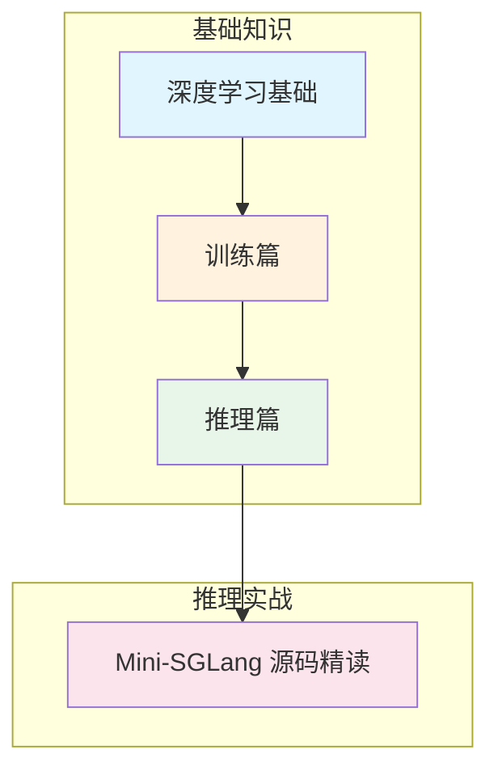
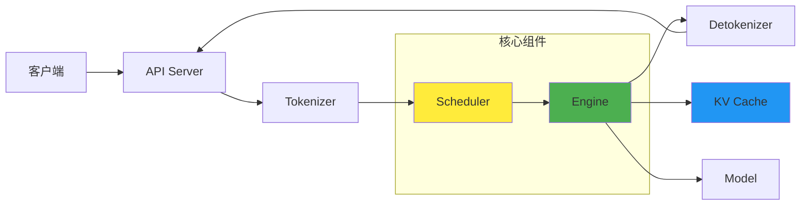

# 从零学习 LLM

> 从神经网络基础到生产级推理系统，一份完整的大语言模型学习路线图。

## 这份指南适合谁？

- **AI 初学者**：想系统性了解大语言模型的完整技术栈
- **算法工程师**：希望深入理解 LLM 训练与推理的底层原理
- **系统工程师**：需要掌握高性能推理系统的设计与优化
- **研究人员**：想快速建立 LLM 领域的知识框架

## 内容概览

本学习指南按照 LLM 的**发展脉络**和**技术层次**组织，分为两大模块：



---

## 第一模块：基础知识

系统性地介绍 LLM 从原理到实践的核心知识点。

### 第一部分：深度学习基础

从最基本的概念出发，建立理解 LLM 的理论根基。

| 文章 | 核心内容 | 你将学到 |
|------|----------|----------|
| [神经网络入门](basics/neural-network-basics) | 感知机、反向传播、梯度下降 | 理解深度学习的数学基础 |
| [语言模型简史](basics/language-model-history) | N-gram → RNN → Transformer | 了解 LLM 的技术演进脉络 |
| [分词器](basics/tokenization) | BPE、WordPiece、SentencePiece | 理解文本如何转化为模型输入 |
| [位置编码](basics/positional-encoding) | 绝对位置、RoPE、ALiBi | 理解模型如何感知序列顺序 |
| [Transformer 架构](basics/transformer-architecture) | Self-Attention、FFN、Layer Norm | 掌握现代 LLM 的核心架构 |

### 第二部分：训练篇

理解 LLM 能力的来源——从预训练到对齐。

| 文章 | 核心内容 | 你将学到 |
|------|----------|----------|
| [预训练](basics/pretraining) | Next Token Prediction、Scaling Law | 理解 LLM 如何从海量数据中学习 |
| [监督微调 (SFT)](basics/sft) | Instruction Tuning、LoRA | 掌握让模型学会对话的方法 |
| [RLHF](basics/rlhf) | Reward Model、PPO、DPO | 理解 ChatGPT "好用"的秘密 |
| [分布式训练](basics/distributed-training) | DP、FSDP、3D Parallelism | 了解大规模训练的工程实践 |

### 第三部分：推理篇

深入 LLM 推理系统的核心技术，为源码阅读做准备。

| 文章 | 核心内容 | 你将学到 |
|------|----------|----------|
| [推理过程揭秘](basics/inference-process) | Prefill vs Decode、自回归生成 | 理解 LLM 推理的两个阶段 |
| [KV Cache](basics/kv-cache) | 缓存机制、显存占用分析 | 理解推理加速的核心技术 |
| [PagedAttention](basics/memory-management) | 虚拟内存、显存分页 | 掌握显存碎片化的解决方案 |
| [Continuous Batching](basics/scheduling) | 动态批处理、调度策略 | 理解高吞吐推理的关键 |
| [Radix Attention](basics/radix-attention) | 前缀树、KV Cache 复用 | 了解 SGLang 的核心创新 |
| [分布式推理](basics/distributed-inference) | Tensor Parallelism、通信原语 | 掌握大模型多卡部署方案 |
| [模型量化](basics/quantization) | INT8/INT4、GPTQ、AWQ | 学会用更少资源运行大模型 |

---

## 🔧 第二模块：推理实战

基于 **Mini-SGLang** 源码，从工程视角深入理解现代 LLM 推理系统的实现。

Mini-SGLang 是 SGLang 的教学版本，保留了核心设计思想，代码量精简但功能完整，非常适合学习。

### 章节列表

| 章节 | 主题 | 核心内容 | 难度 |
|------|------|----------|------|
| [第一章](actions/chapter-01) | 项目概述与架构设计 | 整体架构、核心特性、代码结构 | ⭐ |
| [第二章](actions/chapter-02) | 数据结构与上下文管理 | 请求管理、批处理、状态机 | ⭐⭐ |
| [第三章](actions/chapter-03) | 分布式系统与通信 | 张量并行、NCCL、进程管理 | ⭐⭐⭐ |
| [第四章](actions/chapter-04) | 推理引擎与调度器 | 调度算法、CUDA Graph、重叠调度 | ⭐⭐⭐⭐ |
| [第五章](actions/chapter-05) | KV 缓存与 Radix 树 | 缓存复用、内存管理、LRU 淘汰 | ⭐⭐⭐⭐ |
| [第六章](actions/chapter-06) | 高性能 CUDA 内核 | JIT 编译、算子融合、向量化 | ⭐⭐⭐⭐⭐ |
| [第七章](actions/chapter-07) | 模型层与注意力机制 | Transformer 实现、RoPE、GQA | ⭐⭐⭐⭐ |
| [第八章](actions/chapter-08) | API 服务器与部署 | FastAPI、OpenAI 兼容、生产运维 | ⭐⭐⭐ |

### 系统架构总览



---

## 学习路径建议

### 路径一：快速入门（1-2 周）

适合有深度学习基础，想快速了解 LLM 推理系统的读者。

```
Transformer 架构 → 推理过程揭秘 → KV Cache → 第一章（架构概述）→ 第四章（调度器）
```

### 路径二：系统学习（4-6 周）

适合想全面掌握 LLM 技术栈的读者。

```
第一部分：深度学习基础（全部）
    ↓
第二部分：训练篇（全部）
    ↓
第三部分：推理篇（全部）
    ↓
推理实战：第一章 → 第八章（按顺序）
```

### 路径三：专项深入

根据你的具体需求选择：

| 目标 | 推荐阅读 |
|------|----------|
| 理解 ChatGPT 训练过程 | 预训练 → SFT → RLHF |
| 部署大模型到生产环境 | 量化 → 分布式推理 → 第八章 |
| 优化推理性能 | KV Cache → PagedAttention → 第四、五、六章 |
| 理解 SGLang 核心创新 | Radix Attention → 第五章 |

---

## 学习资源

除了本站内容，我们还整理了优质的外部学习资源：

- [视频教程](resources/video-tutorials) - 精选 YouTube、Bilibili 优质视频
- [经典论文](resources/papers) - LLM 领域必读论文列表
- [开源项目](resources/projects) - 值得学习的开源 LLM 项目

---

## 学习建议

1. **理论与实践结合**：每学完一个概念，尝试在 Mini-SGLang 源码中找到对应实现
2. **动手实验**：克隆 Mini-SGLang 仓库，运行示例，修改代码观察效果
3. **记录笔记**：用自己的话复述学到的知识，这是最好的检验方式
4. **参与社区**：遇到问题多交流，也欢迎贡献内容改进

## 开始学习

准备好了吗？让我们从 [神经网络入门](basics/neural-network-basics) 开始这段旅程！

如果你已有深度学习基础，可以直接跳到 [Transformer 架构演进](basics/transformer-architecture) 或 [推理过程揭秘](basics/inference-process)。
